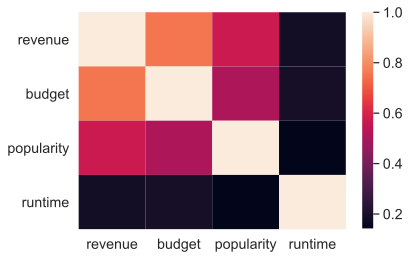

# Box Office Revenue Prediction


```python
import numpy as np
import pandas as pd

pd.set_option('display.max_columns', None)
from matplotlib.colors import rgb_to_hsv
import seaborn as sns
import matplotlib.pyplot as plt
%matplotlib inline
sns.set(font_scale=1.3)
```


```python
train_raw = pd.read_csv('data/train.tsv',delimiter='\t')
test_raw = pd.read_csv('data/test.tsv',delimiter='\t')
```

## Explenatory Data Analysis:


```python
train_raw.head()
```


<div>
<style scoped>
    .dataframe tbody tr th:only-of-type {
        vertical-align: middle;
    }

    .dataframe tbody tr th {
        vertical-align: top;
    }

    .dataframe thead th {
        text-align: right;
    }
</style>
<table border="1" class="dataframe">
  <thead>
    <tr style="text-align: right;">
      <th></th>
      <th>backdrop_path</th>
      <th>belongs_to_collection</th>
      <th>budget</th>
      <th>genres</th>
      <th>homepage</th>
      <th>id</th>
      <th>imdb_id</th>
      <th>original_language</th>
      <th>original_title</th>
      <th>overview</th>
      <th>popularity</th>
      <th>poster_path</th>
      <th>production_companies</th>
      <th>production_countries</th>
      <th>release_date</th>
      <th>revenue</th>
      <th>runtime</th>
      <th>spoken_languages</th>
      <th>status</th>
      <th>tagline</th>
      <th>title</th>
      <th>video</th>
      <th>vote_average</th>
      <th>vote_count</th>
      <th>Keywords</th>
      <th>cast</th>
      <th>crew</th>
    </tr>
  </thead>
  <tbody>
    <tr>
      <th>0</th>
      <td>/7IBpOrw0ATwL1AOV97mtsceDpYs.jpg</td>
      <td>{'id': 556, 'name': 'Spider-Man Collection', '...</td>
      <td>258000000</td>
      <td>[{'id': 14, 'name': 'Fantasy'}, {'id': 28, 'na...</td>
      <td>https://www.sonypictures.com/movies/spiderman3</td>
      <td>559</td>
      <td>tt0413300</td>
      <td>en</td>
      <td>Spider-Man 3</td>
      <td>The seemingly invincible Spider-Man goes up ag...</td>
      <td>22.024</td>
      <td>/2N9lhZg6VtVJoGCZDjXVC3a81Ea.jpg</td>
      <td>[{'id': 19551, 'logo_path': '/2WpWp9b108hizjHK...</td>
      <td>[{'iso_3166_1': 'US', 'name': 'United States o...</td>
      <td>2007-05-01</td>
      <td>890871626</td>
      <td>139.0</td>
      <td>[{'iso_639_1': 'en', 'name': 'English'}, {'iso...</td>
      <td>Released</td>
      <td>The battle within.</td>
      <td>Spider-Man 3</td>
      <td>False</td>
      <td>6.2</td>
      <td>8180</td>
      <td>[{'id': 697, 'name': 'loss of loved one'}, {'i...</td>
      <td>[{'cast_id': 30, 'character': 'Peter Parker / ...</td>
      <td>[{'credit_id': '52fe4252c3a36847f80151a5', 'de...</td>
    </tr>
    <tr>
      <th>1</th>
      <td>/lYeE7k0OR3HXyoq7FeswyaxFJvL.jpg</td>
      <td>{'id': 256296, 'name': 'Silent Night, Deadly N...</td>
      <td>250000</td>
      <td>[{'id': 35, 'name': 'Comedy'}, {'id': 27, 'nam...</td>
      <td>NaN</td>
      <td>50719</td>
      <td>tt0093974</td>
      <td>en</td>
      <td>Silent Night, Deadly Night Part 2</td>
      <td>After being traumatized by his brother Billy's...</td>
      <td>4.756</td>
      <td>/64ATtm2eMd0yfrTJsHANQ0NmMSn.jpg</td>
      <td>[{'id': 18924, 'logo_path': None, 'name': 'Sil...</td>
      <td>[{'iso_3166_1': 'US', 'name': 'United States o...</td>
      <td>1987-04-10</td>
      <td>154323</td>
      <td>88.0</td>
      <td>[{'iso_639_1': 'en', 'name': 'English'}]</td>
      <td>Released</td>
      <td>The nightmare is about to begin ... AGAIN!</td>
      <td>Silent Night, Deadly Night Part 2</td>
      <td>False</td>
      <td>4.3</td>
      <td>68</td>
      <td>[{'id': 65, 'name': 'holiday'}, {'id': 1991, '...</td>
      <td>[{'cast_id': 1000, 'character': 'Ricky Caldwel...</td>
      <td>[{'credit_id': '52fe47d4c3a36847f814a70f', 'de...</td>
    </tr>
    <tr>
      <th>2</th>
      <td>/gVXLIfMR2hLmkn0nACctlMCJBfx.jpg</td>
      <td>NaN</td>
      <td>0</td>
      <td>[{'id': 99, 'name': 'Documentary'}]</td>
      <td>https://www.scottymovie.com/</td>
      <td>469062</td>
      <td>tt2773246</td>
      <td>en</td>
      <td>Scotty and the Secret History of Hollywood</td>
      <td>A deliciously scandalous portrait of unsung Ho...</td>
      <td>4.746</td>
      <td>/2uXDNXBoIrRBbfpVrvegoLr8OVt.jpg</td>
      <td>[{'id': 88564, 'logo_path': '/pn3p12IC4Tb0K8re...</td>
      <td>[{'iso_3166_1': 'US', 'name': 'United States o...</td>
      <td>2018-07-27</td>
      <td>176236</td>
      <td>98.0</td>
      <td>[{'iso_639_1': 'en', 'name': 'English'}]</td>
      <td>Released</td>
      <td>NaN</td>
      <td>Scotty and the Secret History of Hollywood</td>
      <td>False</td>
      <td>6.5</td>
      <td>15</td>
      <td>[{'id': 158718, 'name': 'lgbt'}]</td>
      <td>[{'cast_id': 1, 'character': 'Himself', 'credi...</td>
      <td>[{'credit_id': '5980e931c3a3680cfb002d0e', 'de...</td>
    </tr>
    <tr>
      <th>3</th>
      <td>/rKjE17ncAGNzeImNWbdGTimzjtk.jpg</td>
      <td>{'id': 8917, 'name': 'Hellraiser Collection', ...</td>
      <td>1000000</td>
      <td>[{'id': 27, 'name': 'Horror'}]</td>
      <td>NaN</td>
      <td>9003</td>
      <td>tt0093177</td>
      <td>en</td>
      <td>Hellraiser</td>
      <td>An unfaithful wife encounters the zombie of he...</td>
      <td>13.828</td>
      <td>/4nfAhOTlfZUHNorHJXEib7GYFpp.jpg</td>
      <td>[{'id': 1950, 'logo_path': None, 'name': 'New ...</td>
      <td>[{'iso_3166_1': 'GB', 'name': 'United Kingdom'}]</td>
      <td>1987-09-11</td>
      <td>14564027</td>
      <td>94.0</td>
      <td>[{'iso_639_1': 'en', 'name': 'English'}]</td>
      <td>Released</td>
      <td>He'll tear your soul apart.</td>
      <td>Hellraiser</td>
      <td>False</td>
      <td>6.9</td>
      <td>1115</td>
      <td>[{'id': 1449, 'name': 'underworld'}, {'id': 31...</td>
      <td>[{'cast_id': 15, 'character': 'Larry Cotton', ...</td>
      <td>[{'credit_id': '533fd9260e0a262b92001027', 'de...</td>
    </tr>
    <tr>
      <th>4</th>
      <td>/zcJxJVhvxNHJJ2J7Q7NhgO9nPUV.jpg</td>
      <td>{'id': 108693, 'name': "National Lampoon's Vac...</td>
      <td>15000000</td>
      <td>[{'id': 35, 'name': 'Comedy'}, {'id': 12, 'nam...</td>
      <td>NaN</td>
      <td>11153</td>
      <td>tt0085995</td>
      <td>en</td>
      <td>National Lampoon's Vacation</td>
      <td>Clark Griswold is on a quest to take his famil...</td>
      <td>15.070</td>
      <td>/ySI88wO1IFyKGWpSKRTSPilE3t2.jpg</td>
      <td>[{'id': 174, 'logo_path': '/IuAlhI9eVC9Z8UQWOI...</td>
      <td>[{'iso_3166_1': 'US', 'name': 'United States o...</td>
      <td>1983-07-28</td>
      <td>61399552</td>
      <td>99.0</td>
      <td>[{'iso_639_1': 'en', 'name': 'English'}]</td>
      <td>Released</td>
      <td>Every summer Chevy Chase takes his family on a...</td>
      <td>National Lampoon's Vacation</td>
      <td>False</td>
      <td>7.1</td>
      <td>782</td>
      <td>[{'id': 5493, 'name': 'relatives'}, {'id': 731...</td>
      <td>[{'cast_id': 1, 'character': 'Clark Griswold',...</td>
      <td>[{'credit_id': '52fe44039251416c75025f27', 'de...</td>
    </tr>
  </tbody>
</table>
</div>


```python
test_raw.head()
```


<div>
<style scoped>
    .dataframe tbody tr th:only-of-type {
        vertical-align: middle;
    }

    .dataframe tbody tr th {
        vertical-align: top;
    }

    .dataframe thead th {
        text-align: right;
    }
</style>
<table border="1" class="dataframe">
  <thead>
    <tr style="text-align: right;">
      <th></th>
      <th>backdrop_path</th>
      <th>belongs_to_collection</th>
      <th>budget</th>
      <th>genres</th>
      <th>homepage</th>
      <th>id</th>
      <th>imdb_id</th>
      <th>original_language</th>
      <th>original_title</th>
      <th>overview</th>
      <th>popularity</th>
      <th>poster_path</th>
      <th>production_companies</th>
      <th>production_countries</th>
      <th>release_date</th>
      <th>revenue</th>
      <th>runtime</th>
      <th>spoken_languages</th>
      <th>status</th>
      <th>tagline</th>
      <th>title</th>
      <th>video</th>
      <th>vote_average</th>
      <th>vote_count</th>
      <th>Keywords</th>
      <th>cast</th>
      <th>crew</th>
    </tr>
  </thead>
  <tbody>
    <tr>
      <th>0</th>
      <td>/nNh7vHHISVAaziJEqAq0P9iL52w.jpg</td>
      <td>NaN</td>
      <td>58000000</td>
      <td>[{'id': 27, 'name': 'Horror'}, {'id': 878, 'na...</td>
      <td>http://www.lifemovie.com/</td>
      <td>395992</td>
      <td>tt5442430</td>
      <td>en</td>
      <td>Life</td>
      <td>The six-member crew of the International Space...</td>
      <td>17.409</td>
      <td>/h2mhfbEBGABSHo2vXG1ECMKAJa7.jpg</td>
      <td>[{'id': 5, 'logo_path': '/71BqEFAF4V3qjjMPCpLu...</td>
      <td>[{'iso_3166_1': 'US', 'name': 'United States o...</td>
      <td>2017-03-22</td>
      <td>100541806</td>
      <td>103.0</td>
      <td>[{'iso_639_1': 'cn', 'name': '广州话 / 廣州話'}, {'i...</td>
      <td>Released</td>
      <td>Be careful what you search for</td>
      <td>Life</td>
      <td>False</td>
      <td>6.4</td>
      <td>4738</td>
      <td>[{'id': 839, 'name': 'planet mars'}, {'id': 48...</td>
      <td>[{'cast_id': 0, 'character': 'Dr. David Jordan...</td>
      <td>[{'credit_id': '58bd72b0c3a3686630048e38', 'de...</td>
    </tr>
    <tr>
      <th>1</th>
      <td>/7dadBR1sXrl1TTzRQYNGUvQinF4.jpg</td>
      <td>NaN</td>
      <td>0</td>
      <td>[{'id': 35, 'name': 'Comedy'}, {'id': 80, 'nam...</td>
      <td>NaN</td>
      <td>20832</td>
      <td>tt1182908</td>
      <td>hi</td>
      <td>क्रैजी 4</td>
      <td>A psychiatrist spends the majority of his time...</td>
      <td>2.257</td>
      <td>/8owptcZPbNIqugAHQOzawgRQM5s.jpg</td>
      <td>[{'id': 64779, 'logo_path': None, 'name': 'Fil...</td>
      <td>[{'iso_3166_1': 'IN', 'name': 'India'}]</td>
      <td>2008-04-11</td>
      <td>8000000</td>
      <td>110.0</td>
      <td>[{'iso_639_1': 'hi', 'name': 'हिन्दी'}]</td>
      <td>Released</td>
      <td>NaN</td>
      <td>Krazzy 4</td>
      <td>False</td>
      <td>4.6</td>
      <td>19</td>
      <td>[]</td>
      <td>[{'cast_id': 4, 'character': 'Raja', 'credit_i...</td>
      <td>[{'credit_id': '5cab55c7925141565402137b', 'de...</td>
    </tr>
    <tr>
      <th>2</th>
      <td>/ijDUMFmb34Fv7jBwxzhNc3lbVP3.jpg</td>
      <td>{'id': 410261, 'name': 'A Goofy Movie Collecti...</td>
      <td>0</td>
      <td>[{'id': 10749, 'name': 'Romance'}, {'id': 16, ...</td>
      <td>NaN</td>
      <td>15789</td>
      <td>tt0113198</td>
      <td>en</td>
      <td>A Goofy Movie</td>
      <td>Though Goofy always means well, his amiable cl...</td>
      <td>13.558</td>
      <td>/bycmMhO3iIoEDzP768sUjq2RV4T.jpg</td>
      <td>[{'id': 3475, 'logo_path': '/jTPNzDEn7eHmp3nEX...</td>
      <td>[{'iso_3166_1': 'FR', 'name': 'France'}, {'iso...</td>
      <td>1995-04-07</td>
      <td>35348597</td>
      <td>78.0</td>
      <td>[{'iso_639_1': 'en', 'name': 'English'}]</td>
      <td>Released</td>
      <td>It’s hard to be cool... when your dad’s Goofy.</td>
      <td>A Goofy Movie</td>
      <td>False</td>
      <td>6.9</td>
      <td>964</td>
      <td>[{'id': 970, 'name': 'parent child relationshi...</td>
      <td>[{'cast_id': 2, 'character': 'Goofy Goof (voic...</td>
      <td>[{'credit_id': '591464b9925141583c00cea9', 'de...</td>
    </tr>
    <tr>
      <th>3</th>
      <td>/kb3RNnn4CMPRSaGbrX1ejc7lcRN.jpg</td>
      <td>NaN</td>
      <td>4000000</td>
      <td>[{'id': 18, 'name': 'Drama'}]</td>
      <td>NaN</td>
      <td>265180</td>
      <td>tt2802154</td>
      <td>ru</td>
      <td>Левиафан</td>
      <td>In a Russian coastal town, Kolya is forced to ...</td>
      <td>7.158</td>
      <td>/foMdJ8ijYk5G1Jn0HZRplFTu9Dt.jpg</td>
      <td>[{'id': 5630, 'logo_path': '/s0mHCw53fp6EAapR7...</td>
      <td>[{'iso_3166_1': 'RU', 'name': 'Russia'}]</td>
      <td>2014-09-24</td>
      <td>4396821</td>
      <td>141.0</td>
      <td>[{'iso_639_1': 'ru', 'name': 'Pусский'}]</td>
      <td>Released</td>
      <td>NaN</td>
      <td>Leviathan</td>
      <td>False</td>
      <td>7.5</td>
      <td>447</td>
      <td>[{'id': 1415, 'name': 'small town'}, {'id': 19...</td>
      <td>[{'cast_id': 3, 'character': 'Nikolay', 'credi...</td>
      <td>[{'credit_id': '5b9c25890e0a266e12001f38', 'de...</td>
    </tr>
    <tr>
      <th>4</th>
      <td>/wEo4UtBAWdB4aOmQ9wRjI1aS7Dt.jpg</td>
      <td>NaN</td>
      <td>250000</td>
      <td>[{'id': 35, 'name': 'Comedy'}, {'id': 18, 'nam...</td>
      <td>NaN</td>
      <td>10098</td>
      <td>tt0012349</td>
      <td>en</td>
      <td>The Kid</td>
      <td>A tramp cares for a boy after he's abandoned a...</td>
      <td>10.523</td>
      <td>/drgMcyTsySQBnUPGaBThCHGdlWT.jpg</td>
      <td>[{'id': 3245, 'logo_path': '/9dBTQp9XitrHkx20i...</td>
      <td>[{'iso_3166_1': 'US', 'name': 'United States o...</td>
      <td>1921-02-06</td>
      <td>2500000</td>
      <td>68.0</td>
      <td>[{'iso_639_1': 'xx', 'name': 'No Language'}]</td>
      <td>Released</td>
      <td>6 reels of Joy.</td>
      <td>The Kid</td>
      <td>False</td>
      <td>8.2</td>
      <td>1008</td>
      <td>[{'id': 290, 'name': 'angel'}, {'id': 1252, 'n...</td>
      <td>[{'cast_id': 10, 'character': 'A Tramp', 'cred...</td>
      <td>[{'credit_id': '52fe43269251416c75005611', 'de...</td>
    </tr>
  </tbody>
</table>
</div>


We can see that the data contains multiple nested objects (Dictonaries & Lists, represented as strings).

These attributes will be parsed during feature extraction.

Let's see some statistics regarding our data:


```python
train_raw.describe().apply(lambda s: s.apply(lambda x: format(x, 'g')))
```


<div>
<style scoped>
    .dataframe tbody tr th:only-of-type {
        vertical-align: middle;
    }

    .dataframe tbody tr th {
        vertical-align: top;
    }

    .dataframe thead th {
        text-align: right;
    }
</style>
<table border="1" class="dataframe">
  <thead>
    <tr style="text-align: right;">
      <th></th>
      <th>budget</th>
      <th>id</th>
      <th>popularity</th>
      <th>revenue</th>
      <th>runtime</th>
      <th>vote_average</th>
      <th>vote_count</th>
    </tr>
  </thead>
  <tbody>
    <tr>
      <th>count</th>
      <td>5215</td>
      <td>5215</td>
      <td>5215</td>
      <td>5215</td>
      <td>5211</td>
      <td>5215</td>
      <td>5215</td>
    </tr>
    <tr>
      <th>mean</th>
      <td>2.14797e+07</td>
      <td>98768.7</td>
      <td>10.0166</td>
      <td>6.53874e+07</td>
      <td>108.027</td>
      <td>6.3991</td>
      <td>1062.86</td>
    </tr>
    <tr>
      <th>std</th>
      <td>3.63151e+07</td>
      <td>143993</td>
      <td>7.0758</td>
      <td>1.43238e+08</td>
      <td>22.741</td>
      <td>0.943931</td>
      <td>2097.17</td>
    </tr>
    <tr>
      <th>min</th>
      <td>0</td>
      <td>5</td>
      <td>1.519</td>
      <td>1</td>
      <td>0</td>
      <td>0</td>
      <td>0</td>
    </tr>
    <tr>
      <th>25%</th>
      <td>0</td>
      <td>10136</td>
      <td>6.264</td>
      <td>2.36072e+06</td>
      <td>94</td>
      <td>5.9</td>
      <td>74</td>
    </tr>
    <tr>
      <th>50%</th>
      <td>6.5e+06</td>
      <td>24662</td>
      <td>9.009</td>
      <td>1.51562e+07</td>
      <td>104</td>
      <td>6.4</td>
      <td>290</td>
    </tr>
    <tr>
      <th>75%</th>
      <td>2.6e+07</td>
      <td>121704</td>
      <td>11.801</td>
      <td>6.21425e+07</td>
      <td>118</td>
      <td>7.1</td>
      <td>1028</td>
    </tr>
    <tr>
      <th>max</th>
      <td>3.8e+08</td>
      <td>679106</td>
      <td>151.237</td>
      <td>2.04624e+09</td>
      <td>465</td>
      <td>10</td>
      <td>24834</td>
    </tr>
  </tbody>
</table>
</div>


```python
test_raw.describe().apply(lambda s: s.apply(lambda x: format(x, 'g')))
```


<div>
<style scoped>
    .dataframe tbody tr th:only-of-type {
        vertical-align: middle;
    }

    .dataframe tbody tr th {
        vertical-align: top;
    }

    .dataframe thead th {
        text-align: right;
    }
</style>
<table border="1" class="dataframe">
  <thead>
    <tr style="text-align: right;">
      <th></th>
      <th>budget</th>
      <th>id</th>
      <th>popularity</th>
      <th>revenue</th>
      <th>runtime</th>
      <th>vote_average</th>
      <th>vote_count</th>
    </tr>
  </thead>
  <tbody>
    <tr>
      <th>count</th>
      <td>1738</td>
      <td>1738</td>
      <td>1738</td>
      <td>1738</td>
      <td>1736</td>
      <td>1738</td>
      <td>1738</td>
    </tr>
    <tr>
      <th>mean</th>
      <td>2.19667e+07</td>
      <td>105008</td>
      <td>10.0212</td>
      <td>6.88059e+07</td>
      <td>108.687</td>
      <td>6.39614</td>
      <td>1027.67</td>
    </tr>
    <tr>
      <th>std</th>
      <td>3.74423e+07</td>
      <td>151577</td>
      <td>8.55727</td>
      <td>1.61447e+08</td>
      <td>22.3713</td>
      <td>0.902789</td>
      <td>1993.46</td>
    </tr>
    <tr>
      <th>min</th>
      <td>0</td>
      <td>6</td>
      <td>1.508</td>
      <td>1</td>
      <td>0</td>
      <td>2</td>
      <td>1</td>
    </tr>
    <tr>
      <th>25%</th>
      <td>0</td>
      <td>9944.5</td>
      <td>6.37975</td>
      <td>2.4047e+06</td>
      <td>94</td>
      <td>5.8</td>
      <td>79</td>
    </tr>
    <tr>
      <th>50%</th>
      <td>7e+06</td>
      <td>23871.5</td>
      <td>8.855</td>
      <td>1.53426e+07</td>
      <td>105</td>
      <td>6.4</td>
      <td>287</td>
    </tr>
    <tr>
      <th>75%</th>
      <td>2.575e+07</td>
      <td>139091</td>
      <td>11.618</td>
      <td>6.20512e+07</td>
      <td>119</td>
      <td>7</td>
      <td>914.5</td>
    </tr>
    <tr>
      <th>max</th>
      <td>3.56e+08</td>
      <td>637920</td>
      <td>221.327</td>
      <td>2.7978e+09</td>
      <td>332</td>
      <td>10</td>
      <td>14471</td>
    </tr>
  </tbody>
</table>
</div>


We can see that both train and test has budget and runtime values of 0.

This is unlikely and thus will be considered as Missing value.


```python
print(f"Amount of movies (train) with 0 budget: {(train_raw.budget == 0).sum()}")
print(f"Amount of movies (train) with 0 runtime: {(train_raw.runtime == 0).sum()}")
print(f"Amount of movies (test) with 0 budget: {(test_raw.budget == 0).sum()}")
print(f"Amount of movies (test) with 0 budget: {(test_raw.runtime == 0).sum()}")
```

    Amount of movies (train) with 0 budget: 1487
    Amount of movies (train) with 0 runtime: 12
    Amount of movies (test) with 0 budget: 494
    Amount of movies (test) with 0 budget: 2
    

### What is correlated with 'revenue'?


```python
corr_mat = train_raw.corr()
corr_mat.revenue.sort_values(ascending=False)
```


    revenue         1.000000
    vote_count      0.769808
    budget          0.753590
    popularity      0.567924
    runtime         0.183223
    vote_average    0.159344
    id             -0.001979
    video          -0.025021
    Name: revenue, dtype: float64


Better yet, visualize in a heatmap:


```python
cols =['revenue','budget','popularity','runtime']
sns.heatmap(train_raw[cols].corr())
plt.show()
```





Let's plot the variables relations:


```python
sns.pairplot(train_raw.select_dtypes('number').drop(columns='id'), kind="reg", diag_kind="kde")
plt.show()
```


### Missing Values:


```python
fig, axes = plt.subplots(nrows=1, ncols=2, figsize=(30, 15), sharey=False)

train_na = train_raw.isna().sum().sort_values(ascending=False)
sns.barplot(train_na.values, train_na.index, orient='h', ax=axes[0])
axes[0].set_title('Train Null Values:')

test_na = test_raw.isna().sum().sort_values(ascending=False)
sns.barplot(test_na.values, test_na.index, orient='h', ax=axes[1])
axes[1].set_title('Test Null Values:')

plt.show()
```


`belongs_to_collection` - many movies aren't part of a collection. ("Logical" Null)
 
`homepage` - Not useful, we can drop it.

`tagline` - about 20% of movies don't have a tagline.

`backdrop_path` & `poster_path` - we will not use any image processing.


```python
fig, axes = plt.subplots(nrows=1, ncols=2, figsize=(30, 15), sharey=False)

train_na = train_raw.isin(['[]', '{}', '']).sum().sort_values(ascending=False)
sns.barplot(train_na.values, train_na.index, orient='h', ax=axes[0])
axes[0].set_title('Train Empty Values:')

test_na = test_raw.isin(['[]', '{}', '']).sum().sort_values(ascending=False)
sns.barplot(test_na.values, test_na.index, orient='h', ax=axes[1])
axes[1].set_title('Test Empty Values:')

plt.show()
```


Everything below 10% of the data, and thus ignorable.


```python
fig, axes = plt.subplots(nrows=1, ncols=2, figsize=(30, 15), sharey=False)

train_na = train_raw.eq(0).sum().sort_values(ascending=False)
sns.barplot(train_na.values, train_na.index, orient='h', ax=axes[0])
axes[0].set_title('Train Zero-Values:')

test_na = test_raw.eq(0).sum().sort_values(ascending=False)
sns.barplot(test_na.values, test_na.index, orient='h', ax=axes[1])
axes[1].set_title('Test Zero-Values:')

plt.show()
```


`video` - single valued and thus will be ignored.

`budget` & `runtime` - Will be imputated.

## Feature Engineering:

Following our data exploration, we won't use  the following features:

- `backdrop_path` - We won't use any image processing in this task.
- `homepage` - Mostly Nulls.
- `poster_path` - We won't use any image processing in this task.
- `imdb_id` - We won't use IMDb.
- `video` - Single valued, not useful.
- `status` - Mostly single valued (`Released`), not useful.


```python
from feature_engineering import *

train = drop_features(train_raw)
train_X, train_Y = train.drop('revenue', axis=1), train['revenue']
test = drop_features(test_raw)
test_X, test_Y = test.drop('revenue', axis=1), test['revenue']
```

### Feature Transformations:

First, we should handle with all nested collections attributes.

We used `eval` to convert the string representation of collection to an object.

Then, we've exploded (column-wise) selected attributes from each nested object.

The following attributes were added (mapped):

- `belongs_to_collection.id` : If a movie belongs to a collection, then we keep collection id, else None.
- `genres` : Containing the genre `name` attributes
- `production_comapnies.id` & `production_comapnies.origin_country` : List of production companies id attribute & production companies origin country.
- `production_countries` : List of countries (`iso_3166`) where the movie was filmed.
- `release_month`, `release_quarter`, `release_year` : The month, quarter & year the film was released on.
- `spoken_languages` : List of spoken languages in a movie (`iso_639` attribute).
- `Keywords.id` : List of id attribute for each Keyword.
- `cast.id` & `cast.gender` : List of id & gender (attributes) from `cast` member.
- `crew.id` & `crew.department` : List of id & department (attributes) from `crew` member.


```python
flattened_train = features_flattening(train_X)
flattened_train.head()
```


<div>
<style scoped>
    .dataframe tbody tr th:only-of-type {
        vertical-align: middle;
    }

    .dataframe tbody tr th {
        vertical-align: top;
    }

    .dataframe thead th {
        text-align: right;
    }
</style>
<table border="1" class="dataframe">
  <thead>
    <tr style="text-align: right;">
      <th></th>
      <th>budget</th>
      <th>genres</th>
      <th>original_language</th>
      <th>original_title</th>
      <th>overview</th>
      <th>popularity</th>
      <th>production_countries</th>
      <th>runtime</th>
      <th>spoken_languages</th>
      <th>tagline</th>
      <th>title</th>
      <th>vote_average</th>
      <th>vote_count</th>
      <th>belongs_to_collection.id</th>
      <th>production_companies.id</th>
      <th>production_companies.origin_country</th>
      <th>release_month</th>
      <th>release_quarter</th>
      <th>release_year</th>
      <th>Keywords.id</th>
      <th>cast.id</th>
      <th>cast.gender</th>
      <th>crew.id</th>
      <th>crew.department</th>
    </tr>
    <tr>
      <th>id</th>
      <th></th>
      <th></th>
      <th></th>
      <th></th>
      <th></th>
      <th></th>
      <th></th>
      <th></th>
      <th></th>
      <th></th>
      <th></th>
      <th></th>
      <th></th>
      <th></th>
      <th></th>
      <th></th>
      <th></th>
      <th></th>
      <th></th>
      <th></th>
      <th></th>
      <th></th>
      <th></th>
      <th></th>
    </tr>
  </thead>
  <tbody>
    <tr>
      <th>559</th>
      <td>258000000</td>
      <td>(Fantasy, Action, Adventure)</td>
      <td>en</td>
      <td>Spider-Man 3</td>
      <td>The seemingly invincible Spider-Man goes up ag...</td>
      <td>22.024</td>
      <td>(US,)</td>
      <td>139.0</td>
      <td>(en, fr)</td>
      <td>The battle within.</td>
      <td>Spider-Man 3</td>
      <td>6.2</td>
      <td>8180</td>
      <td>556</td>
      <td>(19551, 5, 326, 34)</td>
      <td>(US, US, , US)</td>
      <td>5</td>
      <td>2</td>
      <td>2007</td>
      <td>(697, 851, 1453, 1965, 2038, 3446, 3986, 4391,...</td>
      <td>(2219, 205, 17051, 19159, 17052, 18997, 18998,...</td>
      <td>(2, 1, 2, 2, 2, 1, 1, 2, 2, 1, 2, 2, 1, 2, 1, ...</td>
      <td>(6410, 10570, 7623, 7623, 7624, 7624, 7625, 77...</td>
      <td>(Production, Production, Writing, Directing, W...</td>
    </tr>
    <tr>
      <th>50719</th>
      <td>250000</td>
      <td>(Comedy, Horror)</td>
      <td>en</td>
      <td>Silent Night, Deadly Night Part 2</td>
      <td>After being traumatized by his brother Billy's...</td>
      <td>4.756</td>
      <td>(US,)</td>
      <td>88.0</td>
      <td>(en,)</td>
      <td>The nightmare is about to begin ... AGAIN!</td>
      <td>Silent Night, Deadly Night Part 2</td>
      <td>4.3</td>
      <td>68</td>
      <td>256296</td>
      <td>(18924,)</td>
      <td>(,)</td>
      <td>4</td>
      <td>2</td>
      <td>1987</td>
      <td>(65, 1991, 9663, 9826, 10714, 11181, 157758, 1...</td>
      <td>(151123, 151124, 98078, 560010, 101281, 560011...</td>
      <td>(2, 2, 1, 0, 0, 0, 0, 0, 0, 0, 2, 0, 0, 2, 0, ...</td>
      <td>(71031, 91309, 97711, 110718, 213404, 213404, ...</td>
      <td>(Sound, Crew, Writing, Camera, Writing, Direct...</td>
    </tr>
    <tr>
      <th>469062</th>
      <td>0</td>
      <td>(Documentary,)</td>
      <td>en</td>
      <td>Scotty and the Secret History of Hollywood</td>
      <td>A deliciously scandalous portrait of unsung Ho...</td>
      <td>4.746</td>
      <td>(US,)</td>
      <td>98.0</td>
      <td>(en,)</td>
      <td>NaN</td>
      <td>Scotty and the Secret History of Hollywood</td>
      <td>6.5</td>
      <td>15</td>
      <td>&lt;NA&gt;</td>
      <td>(88564,)</td>
      <td>(US,)</td>
      <td>7</td>
      <td>3</td>
      <td>2018</td>
      <td>(158718,)</td>
      <td>(1862182, 71766, 1862185, 1862186, 11275, 1453...</td>
      <td>(2, 2, 0, 0, 2, 2, 1)</td>
      <td>(27710, 74761, 143067, 222365, 939501, 1046137...</td>
      <td>(Production, Sound, Editing, Sound, Crew, Prod...</td>
    </tr>
    <tr>
      <th>9003</th>
      <td>1000000</td>
      <td>(Horror,)</td>
      <td>en</td>
      <td>Hellraiser</td>
      <td>An unfaithful wife encounters the zombie of he...</td>
      <td>13.828</td>
      <td>(GB,)</td>
      <td>94.0</td>
      <td>(en,)</td>
      <td>He'll tear your soul apart.</td>
      <td>Hellraiser</td>
      <td>6.9</td>
      <td>1115</td>
      <td>8917</td>
      <td>(1950, 15338, 15339, 15340)</td>
      <td>(, , , )</td>
      <td>9</td>
      <td>3</td>
      <td>1987</td>
      <td>(1449, 3182, 6152, 9748, 10327, 10864, 15001, ...</td>
      <td>(14782, 45588, 56551, 56552, 24737, 56553, 565...</td>
      <td>(2, 1, 1, 2, 2, 2, 0, 0, 2, 0, 2, 0, 2, 2, 2, ...</td>
      <td>(498, 19155, 19155, 9000, 10121, 10121, 40765,...</td>
      <td>(Costume &amp; Make-Up, Sound, Sound, Production, ...</td>
    </tr>
    <tr>
      <th>11153</th>
      <td>15000000</td>
      <td>(Comedy, Adventure)</td>
      <td>en</td>
      <td>National Lampoon's Vacation</td>
      <td>Clark Griswold is on a quest to take his famil...</td>
      <td>15.070</td>
      <td>(US,)</td>
      <td>99.0</td>
      <td>(en,)</td>
      <td>Every summer Chevy Chase takes his family on a...</td>
      <td>National Lampoon's Vacation</td>
      <td>7.1</td>
      <td>782</td>
      <td>108693</td>
      <td>(174,)</td>
      <td>(US,)</td>
      <td>7</td>
      <td>3</td>
      <td>1983</td>
      <td>(5493, 7312, 10673, 14724, 33694, 158340, 179431)</td>
      <td>(54812, 821, 70089, 1811, 1904, 1217003, 35109...</td>
      <td>(2, 1, 1, 2, 2, 1, 1, 2, 2, 2, 2, 2, 2, 1, 1, ...</td>
      <td>(1524, 1531, 11505, 14536, 69342, 69343)</td>
      <td>(Directing, Editing, Writing, Camera, Producti...</td>
    </tr>
  </tbody>
</table>
</div>


```python
flattened_test = features_flattening(test_X)
flattened_test.head()
```


<div>
<style scoped>
    .dataframe tbody tr th:only-of-type {
        vertical-align: middle;
    }

    .dataframe tbody tr th {
        vertical-align: top;
    }

    .dataframe thead th {
        text-align: right;
    }
</style>
<table border="1" class="dataframe">
  <thead>
    <tr style="text-align: right;">
      <th></th>
      <th>budget</th>
      <th>genres</th>
      <th>original_language</th>
      <th>original_title</th>
      <th>overview</th>
      <th>popularity</th>
      <th>production_countries</th>
      <th>runtime</th>
      <th>spoken_languages</th>
      <th>tagline</th>
      <th>title</th>
      <th>vote_average</th>
      <th>vote_count</th>
      <th>belongs_to_collection.id</th>
      <th>production_companies.id</th>
      <th>production_companies.origin_country</th>
      <th>release_month</th>
      <th>release_quarter</th>
      <th>release_year</th>
      <th>Keywords.id</th>
      <th>cast.id</th>
      <th>cast.gender</th>
      <th>crew.id</th>
      <th>crew.department</th>
    </tr>
    <tr>
      <th>id</th>
      <th></th>
      <th></th>
      <th></th>
      <th></th>
      <th></th>
      <th></th>
      <th></th>
      <th></th>
      <th></th>
      <th></th>
      <th></th>
      <th></th>
      <th></th>
      <th></th>
      <th></th>
      <th></th>
      <th></th>
      <th></th>
      <th></th>
      <th></th>
      <th></th>
      <th></th>
      <th></th>
      <th></th>
    </tr>
  </thead>
  <tbody>
    <tr>
      <th>395992</th>
      <td>58000000</td>
      <td>(Horror, Science Fiction, Thriller)</td>
      <td>en</td>
      <td>Life</td>
      <td>The six-member crew of the International Space...</td>
      <td>17.409</td>
      <td>(US,)</td>
      <td>103.0</td>
      <td>(cn, en, ja)</td>
      <td>Be careful what you search for</td>
      <td>Life</td>
      <td>6.4</td>
      <td>4738</td>
      <td>&lt;NA&gt;</td>
      <td>(5, 82925, 34, 82819)</td>
      <td>(US, , US, US)</td>
      <td>3</td>
      <td>1</td>
      <td>2017</td>
      <td>(839, 4862, 9882, 14626, 156039, 160097, 19158...</td>
      <td>(131, 933238, 10859, 9195, 1238461, 932267, 13...</td>
      <td>(2, 1, 2, 2, 2, 1, 0, 0, 0, 1, 1, 2, 0, 0, 0, 1)</td>
      <td>(2210, 3285, 6044, 7932, 9817, 10788, 14765, 1...</td>
      <td>(Production, Camera, Production, Writing, Art,...</td>
    </tr>
    <tr>
      <th>20832</th>
      <td>0</td>
      <td>(Comedy, Crime, Drama)</td>
      <td>hi</td>
      <td>क्रैजी 4</td>
      <td>A psychiatrist spends the majority of his time...</td>
      <td>2.257</td>
      <td>(IN,)</td>
      <td>110.0</td>
      <td>(hi,)</td>
      <td>NaN</td>
      <td>Krazzy 4</td>
      <td>4.6</td>
      <td>19</td>
      <td>&lt;NA&gt;</td>
      <td>(64779,)</td>
      <td>(,)</td>
      <td>4</td>
      <td>2</td>
      <td>2008</td>
      <td>None</td>
      <td>(85889, 76793, 86011, 35756, 35810, 86031, 856...</td>
      <td>(2, 2, 0, 2, 1, 1, 1, 2, 2, 2, 2)</td>
      <td>(53616, 85398, 85400, 959445, 1032103, 1032103...</td>
      <td>(Sound, Crew, Art, Crew, Production, Writing, ...</td>
    </tr>
    <tr>
      <th>15789</th>
      <td>0</td>
      <td>(Romance, Animation, Family, Comedy, Adventure)</td>
      <td>en</td>
      <td>A Goofy Movie</td>
      <td>Though Goofy always means well, his amiable cl...</td>
      <td>13.558</td>
      <td>(FR, US)</td>
      <td>78.0</td>
      <td>(en,)</td>
      <td>It’s hard to be cool... when your dad’s Goofy.</td>
      <td>A Goofy Movie</td>
      <td>6.9</td>
      <td>964</td>
      <td>410261</td>
      <td>(3475, 112779)</td>
      <td>(US, FR)</td>
      <td>4</td>
      <td>2</td>
      <td>1995</td>
      <td>(970, 2032, 4344, 6562, 7312, 14809, 157303, 1...</td>
      <td>(84213, 61983, 43125, 12077, 93663, 15775, 265...</td>
      <td>(2, 2, 2, 2, 1, 2, 1, 2, 1, 2, 2, 1, 2, 2, 2, ...</td>
      <td>(1225, 18382, 15775, 15779, 56147, 60731, 1577...</td>
      <td>(Sound, Writing, Directing, Editing, Directing...</td>
    </tr>
    <tr>
      <th>265180</th>
      <td>4000000</td>
      <td>(Drama,)</td>
      <td>ru</td>
      <td>Левиафан</td>
      <td>In a Russian coastal town, Kolya is forced to ...</td>
      <td>7.158</td>
      <td>(RU,)</td>
      <td>141.0</td>
      <td>(ru,)</td>
      <td>NaN</td>
      <td>Leviathan</td>
      <td>7.5</td>
      <td>447</td>
      <td>&lt;NA&gt;</td>
      <td>(5630,)</td>
      <td>(RU,)</td>
      <td>9</td>
      <td>3</td>
      <td>2014</td>
      <td>(1415, 1919, 3296, 181659, 194176)</td>
      <td>(113332, 1067188, 236369, 97368, 393420, 58328...</td>
      <td>(2, 1, 0, 2, 1, 0, 2, 2, 2, 0, 1, 0, 2, 2, 2, ...</td>
      <td>(1551, 68519, 68519, 68524, 68524, 68525, 1040...</td>
      <td>(Sound, Directing, Writing, Sound, Sound, Came...</td>
    </tr>
    <tr>
      <th>10098</th>
      <td>250000</td>
      <td>(Comedy, Drama)</td>
      <td>en</td>
      <td>The Kid</td>
      <td>A tramp cares for a boy after he's abandoned a...</td>
      <td>10.523</td>
      <td>(US,)</td>
      <td>68.0</td>
      <td>(xx,)</td>
      <td>6 reels of Joy.</td>
      <td>The Kid</td>
      <td>8.2</td>
      <td>1008</td>
      <td>&lt;NA&gt;</td>
      <td>(3245, 1315)</td>
      <td>(US, )</td>
      <td>2</td>
      <td>1</td>
      <td>1921</td>
      <td>(290, 1252, 5572, 9253, 14514, 14864, 41005, 1...</td>
      <td>(13848, 19426, 21301, 63378, 21306, 63380, 633...</td>
      <td>(2, 2, 1, 2, 2, 0, 0, 2, 0, 2, 1, 0, 0, 0, 0, ...</td>
      <td>(3945, 13848, 13848, 13848, 13848, 13848, 1402...</td>
      <td>(Art, Directing, Editing, Production, Sound, W...</td>
    </tr>
  </tbody>
</table>
</div>


#### Extract new features:

Now we can try to manipulate the features to extract more information:

- `collection_size` : specify the amount of movies in same collection (within data).
- `biggest_production_company_size` : The size (film count) of production company with most productions, within the production companies of a film.
- `most_companies_country_size` : The size (companies count) of country with most productions companies, within the production companies countries of a film.
- `most_productions_country_size` : The size (film count) of a production county, with most productions, within the production countries of a film.
- `cast.gender_ratio` : The gender ratio (`Males / Females + Males`) of cast.
- `spoken_lang_num` : The amount of spoken languages in a film.
- `overview_word_count` : Amount of words (whitespaces) in overview.
- `tagline_char_count` : The length (characters) of a tagline.
- `title_char_count` : The length (characters) of a title.
- `cast_size` : Amount of cast-members in a film.
- `crew_size` : Amount of crew-members in a film.
- `[Department Name]_depart_size` : The size of department in a film.
- `avg_runtime_by_year` : Mean runtime of films in the released year of a movie.
- `avg_budget_by_year` : Mean budget of films in the released year of a movie.
- `avg_popularity_by_year` : Mean popularity of films in the released year of a movie.
- `title_changed` : Boolean indicating whether the original title is different from title.


```python
extracted_train = feature_extraction(flattened_train)
extracted_train.head()
```


<div>
<style scoped>
    .dataframe tbody tr th:only-of-type {
        vertical-align: middle;
    }

    .dataframe tbody tr th {
        vertical-align: top;
    }

    .dataframe thead th {
        text-align: right;
    }
</style>
<table border="1" class="dataframe">
  <thead>
    <tr style="text-align: right;">
      <th></th>
      <th>budget</th>
      <th>genres</th>
      <th>original_language</th>
      <th>original_title</th>
      <th>overview</th>
      <th>popularity</th>
      <th>production_countries</th>
      <th>runtime</th>
      <th>spoken_languages</th>
      <th>tagline</th>
      <th>title</th>
      <th>vote_average</th>
      <th>vote_count</th>
      <th>belongs_to_collection.id</th>
      <th>production_companies.id</th>
      <th>production_companies.origin_country</th>
      <th>release_month</th>
      <th>release_quarter</th>
      <th>release_year</th>
      <th>Keywords.id</th>
      <th>cast.id</th>
      <th>cast.gender</th>
      <th>crew.id</th>
      <th>crew.department</th>
      <th>collection_size</th>
      <th>biggest_production_company_size</th>
      <th>most_companies_country_size</th>
      <th>most_productions_country_size</th>
      <th>cast.gender_ratio</th>
      <th>spoken_lang_num</th>
      <th>overview_word_count</th>
      <th>tagline_char_count</th>
      <th>title_char_count</th>
      <th>cast_size</th>
      <th>crew_size</th>
      <th>Art_depart_size</th>
      <th>Camera_depart_size</th>
      <th>Costume &amp; Make-Up_depart_size</th>
      <th>Crew_depart_size</th>
      <th>Directing_depart_size</th>
      <th>Editing_depart_size</th>
      <th>Lighting_depart_size</th>
      <th>Production_depart_size</th>
      <th>Sound_depart_size</th>
      <th>Visual Effects_depart_size</th>
      <th>Writing_depart_size</th>
      <th>avg_runtime_by_year</th>
      <th>avg_budget_by_year</th>
      <th>avg_popularity_by_year</th>
      <th>title_changed</th>
    </tr>
    <tr>
      <th>id</th>
      <th></th>
      <th></th>
      <th></th>
      <th></th>
      <th></th>
      <th></th>
      <th></th>
      <th></th>
      <th></th>
      <th></th>
      <th></th>
      <th></th>
      <th></th>
      <th></th>
      <th></th>
      <th></th>
      <th></th>
      <th></th>
      <th></th>
      <th></th>
      <th></th>
      <th></th>
      <th></th>
      <th></th>
      <th></th>
      <th></th>
      <th></th>
      <th></th>
      <th></th>
      <th></th>
      <th></th>
      <th></th>
      <th></th>
      <th></th>
      <th></th>
      <th></th>
      <th></th>
      <th></th>
      <th></th>
      <th></th>
      <th></th>
      <th></th>
      <th></th>
      <th></th>
      <th></th>
      <th></th>
      <th></th>
      <th></th>
      <th></th>
      <th></th>
    </tr>
  </thead>
  <tbody>
    <tr>
      <th>559</th>
      <td>258000000</td>
      <td>(Fantasy, Action, Adventure)</td>
      <td>en</td>
      <td>Spider-Man 3</td>
      <td>The seemingly invincible Spider-Man goes up ag...</td>
      <td>22.024</td>
      <td>(US,)</td>
      <td>139.0</td>
      <td>(en, fr)</td>
      <td>The battle within.</td>
      <td>Spider-Man 3</td>
      <td>6.2</td>
      <td>8180</td>
      <td>556</td>
      <td>(19551, 5, 326, 34)</td>
      <td>(US, US, , US)</td>
      <td>5</td>
      <td>2</td>
      <td>2007</td>
      <td>(697, 851, 1453, 1965, 2038, 3446, 3986, 4391,...</td>
      <td>(2219, 205, 17051, 19159, 17052, 18997, 18998,...</td>
      <td>(2, 1, 2, 2, 2, 1, 1, 2, 2, 1, 2, 2, 1, 2, 1, ...</td>
      <td>(6410, 10570, 7623, 7623, 7624, 7624, 7625, 77...</td>
      <td>(Production, Production, Writing, Directing, W...</td>
      <td>2</td>
      <td>256</td>
      <td>769</td>
      <td>3917</td>
      <td>0.611111</td>
      <td>2</td>
      <td>43</td>
      <td>18</td>
      <td>12</td>
      <td>137</td>
      <td>57</td>
      <td>19</td>
      <td>3</td>
      <td>2</td>
      <td>1</td>
      <td>2</td>
      <td>1</td>
      <td>0</td>
      <td>23</td>
      <td>1</td>
      <td>0</td>
      <td>5</td>
      <td>106.662651</td>
      <td>2.688542e+07</td>
      <td>9.319018</td>
      <td>False</td>
    </tr>
    <tr>
      <th>50719</th>
      <td>250000</td>
      <td>(Comedy, Horror)</td>
      <td>en</td>
      <td>Silent Night, Deadly Night Part 2</td>
      <td>After being traumatized by his brother Billy's...</td>
      <td>4.756</td>
      <td>(US,)</td>
      <td>88.0</td>
      <td>(en,)</td>
      <td>The nightmare is about to begin ... AGAIN!</td>
      <td>Silent Night, Deadly Night Part 2</td>
      <td>4.3</td>
      <td>68</td>
      <td>256296</td>
      <td>(18924,)</td>
      <td>(,)</td>
      <td>4</td>
      <td>2</td>
      <td>1987</td>
      <td>(65, 1991, 9663, 9826, 10714, 11181, 157758, 1...</td>
      <td>(151123, 151124, 98078, 560010, 101281, 560011...</td>
      <td>(2, 2, 1, 0, 0, 0, 0, 0, 0, 0, 2, 0, 0, 2, 0, ...</td>
      <td>(71031, 91309, 97711, 110718, 213404, 213404, ...</td>
      <td>(Sound, Crew, Writing, Camera, Writing, Direct...</td>
      <td>1</td>
      <td>1</td>
      <td>0</td>
      <td>3917</td>
      <td>0.416667</td>
      <td>1</td>
      <td>48</td>
      <td>42</td>
      <td>33</td>
      <td>52</td>
      <td>15</td>
      <td>0</td>
      <td>1</td>
      <td>0</td>
      <td>2</td>
      <td>1</td>
      <td>1</td>
      <td>0</td>
      <td>1</td>
      <td>1</td>
      <td>0</td>
      <td>8</td>
      <td>103.486486</td>
      <td>6.727433e+06</td>
      <td>8.119851</td>
      <td>False</td>
    </tr>
    <tr>
      <th>469062</th>
      <td>0</td>
      <td>(Documentary,)</td>
      <td>en</td>
      <td>Scotty and the Secret History of Hollywood</td>
      <td>A deliciously scandalous portrait of unsung Ho...</td>
      <td>4.746</td>
      <td>(US,)</td>
      <td>98.0</td>
      <td>(en,)</td>
      <td>NaN</td>
      <td>Scotty and the Secret History of Hollywood</td>
      <td>6.5</td>
      <td>15</td>
      <td>&lt;NA&gt;</td>
      <td>(88564,)</td>
      <td>(US,)</td>
      <td>7</td>
      <td>3</td>
      <td>2018</td>
      <td>(158718,)</td>
      <td>(1862182, 71766, 1862185, 1862186, 11275, 1453...</td>
      <td>(2, 2, 0, 0, 2, 2, 1)</td>
      <td>(27710, 74761, 143067, 222365, 939501, 1046137...</td>
      <td>(Production, Sound, Editing, Sound, Crew, Prod...</td>
      <td>0</td>
      <td>1</td>
      <td>769</td>
      <td>3917</td>
      <td>0.200000</td>
      <td>1</td>
      <td>23</td>
      <td>0</td>
      <td>42</td>
      <td>7</td>
      <td>57</td>
      <td>1</td>
      <td>6</td>
      <td>0</td>
      <td>4</td>
      <td>1</td>
      <td>16</td>
      <td>0</td>
      <td>20</td>
      <td>9</td>
      <td>0</td>
      <td>0</td>
      <td>109.064286</td>
      <td>2.937105e+07</td>
      <td>14.132214</td>
      <td>False</td>
    </tr>
    <tr>
      <th>9003</th>
      <td>1000000</td>
      <td>(Horror,)</td>
      <td>en</td>
      <td>Hellraiser</td>
      <td>An unfaithful wife encounters the zombie of he...</td>
      <td>13.828</td>
      <td>(GB,)</td>
      <td>94.0</td>
      <td>(en,)</td>
      <td>He'll tear your soul apart.</td>
      <td>Hellraiser</td>
      <td>6.9</td>
      <td>1115</td>
      <td>8917</td>
      <td>(1950, 15338, 15339, 15340)</td>
      <td>(, , , )</td>
      <td>9</td>
      <td>3</td>
      <td>1987</td>
      <td>(1449, 3182, 6152, 9748, 10327, 10864, 15001, ...</td>
      <td>(14782, 45588, 56551, 56552, 24737, 56553, 565...</td>
      <td>(2, 1, 1, 2, 2, 2, 0, 0, 2, 0, 2, 0, 2, 2, 2, ...</td>
      <td>(498, 19155, 19155, 9000, 10121, 10121, 40765,...</td>
      <td>(Costume &amp; Make-Up, Sound, Sound, Production, ...</td>
      <td>2</td>
      <td>10</td>
      <td>0</td>
      <td>671</td>
      <td>0.230769</td>
      <td>1</td>
      <td>23</td>
      <td>27</td>
      <td>10</td>
      <td>22</td>
      <td>71</td>
      <td>5</td>
      <td>4</td>
      <td>7</td>
      <td>20</td>
      <td>6</td>
      <td>3</td>
      <td>3</td>
      <td>9</td>
      <td>8</td>
      <td>4</td>
      <td>2</td>
      <td>103.486486</td>
      <td>6.727433e+06</td>
      <td>8.119851</td>
      <td>False</td>
    </tr>
    <tr>
      <th>11153</th>
      <td>15000000</td>
      <td>(Comedy, Adventure)</td>
      <td>en</td>
      <td>National Lampoon's Vacation</td>
      <td>Clark Griswold is on a quest to take his famil...</td>
      <td>15.070</td>
      <td>(US,)</td>
      <td>99.0</td>
      <td>(en,)</td>
      <td>Every summer Chevy Chase takes his family on a...</td>
      <td>National Lampoon's Vacation</td>
      <td>7.1</td>
      <td>782</td>
      <td>108693</td>
      <td>(174,)</td>
      <td>(US,)</td>
      <td>7</td>
      <td>3</td>
      <td>1983</td>
      <td>(5493, 7312, 10673, 14724, 33694, 158340, 179431)</td>
      <td>(54812, 821, 70089, 1811, 1904, 1217003, 35109...</td>
      <td>(2, 1, 1, 2, 2, 1, 1, 2, 2, 2, 2, 2, 2, 1, 1, ...</td>
      <td>(1524, 1531, 11505, 14536, 69342, 69343)</td>
      <td>(Directing, Editing, Writing, Camera, Producti...</td>
      <td>2</td>
      <td>344</td>
      <td>769</td>
      <td>3917</td>
      <td>0.272727</td>
      <td>1</td>
      <td>28</td>
      <td>86</td>
      <td>27</td>
      <td>24</td>
      <td>6</td>
      <td>0</td>
      <td>1</td>
      <td>0</td>
      <td>0</td>
      <td>1</td>
      <td>1</td>
      <td>0</td>
      <td>1</td>
      <td>1</td>
      <td>0</td>
      <td>1</td>
      <td>101.666667</td>
      <td>6.459246e+06</td>
      <td>7.817860</td>
      <td>False</td>
    </tr>
  </tbody>
</table>
</div>


```python
extracted_test = feature_extraction(flattened_test)
extracted_test.head()
```


<div>
<style scoped>
    .dataframe tbody tr th:only-of-type {
        vertical-align: middle;
    }

    .dataframe tbody tr th {
        vertical-align: top;
    }

    .dataframe thead th {
        text-align: right;
    }
</style>
<table border="1" class="dataframe">
  <thead>
    <tr style="text-align: right;">
      <th></th>
      <th>budget</th>
      <th>genres</th>
      <th>original_language</th>
      <th>original_title</th>
      <th>overview</th>
      <th>popularity</th>
      <th>production_countries</th>
      <th>runtime</th>
      <th>spoken_languages</th>
      <th>tagline</th>
      <th>title</th>
      <th>vote_average</th>
      <th>vote_count</th>
      <th>belongs_to_collection.id</th>
      <th>production_companies.id</th>
      <th>production_companies.origin_country</th>
      <th>release_month</th>
      <th>release_quarter</th>
      <th>release_year</th>
      <th>Keywords.id</th>
      <th>cast.id</th>
      <th>cast.gender</th>
      <th>crew.id</th>
      <th>crew.department</th>
      <th>collection_size</th>
      <th>biggest_production_company_size</th>
      <th>most_companies_country_size</th>
      <th>most_productions_country_size</th>
      <th>cast.gender_ratio</th>
      <th>spoken_lang_num</th>
      <th>overview_word_count</th>
      <th>tagline_char_count</th>
      <th>title_char_count</th>
      <th>cast_size</th>
      <th>crew_size</th>
      <th>Art_depart_size</th>
      <th>Camera_depart_size</th>
      <th>Costume &amp; Make-Up_depart_size</th>
      <th>Crew_depart_size</th>
      <th>Directing_depart_size</th>
      <th>Editing_depart_size</th>
      <th>Lighting_depart_size</th>
      <th>Production_depart_size</th>
      <th>Sound_depart_size</th>
      <th>Visual Effects_depart_size</th>
      <th>Writing_depart_size</th>
      <th>avg_runtime_by_year</th>
      <th>avg_budget_by_year</th>
      <th>avg_popularity_by_year</th>
      <th>title_changed</th>
    </tr>
    <tr>
      <th>id</th>
      <th></th>
      <th></th>
      <th></th>
      <th></th>
      <th></th>
      <th></th>
      <th></th>
      <th></th>
      <th></th>
      <th></th>
      <th></th>
      <th></th>
      <th></th>
      <th></th>
      <th></th>
      <th></th>
      <th></th>
      <th></th>
      <th></th>
      <th></th>
      <th></th>
      <th></th>
      <th></th>
      <th></th>
      <th></th>
      <th></th>
      <th></th>
      <th></th>
      <th></th>
      <th></th>
      <th></th>
      <th></th>
      <th></th>
      <th></th>
      <th></th>
      <th></th>
      <th></th>
      <th></th>
      <th></th>
      <th></th>
      <th></th>
      <th></th>
      <th></th>
      <th></th>
      <th></th>
      <th></th>
      <th></th>
      <th></th>
      <th></th>
      <th></th>
    </tr>
  </thead>
  <tbody>
    <tr>
      <th>395992</th>
      <td>58000000</td>
      <td>(Horror, Science Fiction, Thriller)</td>
      <td>en</td>
      <td>Life</td>
      <td>The six-member crew of the International Space...</td>
      <td>17.409</td>
      <td>(US,)</td>
      <td>103.0</td>
      <td>(cn, en, ja)</td>
      <td>Be careful what you search for</td>
      <td>Life</td>
      <td>6.4</td>
      <td>4738</td>
      <td>&lt;NA&gt;</td>
      <td>(5, 82925, 34, 82819)</td>
      <td>(US, , US, US)</td>
      <td>3</td>
      <td>1</td>
      <td>2017</td>
      <td>(839, 4862, 9882, 14626, 156039, 160097, 19158...</td>
      <td>(131, 933238, 10859, 9195, 1238461, 932267, 13...</td>
      <td>(2, 1, 2, 2, 2, 1, 0, 0, 0, 1, 1, 2, 0, 0, 0, 1)</td>
      <td>(2210, 3285, 6044, 7932, 9817, 10788, 14765, 1...</td>
      <td>(Production, Camera, Production, Writing, Art,...</td>
      <td>0</td>
      <td>86</td>
      <td>495</td>
      <td>1293</td>
      <td>0.500000</td>
      <td>3</td>
      <td>32</td>
      <td>30</td>
      <td>4</td>
      <td>16</td>
      <td>82</td>
      <td>11</td>
      <td>6</td>
      <td>7</td>
      <td>8</td>
      <td>5</td>
      <td>3</td>
      <td>0</td>
      <td>10</td>
      <td>11</td>
      <td>19</td>
      <td>2</td>
      <td>111.184615</td>
      <td>2.342561e+07</td>
      <td>11.716723</td>
      <td>False</td>
    </tr>
    <tr>
      <th>20832</th>
      <td>0</td>
      <td>(Comedy, Crime, Drama)</td>
      <td>hi</td>
      <td>क्रैजी 4</td>
      <td>A psychiatrist spends the majority of his time...</td>
      <td>2.257</td>
      <td>(IN,)</td>
      <td>110.0</td>
      <td>(hi,)</td>
      <td>NaN</td>
      <td>Krazzy 4</td>
      <td>4.6</td>
      <td>19</td>
      <td>&lt;NA&gt;</td>
      <td>(64779,)</td>
      <td>(,)</td>
      <td>4</td>
      <td>2</td>
      <td>2008</td>
      <td>None</td>
      <td>(85889, 76793, 86011, 35756, 35810, 86031, 856...</td>
      <td>(2, 2, 0, 2, 1, 1, 1, 2, 2, 2, 2)</td>
      <td>(53616, 85398, 85400, 959445, 1032103, 1032103...</td>
      <td>(Sound, Crew, Art, Crew, Production, Writing, ...</td>
      <td>0</td>
      <td>1</td>
      <td>0</td>
      <td>66</td>
      <td>0.300000</td>
      <td>1</td>
      <td>28</td>
      <td>0</td>
      <td>8</td>
      <td>11</td>
      <td>15</td>
      <td>1</td>
      <td>1</td>
      <td>1</td>
      <td>2</td>
      <td>1</td>
      <td>1</td>
      <td>0</td>
      <td>4</td>
      <td>2</td>
      <td>0</td>
      <td>2</td>
      <td>106.544118</td>
      <td>2.582474e+07</td>
      <td>9.763456</td>
      <td>True</td>
    </tr>
    <tr>
      <th>15789</th>
      <td>0</td>
      <td>(Romance, Animation, Family, Comedy, Adventure)</td>
      <td>en</td>
      <td>A Goofy Movie</td>
      <td>Though Goofy always means well, his amiable cl...</td>
      <td>13.558</td>
      <td>(FR, US)</td>
      <td>78.0</td>
      <td>(en,)</td>
      <td>It’s hard to be cool... when your dad’s Goofy.</td>
      <td>A Goofy Movie</td>
      <td>6.9</td>
      <td>964</td>
      <td>410261</td>
      <td>(3475, 112779)</td>
      <td>(US, FR)</td>
      <td>4</td>
      <td>2</td>
      <td>1995</td>
      <td>(970, 2032, 4344, 6562, 7312, 14809, 157303, 1...</td>
      <td>(84213, 61983, 43125, 12077, 93663, 15775, 265...</td>
      <td>(2, 2, 2, 2, 1, 2, 1, 2, 1, 2, 2, 1, 2, 2, 2, ...</td>
      <td>(1225, 18382, 15775, 15779, 56147, 60731, 1577...</td>
      <td>(Sound, Writing, Directing, Editing, Directing...</td>
      <td>1</td>
      <td>2</td>
      <td>495</td>
      <td>1293</td>
      <td>0.235294</td>
      <td>1</td>
      <td>84</td>
      <td>46</td>
      <td>13</td>
      <td>17</td>
      <td>23</td>
      <td>1</td>
      <td>0</td>
      <td>0</td>
      <td>2</td>
      <td>2</td>
      <td>1</td>
      <td>0</td>
      <td>3</td>
      <td>8</td>
      <td>2</td>
      <td>4</td>
      <td>112.129032</td>
      <td>2.744901e+07</td>
      <td>10.640065</td>
      <td>False</td>
    </tr>
    <tr>
      <th>265180</th>
      <td>4000000</td>
      <td>(Drama,)</td>
      <td>ru</td>
      <td>Левиафан</td>
      <td>In a Russian coastal town, Kolya is forced to ...</td>
      <td>7.158</td>
      <td>(RU,)</td>
      <td>141.0</td>
      <td>(ru,)</td>
      <td>NaN</td>
      <td>Leviathan</td>
      <td>7.5</td>
      <td>447</td>
      <td>&lt;NA&gt;</td>
      <td>(5630,)</td>
      <td>(RU,)</td>
      <td>9</td>
      <td>3</td>
      <td>2014</td>
      <td>(1415, 1919, 3296, 181659, 194176)</td>
      <td>(113332, 1067188, 236369, 97368, 393420, 58328...</td>
      <td>(2, 1, 0, 2, 1, 0, 2, 2, 2, 0, 1, 0, 2, 2, 2, ...</td>
      <td>(1551, 68519, 68519, 68524, 68524, 68525, 1040...</td>
      <td>(Sound, Directing, Writing, Sound, Sound, Came...</td>
      <td>0</td>
      <td>2</td>
      <td>16</td>
      <td>30</td>
      <td>0.352941</td>
      <td>1</td>
      <td>42</td>
      <td>0</td>
      <td>9</td>
      <td>21</td>
      <td>30</td>
      <td>3</td>
      <td>3</td>
      <td>2</td>
      <td>2</td>
      <td>1</td>
      <td>1</td>
      <td>3</td>
      <td>6</td>
      <td>5</td>
      <td>2</td>
      <td>2</td>
      <td>107.153846</td>
      <td>1.739839e+07</td>
      <td>9.930731</td>
      <td>True</td>
    </tr>
    <tr>
      <th>10098</th>
      <td>250000</td>
      <td>(Comedy, Drama)</td>
      <td>en</td>
      <td>The Kid</td>
      <td>A tramp cares for a boy after he's abandoned a...</td>
      <td>10.523</td>
      <td>(US,)</td>
      <td>68.0</td>
      <td>(xx,)</td>
      <td>6 reels of Joy.</td>
      <td>The Kid</td>
      <td>8.2</td>
      <td>1008</td>
      <td>&lt;NA&gt;</td>
      <td>(3245, 1315)</td>
      <td>(US, )</td>
      <td>2</td>
      <td>1</td>
      <td>1921</td>
      <td>(290, 1252, 5572, 9253, 14514, 14864, 41005, 1...</td>
      <td>(13848, 19426, 21301, 63378, 21306, 63380, 633...</td>
      <td>(2, 2, 1, 2, 2, 0, 0, 2, 0, 2, 1, 0, 0, 0, 0, ...</td>
      <td>(3945, 13848, 13848, 13848, 13848, 13848, 1402...</td>
      <td>(Art, Directing, Editing, Production, Sound, W...</td>
      <td>0</td>
      <td>1</td>
      <td>495</td>
      <td>1293</td>
      <td>0.357143</td>
      <td>1</td>
      <td>31</td>
      <td>15</td>
      <td>7</td>
      <td>35</td>
      <td>12</td>
      <td>1</td>
      <td>2</td>
      <td>0</td>
      <td>2</td>
      <td>3</td>
      <td>1</td>
      <td>0</td>
      <td>1</td>
      <td>1</td>
      <td>0</td>
      <td>1</td>
      <td>68.000000</td>
      <td>2.500000e+05</td>
      <td>10.523000</td>
      <td>False</td>
    </tr>
  </tbody>
</table>
</div>


#### Dummy variables, Dummy variables everywhere

Our data contain **many** categorical features, we need to convert them to dummy variables before any learning can be preformed.

- **Keywords** : Since there are roughly `10,000` unique keywords in train data, we will use only the top 20 most-frequent keywords in train. This will provide high confidence that these keywords will be meaningful in validation\test data.
- **Genres** : We will use all genres (19), as dummy variables.
- **Production Companies** : Since there are **many** production companies (over `70,000`), we will be create a dummy variable from the top 10 most-frequent production companies in train data.
- **Production Countries** : We will use the top 10 most-frequent production countries in train data.
- **Spoken Languages** : We will use the top 10 most-frequent spoken languages in train data.
- **Original Language** : We will use the top 10 most-frequent original language in train data.

All these dummy variables will be extracted from train data, and be hard coded to use in test preprocessing.


```python
dummy_train = add_dummies_train(extracted_train)
print(f"Added {dummy_train.shape[1] - extracted_train.shape[1]} dummy variables to train!")
```

    Added 79 dummy variables to train!
    


```python
dummy_test = add_dummies_test(extracted_test)
print(f"Added {dummy_test.shape[1] - extracted_test.shape[1]} dummy variables to test!")
```

    Added 79 dummy variables to test!
    

#### Ehh, Some cleaning:


```python
# Drop unneccesry fields:
tuple_fields = ['genres', 'spoken_languages', 'production_countries', 'production_companies.id', 'Keywords.id', 'cast.id', 'cast.gender', 'crew.id', 'crew.department', 'belongs_to_collection.id', 'production_companies.origin_country']
text_fields = ['original_language', 'original_title', 'overview', 'tagline', 'title']

dummy_train.drop(tuple_fields + text_fields, axis=1, inplace=True)
dummy_test.drop(tuple_fields + text_fields, axis=1, inplace=True)
```

#### Missing values Imputation:

We will use KNN (`k = 5, Euclidean distance`) Imputation to find budget & runtime for films with zero values.


```python
imputated_train =  missing_value_imputation(dummy_train)
imputated_test =  missing_value_imputation(dummy_test)
```

#### Scale budget to logarithmic scale:


```python
imputated_train['budget'] = imputated_train.budget.transform(np.log1p)
imputated_test['budget'] = imputated_test.budget.transform(np.log1p)
```

### Preprocessing results:


```python
imputated_train
```


<div>
<style scoped>
    .dataframe tbody tr th:only-of-type {
        vertical-align: middle;
    }

    .dataframe tbody tr th {
        vertical-align: top;
    }

    .dataframe thead th {
        text-align: right;
    }
</style>
<table border="1" class="dataframe">
  <thead>
    <tr style="text-align: right;">
      <th></th>
      <th>budget</th>
      <th>popularity</th>
      <th>runtime</th>
      <th>vote_average</th>
      <th>vote_count</th>
      <th>release_month</th>
      <th>release_quarter</th>
      <th>release_year</th>
      <th>collection_size</th>
      <th>biggest_production_company_size</th>
      <th>most_companies_country_size</th>
      <th>most_productions_country_size</th>
      <th>cast.gender_ratio</th>
      <th>spoken_lang_num</th>
      <th>overview_word_count</th>
      <th>tagline_char_count</th>
      <th>title_char_count</th>
      <th>cast_size</th>
      <th>crew_size</th>
      <th>Art_depart_size</th>
      <th>Camera_depart_size</th>
      <th>Costume &amp; Make-Up_depart_size</th>
      <th>Crew_depart_size</th>
      <th>Directing_depart_size</th>
      <th>Editing_depart_size</th>
      <th>Lighting_depart_size</th>
      <th>Production_depart_size</th>
      <th>Sound_depart_size</th>
      <th>Visual Effects_depart_size</th>
      <th>Writing_depart_size</th>
      <th>avg_runtime_by_year</th>
      <th>avg_budget_by_year</th>
      <th>avg_popularity_by_year</th>
      <th>title_changed</th>
      <th>keyword_818</th>
      <th>keyword_187056</th>
      <th>keyword_9826</th>
      <th>keyword_179431</th>
      <th>keyword_242</th>
      <th>keyword_14819</th>
      <th>keyword_5565</th>
      <th>keyword_9672</th>
      <th>keyword_9663</th>
      <th>keyword_10183</th>
      <th>keyword_9748</th>
      <th>keyword_6054</th>
      <th>keyword_9673</th>
      <th>keyword_970</th>
      <th>keyword_6149</th>
      <th>keyword_6075</th>
      <th>keyword_380</th>
      <th>keyword_4565</th>
      <th>keyword_13130</th>
      <th>keyword_179430</th>
      <th>genre_Action</th>
      <th>genre_Adventure</th>
      <th>genre_Animation</th>
      <th>genre_Comedy</th>
      <th>genre_Crime</th>
      <th>genre_Documentary</th>
      <th>genre_Drama</th>
      <th>genre_Family</th>
      <th>genre_Fantasy</th>
      <th>genre_History</th>
      <th>genre_Horror</th>
      <th>genre_Music</th>
      <th>genre_Mystery</th>
      <th>genre_Romance</th>
      <th>genre_Science Fiction</th>
      <th>genre_TV Movie</th>
      <th>genre_Thriller</th>
      <th>genre_War</th>
      <th>genre_Western</th>
      <th>company_174</th>
      <th>company_33</th>
      <th>company_4</th>
      <th>company_5</th>
      <th>company_25</th>
      <th>company_21</th>
      <th>company_12</th>
      <th>company_104</th>
      <th>company_9195</th>
      <th>company_2</th>
      <th>country_US</th>
      <th>country_GB</th>
      <th>country_FR</th>
      <th>country_DE</th>
      <th>country_CA</th>
      <th>country_IN</th>
      <th>country_JP</th>
      <th>country_IT</th>
      <th>country_ES</th>
      <th>country_AU</th>
      <th>spoken_lang_en</th>
      <th>spoken_lang_fr</th>
      <th>spoken_lang_es</th>
      <th>spoken_lang_de</th>
      <th>spoken_lang_it</th>
      <th>spoken_lang_ru</th>
      <th>spoken_lang_ja</th>
      <th>spoken_lang_hi</th>
      <th>spoken_lang_zh</th>
      <th>spoken_lang_ar</th>
      <th>original_lang_en</th>
      <th>original_lang_fr</th>
      <th>original_lang_hi</th>
      <th>original_lang_ja</th>
      <th>original_lang_es</th>
      <th>original_lang_ru</th>
      <th>original_lang_ko</th>
      <th>original_lang_it</th>
      <th>original_lang_zh</th>
      <th>original_lang_cn</th>
    </tr>
    <tr>
      <th>id</th>
      <th></th>
      <th></th>
      <th></th>
      <th></th>
      <th></th>
      <th></th>
      <th></th>
      <th></th>
      <th></th>
      <th></th>
      <th></th>
      <th></th>
      <th></th>
      <th></th>
      <th></th>
      <th></th>
      <th></th>
      <th></th>
      <th></th>
      <th></th>
      <th></th>
      <th></th>
      <th></th>
      <th></th>
      <th></th>
      <th></th>
      <th></th>
      <th></th>
      <th></th>
      <th></th>
      <th></th>
      <th></th>
      <th></th>
      <th></th>
      <th></th>
      <th></th>
      <th></th>
      <th></th>
      <th></th>
      <th></th>
      <th></th>
      <th></th>
      <th></th>
      <th></th>
      <th></th>
      <th></th>
      <th></th>
      <th></th>
      <th></th>
      <th></th>
      <th></th>
      <th></th>
      <th></th>
      <th></th>
      <th></th>
      <th></th>
      <th></th>
      <th></th>
      <th></th>
      <th></th>
      <th></th>
      <th></th>
      <th></th>
      <th></th>
      <th></th>
      <th></th>
      <th></th>
      <th></th>
      <th></th>
      <th></th>
      <th></th>
      <th></th>
      <th></th>
      <th></th>
      <th></th>
      <th></th>
      <th></th>
      <th></th>
      <th></th>
      <th></th>
      <th></th>
      <th></th>
      <th></th>
      <th></th>
      <th></th>
      <th></th>
      <th></th>
      <th></th>
      <th></th>
      <th></th>
      <th></th>
      <th></th>
      <th></th>
      <th></th>
      <th></th>
      <th></th>
      <th></th>
      <th></th>
      <th></th>
      <th></th>
      <th></th>
      <th></th>
      <th></th>
      <th></th>
      <th></th>
      <th></th>
      <th></th>
      <th></th>
      <th></th>
      <th></th>
      <th></th>
      <th></th>
      <th></th>
    </tr>
  </thead>
  <tbody>
    <tr>
      <th>559</th>
      <td>19.368470</td>
      <td>22.024</td>
      <td>139.0</td>
      <td>6.2</td>
      <td>8180.0</td>
      <td>5.0</td>
      <td>2.0</td>
      <td>2007.0</td>
      <td>2.0</td>
      <td>256.0</td>
      <td>769.0</td>
      <td>3917.0</td>
      <td>0.611111</td>
      <td>2.0</td>
      <td>43.0</td>
      <td>18.0</td>
      <td>12.0</td>
      <td>137.0</td>
      <td>57.0</td>
      <td>19.0</td>
      <td>3.0</td>
      <td>2.0</td>
      <td>1.0</td>
      <td>2.0</td>
      <td>1.0</td>
      <td>0.0</td>
      <td>23.0</td>
      <td>1.0</td>
      <td>0.0</td>
      <td>5.0</td>
      <td>106.662651</td>
      <td>2.688542e+07</td>
      <td>9.319018</td>
      <td>0.0</td>
      <td>0.0</td>
      <td>0.0</td>
      <td>0.0</td>
      <td>0.0</td>
      <td>0.0</td>
      <td>0.0</td>
      <td>0.0</td>
      <td>0.0</td>
      <td>1.0</td>
      <td>0.0</td>
      <td>1.0</td>
      <td>0.0</td>
      <td>0.0</td>
      <td>0.0</td>
      <td>0.0</td>
      <td>0.0</td>
      <td>0.0</td>
      <td>0.0</td>
      <td>0.0</td>
      <td>0.0</td>
      <td>1.0</td>
      <td>1.0</td>
      <td>0.0</td>
      <td>0.0</td>
      <td>0.0</td>
      <td>0.0</td>
      <td>0.0</td>
      <td>0.0</td>
      <td>1.0</td>
      <td>0.0</td>
      <td>0.0</td>
      <td>0.0</td>
      <td>0.0</td>
      <td>0.0</td>
      <td>0.0</td>
      <td>0.0</td>
      <td>0.0</td>
      <td>0.0</td>
      <td>0.0</td>
      <td>0.0</td>
      <td>0.0</td>
      <td>0.0</td>
      <td>1.0</td>
      <td>0.0</td>
      <td>0.0</td>
      <td>0.0</td>
      <td>0.0</td>
      <td>0.0</td>
      <td>0.0</td>
      <td>1.0</td>
      <td>0.0</td>
      <td>0.0</td>
      <td>0.0</td>
      <td>0.0</td>
      <td>0.0</td>
      <td>0.0</td>
      <td>0.0</td>
      <td>0.0</td>
      <td>0.0</td>
      <td>1.0</td>
      <td>1.0</td>
      <td>0.0</td>
      <td>0.0</td>
      <td>0.0</td>
      <td>0.0</td>
      <td>0.0</td>
      <td>0.0</td>
      <td>0.0</td>
      <td>0.0</td>
      <td>1.0</td>
      <td>0.0</td>
      <td>0.0</td>
      <td>0.0</td>
      <td>0.0</td>
      <td>0.0</td>
      <td>0.0</td>
      <td>0.0</td>
      <td>0.0</td>
      <td>0.0</td>
    </tr>
    <tr>
      <th>50719</th>
      <td>12.429220</td>
      <td>4.756</td>
      <td>88.0</td>
      <td>4.3</td>
      <td>68.0</td>
      <td>4.0</td>
      <td>2.0</td>
      <td>1987.0</td>
      <td>1.0</td>
      <td>1.0</td>
      <td>0.0</td>
      <td>3917.0</td>
      <td>0.416667</td>
      <td>1.0</td>
      <td>48.0</td>
      <td>42.0</td>
      <td>33.0</td>
      <td>52.0</td>
      <td>15.0</td>
      <td>0.0</td>
      <td>1.0</td>
      <td>0.0</td>
      <td>2.0</td>
      <td>1.0</td>
      <td>1.0</td>
      <td>0.0</td>
      <td>1.0</td>
      <td>1.0</td>
      <td>0.0</td>
      <td>8.0</td>
      <td>103.486486</td>
      <td>6.727433e+06</td>
      <td>8.119851</td>
      <td>0.0</td>
      <td>0.0</td>
      <td>0.0</td>
      <td>1.0</td>
      <td>0.0</td>
      <td>0.0</td>
      <td>0.0</td>
      <td>0.0</td>
      <td>0.0</td>
      <td>1.0</td>
      <td>0.0</td>
      <td>0.0</td>
      <td>0.0</td>
      <td>0.0</td>
      <td>0.0</td>
      <td>0.0</td>
      <td>0.0</td>
      <td>0.0</td>
      <td>0.0</td>
      <td>0.0</td>
      <td>0.0</td>
      <td>0.0</td>
      <td>0.0</td>
      <td>0.0</td>
      <td>1.0</td>
      <td>0.0</td>
      <td>0.0</td>
      <td>0.0</td>
      <td>0.0</td>
      <td>0.0</td>
      <td>0.0</td>
      <td>1.0</td>
      <td>0.0</td>
      <td>0.0</td>
      <td>0.0</td>
      <td>0.0</td>
      <td>0.0</td>
      <td>0.0</td>
      <td>0.0</td>
      <td>0.0</td>
      <td>0.0</td>
      <td>0.0</td>
      <td>0.0</td>
      <td>0.0</td>
      <td>0.0</td>
      <td>0.0</td>
      <td>0.0</td>
      <td>0.0</td>
      <td>0.0</td>
      <td>0.0</td>
      <td>1.0</td>
      <td>0.0</td>
      <td>0.0</td>
      <td>0.0</td>
      <td>0.0</td>
      <td>0.0</td>
      <td>0.0</td>
      <td>0.0</td>
      <td>0.0</td>
      <td>0.0</td>
      <td>1.0</td>
      <td>0.0</td>
      <td>0.0</td>
      <td>0.0</td>
      <td>0.0</td>
      <td>0.0</td>
      <td>0.0</td>
      <td>0.0</td>
      <td>0.0</td>
      <td>0.0</td>
      <td>1.0</td>
      <td>0.0</td>
      <td>0.0</td>
      <td>0.0</td>
      <td>0.0</td>
      <td>0.0</td>
      <td>0.0</td>
      <td>0.0</td>
      <td>0.0</td>
      <td>0.0</td>
    </tr>
    <tr>
      <th>469062</th>
      <td>14.923418</td>
      <td>4.746</td>
      <td>98.0</td>
      <td>6.5</td>
      <td>15.0</td>
      <td>7.0</td>
      <td>3.0</td>
      <td>2018.0</td>
      <td>0.0</td>
      <td>1.0</td>
      <td>769.0</td>
      <td>3917.0</td>
      <td>0.200000</td>
      <td>1.0</td>
      <td>23.0</td>
      <td>0.0</td>
      <td>42.0</td>
      <td>7.0</td>
      <td>57.0</td>
      <td>1.0</td>
      <td>6.0</td>
      <td>0.0</td>
      <td>4.0</td>
      <td>1.0</td>
      <td>16.0</td>
      <td>0.0</td>
      <td>20.0</td>
      <td>9.0</td>
      <td>0.0</td>
      <td>0.0</td>
      <td>109.064286</td>
      <td>2.937105e+07</td>
      <td>14.132214</td>
      <td>0.0</td>
      <td>0.0</td>
      <td>0.0</td>
      <td>0.0</td>
      <td>0.0</td>
      <td>0.0</td>
      <td>0.0</td>
      <td>0.0</td>
      <td>0.0</td>
      <td>0.0</td>
      <td>0.0</td>
      <td>0.0</td>
      <td>0.0</td>
      <td>0.0</td>
      <td>0.0</td>
      <td>0.0</td>
      <td>0.0</td>
      <td>0.0</td>
      <td>0.0</td>
      <td>0.0</td>
      <td>0.0</td>
      <td>0.0</td>
      <td>0.0</td>
      <td>0.0</td>
      <td>0.0</td>
      <td>0.0</td>
      <td>1.0</td>
      <td>0.0</td>
      <td>0.0</td>
      <td>0.0</td>
      <td>0.0</td>
      <td>0.0</td>
      <td>0.0</td>
      <td>0.0</td>
      <td>0.0</td>
      <td>0.0</td>
      <td>0.0</td>
      <td>0.0</td>
      <td>0.0</td>
      <td>0.0</td>
      <td>0.0</td>
      <td>0.0</td>
      <td>0.0</td>
      <td>0.0</td>
      <td>0.0</td>
      <td>0.0</td>
      <td>0.0</td>
      <td>0.0</td>
      <td>0.0</td>
      <td>0.0</td>
      <td>1.0</td>
      <td>0.0</td>
      <td>0.0</td>
      <td>0.0</td>
      <td>0.0</td>
      <td>0.0</td>
      <td>0.0</td>
      <td>0.0</td>
      <td>0.0</td>
      <td>0.0</td>
      <td>1.0</td>
      <td>0.0</td>
      <td>0.0</td>
      <td>0.0</td>
      <td>0.0</td>
      <td>0.0</td>
      <td>0.0</td>
      <td>0.0</td>
      <td>0.0</td>
      <td>0.0</td>
      <td>1.0</td>
      <td>0.0</td>
      <td>0.0</td>
      <td>0.0</td>
      <td>0.0</td>
      <td>0.0</td>
      <td>0.0</td>
      <td>0.0</td>
      <td>0.0</td>
      <td>0.0</td>
    </tr>
    <tr>
      <th>9003</th>
      <td>13.815512</td>
      <td>13.828</td>
      <td>94.0</td>
      <td>6.9</td>
      <td>1115.0</td>
      <td>9.0</td>
      <td>3.0</td>
      <td>1987.0</td>
      <td>2.0</td>
      <td>10.0</td>
      <td>0.0</td>
      <td>671.0</td>
      <td>0.230769</td>
      <td>1.0</td>
      <td>23.0</td>
      <td>27.0</td>
      <td>10.0</td>
      <td>22.0</td>
      <td>71.0</td>
      <td>5.0</td>
      <td>4.0</td>
      <td>7.0</td>
      <td>20.0</td>
      <td>6.0</td>
      <td>3.0</td>
      <td>3.0</td>
      <td>9.0</td>
      <td>8.0</td>
      <td>4.0</td>
      <td>2.0</td>
      <td>103.486486</td>
      <td>6.727433e+06</td>
      <td>8.119851</td>
      <td>0.0</td>
      <td>0.0</td>
      <td>0.0</td>
      <td>0.0</td>
      <td>0.0</td>
      <td>0.0</td>
      <td>0.0</td>
      <td>0.0</td>
      <td>0.0</td>
      <td>0.0</td>
      <td>0.0</td>
      <td>1.0</td>
      <td>0.0</td>
      <td>0.0</td>
      <td>0.0</td>
      <td>0.0</td>
      <td>0.0</td>
      <td>0.0</td>
      <td>0.0</td>
      <td>0.0</td>
      <td>0.0</td>
      <td>0.0</td>
      <td>0.0</td>
      <td>0.0</td>
      <td>0.0</td>
      <td>0.0</td>
      <td>0.0</td>
      <td>0.0</td>
      <td>0.0</td>
      <td>0.0</td>
      <td>0.0</td>
      <td>1.0</td>
      <td>0.0</td>
      <td>0.0</td>
      <td>0.0</td>
      <td>0.0</td>
      <td>0.0</td>
      <td>0.0</td>
      <td>0.0</td>
      <td>0.0</td>
      <td>0.0</td>
      <td>0.0</td>
      <td>0.0</td>
      <td>0.0</td>
      <td>0.0</td>
      <td>0.0</td>
      <td>0.0</td>
      <td>0.0</td>
      <td>0.0</td>
      <td>0.0</td>
      <td>0.0</td>
      <td>1.0</td>
      <td>0.0</td>
      <td>0.0</td>
      <td>0.0</td>
      <td>0.0</td>
      <td>0.0</td>
      <td>0.0</td>
      <td>0.0</td>
      <td>0.0</td>
      <td>1.0</td>
      <td>0.0</td>
      <td>0.0</td>
      <td>0.0</td>
      <td>0.0</td>
      <td>0.0</td>
      <td>0.0</td>
      <td>0.0</td>
      <td>0.0</td>
      <td>0.0</td>
      <td>1.0</td>
      <td>0.0</td>
      <td>0.0</td>
      <td>0.0</td>
      <td>0.0</td>
      <td>0.0</td>
      <td>0.0</td>
      <td>0.0</td>
      <td>0.0</td>
      <td>0.0</td>
    </tr>
    <tr>
      <th>11153</th>
      <td>16.523561</td>
      <td>15.070</td>
      <td>99.0</td>
      <td>7.1</td>
      <td>782.0</td>
      <td>7.0</td>
      <td>3.0</td>
      <td>1983.0</td>
      <td>2.0</td>
      <td>344.0</td>
      <td>769.0</td>
      <td>3917.0</td>
      <td>0.272727</td>
      <td>1.0</td>
      <td>28.0</td>
      <td>86.0</td>
      <td>27.0</td>
      <td>24.0</td>
      <td>6.0</td>
      <td>0.0</td>
      <td>1.0</td>
      <td>0.0</td>
      <td>0.0</td>
      <td>1.0</td>
      <td>1.0</td>
      <td>0.0</td>
      <td>1.0</td>
      <td>1.0</td>
      <td>0.0</td>
      <td>1.0</td>
      <td>101.666667</td>
      <td>6.459246e+06</td>
      <td>7.817860</td>
      <td>0.0</td>
      <td>0.0</td>
      <td>0.0</td>
      <td>0.0</td>
      <td>1.0</td>
      <td>0.0</td>
      <td>0.0</td>
      <td>0.0</td>
      <td>0.0</td>
      <td>0.0</td>
      <td>0.0</td>
      <td>0.0</td>
      <td>0.0</td>
      <td>0.0</td>
      <td>0.0</td>
      <td>0.0</td>
      <td>0.0</td>
      <td>0.0</td>
      <td>0.0</td>
      <td>0.0</td>
      <td>0.0</td>
      <td>0.0</td>
      <td>1.0</td>
      <td>0.0</td>
      <td>1.0</td>
      <td>0.0</td>
      <td>0.0</td>
      <td>0.0</td>
      <td>0.0</td>
      <td>0.0</td>
      <td>0.0</td>
      <td>0.0</td>
      <td>0.0</td>
      <td>0.0</td>
      <td>0.0</td>
      <td>0.0</td>
      <td>0.0</td>
      <td>0.0</td>
      <td>0.0</td>
      <td>0.0</td>
      <td>1.0</td>
      <td>0.0</td>
      <td>0.0</td>
      <td>0.0</td>
      <td>0.0</td>
      <td>0.0</td>
      <td>0.0</td>
      <td>0.0</td>
      <td>0.0</td>
      <td>0.0</td>
      <td>1.0</td>
      <td>0.0</td>
      <td>0.0</td>
      <td>0.0</td>
      <td>0.0</td>
      <td>0.0</td>
      <td>0.0</td>
      <td>0.0</td>
      <td>0.0</td>
      <td>0.0</td>
      <td>1.0</td>
      <td>0.0</td>
      <td>0.0</td>
      <td>0.0</td>
      <td>0.0</td>
      <td>0.0</td>
      <td>0.0</td>
      <td>0.0</td>
      <td>0.0</td>
      <td>0.0</td>
      <td>1.0</td>
      <td>0.0</td>
      <td>0.0</td>
      <td>0.0</td>
      <td>0.0</td>
      <td>0.0</td>
      <td>0.0</td>
      <td>0.0</td>
      <td>0.0</td>
      <td>0.0</td>
    </tr>
    <tr>
      <th>...</th>
      <td>...</td>
      <td>...</td>
      <td>...</td>
      <td>...</td>
      <td>...</td>
      <td>...</td>
      <td>...</td>
      <td>...</td>
      <td>...</td>
      <td>...</td>
      <td>...</td>
      <td>...</td>
      <td>...</td>
      <td>...</td>
      <td>...</td>
      <td>...</td>
      <td>...</td>
      <td>...</td>
      <td>...</td>
      <td>...</td>
      <td>...</td>
      <td>...</td>
      <td>...</td>
      <td>...</td>
      <td>...</td>
      <td>...</td>
      <td>...</td>
      <td>...</td>
      <td>...</td>
      <td>...</td>
      <td>...</td>
      <td>...</td>
      <td>...</td>
      <td>...</td>
      <td>...</td>
      <td>...</td>
      <td>...</td>
      <td>...</td>
      <td>...</td>
      <td>...</td>
      <td>...</td>
      <td>...</td>
      <td>...</td>
      <td>...</td>
      <td>...</td>
      <td>...</td>
      <td>...</td>
      <td>...</td>
      <td>...</td>
      <td>...</td>
      <td>...</td>
      <td>...</td>
      <td>...</td>
      <td>...</td>
      <td>...</td>
      <td>...</td>
      <td>...</td>
      <td>...</td>
      <td>...</td>
      <td>...</td>
      <td>...</td>
      <td>...</td>
      <td>...</td>
      <td>...</td>
      <td>...</td>
      <td>...</td>
      <td>...</td>
      <td>...</td>
      <td>...</td>
      <td>...</td>
      <td>...</td>
      <td>...</td>
      <td>...</td>
      <td>...</td>
      <td>...</td>
      <td>...</td>
      <td>...</td>
      <td>...</td>
      <td>...</td>
      <td>...</td>
      <td>...</td>
      <td>...</td>
      <td>...</td>
      <td>...</td>
      <td>...</td>
      <td>...</td>
      <td>...</td>
      <td>...</td>
      <td>...</td>
      <td>...</td>
      <td>...</td>
      <td>...</td>
      <td>...</td>
      <td>...</td>
      <td>...</td>
      <td>...</td>
      <td>...</td>
      <td>...</td>
      <td>...</td>
      <td>...</td>
      <td>...</td>
      <td>...</td>
      <td>...</td>
      <td>...</td>
      <td>...</td>
      <td>...</td>
      <td>...</td>
      <td>...</td>
      <td>...</td>
      <td>...</td>
      <td>...</td>
      <td>...</td>
      <td>...</td>
    </tr>
    <tr>
      <th>78159</th>
      <td>16.009619</td>
      <td>3.050</td>
      <td>87.0</td>
      <td>4.7</td>
      <td>29.0</td>
      <td>11.0</td>
      <td>4.0</td>
      <td>1985.0</td>
      <td>1.0</td>
      <td>1.0</td>
      <td>0.0</td>
      <td>390.0</td>
      <td>0.333333</td>
      <td>1.0</td>
      <td>53.0</td>
      <td>0.0</td>
      <td>33.0</td>
      <td>9.0</td>
      <td>4.0</td>
      <td>0.0</td>
      <td>0.0</td>
      <td>1.0</td>
      <td>1.0</td>
      <td>1.0</td>
      <td>0.0</td>
      <td>0.0</td>
      <td>0.0</td>
      <td>1.0</td>
      <td>0.0</td>
      <td>0.0</td>
      <td>107.125000</td>
      <td>6.598875e+06</td>
      <td>8.496375</td>
      <td>1.0</td>
      <td>0.0</td>
      <td>0.0</td>
      <td>0.0</td>
      <td>0.0</td>
      <td>0.0</td>
      <td>0.0</td>
      <td>0.0</td>
      <td>0.0</td>
      <td>0.0</td>
      <td>0.0</td>
      <td>0.0</td>
      <td>0.0</td>
      <td>0.0</td>
      <td>0.0</td>
      <td>0.0</td>
      <td>0.0</td>
      <td>0.0</td>
      <td>0.0</td>
      <td>0.0</td>
      <td>0.0</td>
      <td>0.0</td>
      <td>0.0</td>
      <td>0.0</td>
      <td>1.0</td>
      <td>0.0</td>
      <td>0.0</td>
      <td>0.0</td>
      <td>0.0</td>
      <td>0.0</td>
      <td>0.0</td>
      <td>0.0</td>
      <td>0.0</td>
      <td>0.0</td>
      <td>0.0</td>
      <td>0.0</td>
      <td>0.0</td>
      <td>0.0</td>
      <td>0.0</td>
      <td>0.0</td>
      <td>0.0</td>
      <td>0.0</td>
      <td>0.0</td>
      <td>0.0</td>
      <td>0.0</td>
      <td>0.0</td>
      <td>0.0</td>
      <td>0.0</td>
      <td>0.0</td>
      <td>0.0</td>
      <td>0.0</td>
      <td>0.0</td>
      <td>1.0</td>
      <td>0.0</td>
      <td>0.0</td>
      <td>0.0</td>
      <td>0.0</td>
      <td>1.0</td>
      <td>0.0</td>
      <td>0.0</td>
      <td>0.0</td>
      <td>1.0</td>
      <td>0.0</td>
      <td>0.0</td>
      <td>0.0</td>
      <td>0.0</td>
      <td>0.0</td>
      <td>0.0</td>
      <td>0.0</td>
      <td>0.0</td>
      <td>0.0</td>
      <td>1.0</td>
      <td>0.0</td>
      <td>0.0</td>
      <td>0.0</td>
      <td>0.0</td>
      <td>0.0</td>
      <td>0.0</td>
      <td>0.0</td>
      <td>0.0</td>
    </tr>
    <tr>
      <th>30497</th>
      <td>11.350418</td>
      <td>11.580</td>
      <td>83.0</td>
      <td>7.3</td>
      <td>1483.0</td>
      <td>10.0</td>
      <td>4.0</td>
      <td>1974.0</td>
      <td>3.0</td>
      <td>123.0</td>
      <td>769.0</td>
      <td>3917.0</td>
      <td>0.181818</td>
      <td>1.0</td>
      <td>71.0</td>
      <td>47.0</td>
      <td>28.0</td>
      <td>17.0</td>
      <td>12.0</td>
      <td>1.0</td>
      <td>1.0</td>
      <td>1.0</td>
      <td>0.0</td>
      <td>1.0</td>
      <td>2.0</td>
      <td>0.0</td>
      <td>1.0</td>
      <td>3.0</td>
      <td>0.0</td>
      <td>2.0</td>
      <td>118.800000</td>
      <td>3.765667e+06</td>
      <td>10.330733</td>
      <td>0.0</td>
      <td>0.0</td>
      <td>0.0</td>
      <td>0.0</td>
      <td>0.0</td>
      <td>0.0</td>
      <td>0.0</td>
      <td>0.0</td>
      <td>0.0</td>
      <td>0.0</td>
      <td>0.0</td>
      <td>0.0</td>
      <td>0.0</td>
      <td>0.0</td>
      <td>0.0</td>
      <td>0.0</td>
      <td>0.0</td>
      <td>0.0</td>
      <td>0.0</td>
      <td>0.0</td>
      <td>0.0</td>
      <td>0.0</td>
      <td>0.0</td>
      <td>0.0</td>
      <td>0.0</td>
      <td>0.0</td>
      <td>0.0</td>
      <td>0.0</td>
      <td>0.0</td>
      <td>0.0</td>
      <td>0.0</td>
      <td>1.0</td>
      <td>0.0</td>
      <td>0.0</td>
      <td>0.0</td>
      <td>0.0</td>
      <td>0.0</td>
      <td>0.0</td>
      <td>0.0</td>
      <td>0.0</td>
      <td>0.0</td>
      <td>0.0</td>
      <td>0.0</td>
      <td>0.0</td>
      <td>0.0</td>
      <td>0.0</td>
      <td>1.0</td>
      <td>0.0</td>
      <td>0.0</td>
      <td>0.0</td>
      <td>1.0</td>
      <td>0.0</td>
      <td>0.0</td>
      <td>0.0</td>
      <td>0.0</td>
      <td>0.0</td>
      <td>0.0</td>
      <td>0.0</td>
      <td>0.0</td>
      <td>0.0</td>
      <td>1.0</td>
      <td>0.0</td>
      <td>0.0</td>
      <td>0.0</td>
      <td>0.0</td>
      <td>0.0</td>
      <td>0.0</td>
      <td>0.0</td>
      <td>0.0</td>
      <td>0.0</td>
      <td>1.0</td>
      <td>0.0</td>
      <td>0.0</td>
      <td>0.0</td>
      <td>0.0</td>
      <td>0.0</td>
      <td>0.0</td>
      <td>0.0</td>
      <td>0.0</td>
      <td>0.0</td>
    </tr>
    <tr>
      <th>14342</th>
      <td>17.216708</td>
      <td>7.946</td>
      <td>90.0</td>
      <td>5.6</td>
      <td>91.0</td>
      <td>5.0</td>
      <td>2.0</td>
      <td>1998.0</td>
      <td>0.0</td>
      <td>10.0</td>
      <td>769.0</td>
      <td>3917.0</td>
      <td>0.045455</td>
      <td>1.0</td>
      <td>26.0</td>
      <td>54.0</td>
      <td>13.0</td>
      <td>26.0</td>
      <td>16.0</td>
      <td>3.0</td>
      <td>2.0</td>
      <td>1.0</td>
      <td>0.0</td>
      <td>1.0</td>
      <td>1.0</td>
      <td>0.0</td>
      <td>4.0</td>
      <td>1.0</td>
      <td>0.0</td>
      <td>3.0</td>
      <td>107.757282</td>
      <td>3.092646e+07</td>
      <td>10.181087</td>
      <td>0.0</td>
      <td>0.0</td>
      <td>0.0</td>
      <td>0.0</td>
      <td>0.0</td>
      <td>0.0</td>
      <td>0.0</td>
      <td>0.0</td>
      <td>0.0</td>
      <td>0.0</td>
      <td>0.0</td>
      <td>0.0</td>
      <td>0.0</td>
      <td>0.0</td>
      <td>0.0</td>
      <td>0.0</td>
      <td>0.0</td>
      <td>0.0</td>
      <td>0.0</td>
      <td>0.0</td>
      <td>0.0</td>
      <td>0.0</td>
      <td>1.0</td>
      <td>0.0</td>
      <td>1.0</td>
      <td>0.0</td>
      <td>0.0</td>
      <td>0.0</td>
      <td>0.0</td>
      <td>0.0</td>
      <td>0.0</td>
      <td>0.0</td>
      <td>0.0</td>
      <td>0.0</td>
      <td>0.0</td>
      <td>0.0</td>
      <td>0.0</td>
      <td>0.0</td>
      <td>0.0</td>
      <td>1.0</td>
      <td>0.0</td>
      <td>0.0</td>
      <td>0.0</td>
      <td>0.0</td>
      <td>0.0</td>
      <td>0.0</td>
      <td>0.0</td>
      <td>0.0</td>
      <td>0.0</td>
      <td>0.0</td>
      <td>1.0</td>
      <td>0.0</td>
      <td>0.0</td>
      <td>0.0</td>
      <td>0.0</td>
      <td>0.0</td>
      <td>0.0</td>
      <td>0.0</td>
      <td>0.0</td>
      <td>0.0</td>
      <td>1.0</td>
      <td>0.0</td>
      <td>0.0</td>
      <td>0.0</td>
      <td>0.0</td>
      <td>0.0</td>
      <td>0.0</td>
      <td>0.0</td>
      <td>0.0</td>
      <td>0.0</td>
      <td>1.0</td>
      <td>0.0</td>
      <td>0.0</td>
      <td>0.0</td>
      <td>0.0</td>
      <td>0.0</td>
      <td>0.0</td>
      <td>0.0</td>
      <td>0.0</td>
      <td>0.0</td>
    </tr>
    <tr>
      <th>38</th>
      <td>16.811243</td>
      <td>19.693</td>
      <td>108.0</td>
      <td>8.1</td>
      <td>8753.0</td>
      <td>3.0</td>
      <td>1.0</td>
      <td>2004.0</td>
      <td>0.0</td>
      <td>44.0</td>
      <td>769.0</td>
      <td>3917.0</td>
      <td>0.375000</td>
      <td>1.0</td>
      <td>46.0</td>
      <td>86.0</td>
      <td>37.0</td>
      <td>19.0</td>
      <td>22.0</td>
      <td>2.0</td>
      <td>2.0</td>
      <td>1.0</td>
      <td>0.0</td>
      <td>2.0</td>
      <td>1.0</td>
      <td>1.0</td>
      <td>7.0</td>
      <td>2.0</td>
      <td>0.0</td>
      <td>4.0</td>
      <td>108.852941</td>
      <td>3.247979e+07</td>
      <td>10.286375</td>
      <td>0.0</td>
      <td>0.0</td>
      <td>0.0</td>
      <td>0.0</td>
      <td>0.0</td>
      <td>0.0</td>
      <td>0.0</td>
      <td>0.0</td>
      <td>0.0</td>
      <td>0.0</td>
      <td>0.0</td>
      <td>0.0</td>
      <td>0.0</td>
      <td>1.0</td>
      <td>0.0</td>
      <td>0.0</td>
      <td>0.0</td>
      <td>0.0</td>
      <td>0.0</td>
      <td>0.0</td>
      <td>0.0</td>
      <td>0.0</td>
      <td>0.0</td>
      <td>0.0</td>
      <td>0.0</td>
      <td>0.0</td>
      <td>0.0</td>
      <td>1.0</td>
      <td>0.0</td>
      <td>0.0</td>
      <td>0.0</td>
      <td>0.0</td>
      <td>0.0</td>
      <td>0.0</td>
      <td>1.0</td>
      <td>1.0</td>
      <td>0.0</td>
      <td>0.0</td>
      <td>0.0</td>
      <td>0.0</td>
      <td>0.0</td>
      <td>0.0</td>
      <td>0.0</td>
      <td>0.0</td>
      <td>0.0</td>
      <td>0.0</td>
      <td>0.0</td>
      <td>0.0</td>
      <td>0.0</td>
      <td>0.0</td>
      <td>1.0</td>
      <td>0.0</td>
      <td>0.0</td>
      <td>0.0</td>
      <td>0.0</td>
      <td>0.0</td>
      <td>0.0</td>
      <td>0.0</td>
      <td>0.0</td>
      <td>0.0</td>
      <td>1.0</td>
      <td>0.0</td>
      <td>0.0</td>
      <td>0.0</td>
      <td>0.0</td>
      <td>0.0</td>
      <td>0.0</td>
      <td>0.0</td>
      <td>0.0</td>
      <td>0.0</td>
      <td>1.0</td>
      <td>0.0</td>
      <td>0.0</td>
      <td>0.0</td>
      <td>0.0</td>
      <td>0.0</td>
      <td>0.0</td>
      <td>0.0</td>
      <td>0.0</td>
      <td>0.0</td>
    </tr>
    <tr>
      <th>16314</th>
      <td>15.687313</td>
      <td>10.913</td>
      <td>84.0</td>
      <td>5.7</td>
      <td>240.0</td>
      <td>8.0</td>
      <td>3.0</td>
      <td>1992.0</td>
      <td>4.0</td>
      <td>105.0</td>
      <td>769.0</td>
      <td>3917.0</td>
      <td>0.187500</td>
      <td>1.0</td>
      <td>90.0</td>
      <td>52.0</td>
      <td>8.0</td>
      <td>19.0</td>
      <td>3.0</td>
      <td>0.0</td>
      <td>0.0</td>
      <td>0.0</td>
      <td>0.0</td>
      <td>1.0</td>
      <td>0.0</td>
      <td>0.0</td>
      <td>0.0</td>
      <td>0.0</td>
      <td>0.0</td>
      <td>2.0</td>
      <td>106.833333</td>
      <td>1.393333e+07</td>
      <td>9.643452</td>
      <td>0.0</td>
      <td>0.0</td>
      <td>0.0</td>
      <td>0.0</td>
      <td>0.0</td>
      <td>0.0</td>
      <td>0.0</td>
      <td>0.0</td>
      <td>0.0</td>
      <td>0.0</td>
      <td>0.0</td>
      <td>0.0</td>
      <td>0.0</td>
      <td>0.0</td>
      <td>0.0</td>
      <td>0.0</td>
      <td>0.0</td>
      <td>1.0</td>
      <td>0.0</td>
      <td>0.0</td>
      <td>0.0</td>
      <td>1.0</td>
      <td>1.0</td>
      <td>0.0</td>
      <td>1.0</td>
      <td>0.0</td>
      <td>0.0</td>
      <td>0.0</td>
      <td>1.0</td>
      <td>0.0</td>
      <td>0.0</td>
      <td>0.0</td>
      <td>0.0</td>
      <td>0.0</td>
      <td>0.0</td>
      <td>0.0</td>
      <td>0.0</td>
      <td>0.0</td>
      <td>0.0</td>
      <td>0.0</td>
      <td>0.0</td>
      <td>0.0</td>
      <td>0.0</td>
      <td>0.0</td>
      <td>0.0</td>
      <td>0.0</td>
      <td>0.0</td>
      <td>0.0</td>
      <td>1.0</td>
      <td>0.0</td>
      <td>1.0</td>
      <td>0.0</td>
      <td>0.0</td>
      <td>0.0</td>
      <td>0.0</td>
      <td>0.0</td>
      <td>0.0</td>
      <td>0.0</td>
      <td>0.0</td>
      <td>0.0</td>
      <td>1.0</td>
      <td>0.0</td>
      <td>0.0</td>
      <td>0.0</td>
      <td>0.0</td>
      <td>0.0</td>
      <td>0.0</td>
      <td>0.0</td>
      <td>0.0</td>
      <td>0.0</td>
      <td>1.0</td>
      <td>0.0</td>
      <td>0.0</td>
      <td>0.0</td>
      <td>0.0</td>
      <td>0.0</td>
      <td>0.0</td>
      <td>0.0</td>
      <td>0.0</td>
      <td>0.0</td>
    </tr>
  </tbody>
</table>
<p>5215 rows × 113 columns</p>
</div>


```python
imputated_test
```


<div>
<style scoped>
    .dataframe tbody tr th:only-of-type {
        vertical-align: middle;
    }

    .dataframe tbody tr th {
        vertical-align: top;
    }

    .dataframe thead th {
        text-align: right;
    }
</style>
<table border="1" class="dataframe">
  <thead>
    <tr style="text-align: right;">
      <th></th>
      <th>budget</th>
      <th>popularity</th>
      <th>runtime</th>
      <th>vote_average</th>
      <th>vote_count</th>
      <th>release_month</th>
      <th>release_quarter</th>
      <th>release_year</th>
      <th>collection_size</th>
      <th>biggest_production_company_size</th>
      <th>most_companies_country_size</th>
      <th>most_productions_country_size</th>
      <th>cast.gender_ratio</th>
      <th>spoken_lang_num</th>
      <th>overview_word_count</th>
      <th>tagline_char_count</th>
      <th>title_char_count</th>
      <th>cast_size</th>
      <th>crew_size</th>
      <th>Art_depart_size</th>
      <th>Camera_depart_size</th>
      <th>Costume &amp; Make-Up_depart_size</th>
      <th>Crew_depart_size</th>
      <th>Directing_depart_size</th>
      <th>Editing_depart_size</th>
      <th>Lighting_depart_size</th>
      <th>Production_depart_size</th>
      <th>Sound_depart_size</th>
      <th>Visual Effects_depart_size</th>
      <th>Writing_depart_size</th>
      <th>avg_runtime_by_year</th>
      <th>avg_budget_by_year</th>
      <th>avg_popularity_by_year</th>
      <th>title_changed</th>
      <th>keyword_818</th>
      <th>keyword_187056</th>
      <th>keyword_9826</th>
      <th>keyword_179431</th>
      <th>keyword_242</th>
      <th>keyword_14819</th>
      <th>keyword_5565</th>
      <th>keyword_9672</th>
      <th>keyword_9663</th>
      <th>keyword_10183</th>
      <th>keyword_9748</th>
      <th>keyword_6054</th>
      <th>keyword_9673</th>
      <th>keyword_970</th>
      <th>keyword_6149</th>
      <th>keyword_6075</th>
      <th>keyword_380</th>
      <th>keyword_4565</th>
      <th>keyword_13130</th>
      <th>keyword_179430</th>
      <th>genre_Action</th>
      <th>genre_Adventure</th>
      <th>genre_Animation</th>
      <th>genre_Comedy</th>
      <th>genre_Crime</th>
      <th>genre_Documentary</th>
      <th>genre_Drama</th>
      <th>genre_Family</th>
      <th>genre_Fantasy</th>
      <th>genre_History</th>
      <th>genre_Horror</th>
      <th>genre_Music</th>
      <th>genre_Mystery</th>
      <th>genre_Romance</th>
      <th>genre_Science Fiction</th>
      <th>genre_TV Movie</th>
      <th>genre_Thriller</th>
      <th>genre_War</th>
      <th>genre_Western</th>
      <th>company_174</th>
      <th>company_33</th>
      <th>company_4</th>
      <th>company_5</th>
      <th>company_25</th>
      <th>company_21</th>
      <th>company_12</th>
      <th>company_104</th>
      <th>company_9195</th>
      <th>company_2</th>
      <th>country_US</th>
      <th>country_GB</th>
      <th>country_FR</th>
      <th>country_DE</th>
      <th>country_CA</th>
      <th>country_IN</th>
      <th>country_JP</th>
      <th>country_IT</th>
      <th>country_ES</th>
      <th>country_AU</th>
      <th>spoken_lang_en</th>
      <th>spoken_lang_fr</th>
      <th>spoken_lang_es</th>
      <th>spoken_lang_de</th>
      <th>spoken_lang_it</th>
      <th>spoken_lang_ru</th>
      <th>spoken_lang_ja</th>
      <th>spoken_lang_hi</th>
      <th>spoken_lang_zh</th>
      <th>spoken_lang_ar</th>
      <th>original_lang_en</th>
      <th>original_lang_fr</th>
      <th>original_lang_hi</th>
      <th>original_lang_ja</th>
      <th>original_lang_es</th>
      <th>original_lang_ru</th>
      <th>original_lang_ko</th>
      <th>original_lang_it</th>
      <th>original_lang_zh</th>
      <th>original_lang_cn</th>
    </tr>
    <tr>
      <th>id</th>
      <th></th>
      <th></th>
      <th></th>
      <th></th>
      <th></th>
      <th></th>
      <th></th>
      <th></th>
      <th></th>
      <th></th>
      <th></th>
      <th></th>
      <th></th>
      <th></th>
      <th></th>
      <th></th>
      <th></th>
      <th></th>
      <th></th>
      <th></th>
      <th></th>
      <th></th>
      <th></th>
      <th></th>
      <th></th>
      <th></th>
      <th></th>
      <th></th>
      <th></th>
      <th></th>
      <th></th>
      <th></th>
      <th></th>
      <th></th>
      <th></th>
      <th></th>
      <th></th>
      <th></th>
      <th></th>
      <th></th>
      <th></th>
      <th></th>
      <th></th>
      <th></th>
      <th></th>
      <th></th>
      <th></th>
      <th></th>
      <th></th>
      <th></th>
      <th></th>
      <th></th>
      <th></th>
      <th></th>
      <th></th>
      <th></th>
      <th></th>
      <th></th>
      <th></th>
      <th></th>
      <th></th>
      <th></th>
      <th></th>
      <th></th>
      <th></th>
      <th></th>
      <th></th>
      <th></th>
      <th></th>
      <th></th>
      <th></th>
      <th></th>
      <th></th>
      <th></th>
      <th></th>
      <th></th>
      <th></th>
      <th></th>
      <th></th>
      <th></th>
      <th></th>
      <th></th>
      <th></th>
      <th></th>
      <th></th>
      <th></th>
      <th></th>
      <th></th>
      <th></th>
      <th></th>
      <th></th>
      <th></th>
      <th></th>
      <th></th>
      <th></th>
      <th></th>
      <th></th>
      <th></th>
      <th></th>
      <th></th>
      <th></th>
      <th></th>
      <th></th>
      <th></th>
      <th></th>
      <th></th>
      <th></th>
      <th></th>
      <th></th>
      <th></th>
      <th></th>
      <th></th>
      <th></th>
    </tr>
  </thead>
  <tbody>
    <tr>
      <th>395992</th>
      <td>17.875954</td>
      <td>17.409</td>
      <td>103.0</td>
      <td>6.4</td>
      <td>4738.0</td>
      <td>3.0</td>
      <td>1.0</td>
      <td>2017.0</td>
      <td>0.0</td>
      <td>86.0</td>
      <td>495.0</td>
      <td>1293.0</td>
      <td>0.500000</td>
      <td>3.0</td>
      <td>32.0</td>
      <td>30.0</td>
      <td>4.0</td>
      <td>16.0</td>
      <td>82.0</td>
      <td>11.0</td>
      <td>6.0</td>
      <td>7.0</td>
      <td>8.0</td>
      <td>5.0</td>
      <td>3.0</td>
      <td>0.0</td>
      <td>10.0</td>
      <td>11.0</td>
      <td>19.0</td>
      <td>2.0</td>
      <td>111.184615</td>
      <td>2.342561e+07</td>
      <td>11.716723</td>
      <td>0.0</td>
      <td>0.0</td>
      <td>0.0</td>
      <td>0.0</td>
      <td>0.0</td>
      <td>0.0</td>
      <td>0.0</td>
      <td>0.0</td>
      <td>0.0</td>
      <td>0.0</td>
      <td>0.0</td>
      <td>0.0</td>
      <td>0.0</td>
      <td>0.0</td>
      <td>0.0</td>
      <td>0.0</td>
      <td>0.0</td>
      <td>0.0</td>
      <td>0.0</td>
      <td>0.0</td>
      <td>0.0</td>
      <td>0.0</td>
      <td>0.0</td>
      <td>0.0</td>
      <td>0.0</td>
      <td>0.0</td>
      <td>0.0</td>
      <td>0.0</td>
      <td>0.0</td>
      <td>0.0</td>
      <td>0.0</td>
      <td>1.0</td>
      <td>0.0</td>
      <td>0.0</td>
      <td>0.0</td>
      <td>1.0</td>
      <td>0.0</td>
      <td>1.0</td>
      <td>0.0</td>
      <td>0.0</td>
      <td>0.0</td>
      <td>0.0</td>
      <td>0.0</td>
      <td>1.0</td>
      <td>0.0</td>
      <td>0.0</td>
      <td>0.0</td>
      <td>0.0</td>
      <td>0.0</td>
      <td>0.0</td>
      <td>1.0</td>
      <td>0.0</td>
      <td>0.0</td>
      <td>0.0</td>
      <td>0.0</td>
      <td>0.0</td>
      <td>0.0</td>
      <td>0.0</td>
      <td>0.0</td>
      <td>0.0</td>
      <td>1.0</td>
      <td>0.0</td>
      <td>0.0</td>
      <td>0.0</td>
      <td>0.0</td>
      <td>0.0</td>
      <td>1.0</td>
      <td>0.0</td>
      <td>0.0</td>
      <td>0.0</td>
      <td>1.0</td>
      <td>0.0</td>
      <td>0.0</td>
      <td>0.0</td>
      <td>0.0</td>
      <td>0.0</td>
      <td>0.0</td>
      <td>0.0</td>
      <td>0.0</td>
      <td>0.0</td>
    </tr>
    <tr>
      <th>20832</th>
      <td>16.397405</td>
      <td>2.257</td>
      <td>110.0</td>
      <td>4.6</td>
      <td>19.0</td>
      <td>4.0</td>
      <td>2.0</td>
      <td>2008.0</td>
      <td>0.0</td>
      <td>1.0</td>
      <td>0.0</td>
      <td>66.0</td>
      <td>0.300000</td>
      <td>1.0</td>
      <td>28.0</td>
      <td>0.0</td>
      <td>8.0</td>
      <td>11.0</td>
      <td>15.0</td>
      <td>1.0</td>
      <td>1.0</td>
      <td>1.0</td>
      <td>2.0</td>
      <td>1.0</td>
      <td>1.0</td>
      <td>0.0</td>
      <td>4.0</td>
      <td>2.0</td>
      <td>0.0</td>
      <td>2.0</td>
      <td>106.544118</td>
      <td>2.582474e+07</td>
      <td>9.763456</td>
      <td>1.0</td>
      <td>0.0</td>
      <td>0.0</td>
      <td>0.0</td>
      <td>0.0</td>
      <td>0.0</td>
      <td>0.0</td>
      <td>0.0</td>
      <td>0.0</td>
      <td>0.0</td>
      <td>0.0</td>
      <td>0.0</td>
      <td>0.0</td>
      <td>0.0</td>
      <td>0.0</td>
      <td>0.0</td>
      <td>0.0</td>
      <td>0.0</td>
      <td>0.0</td>
      <td>0.0</td>
      <td>0.0</td>
      <td>0.0</td>
      <td>0.0</td>
      <td>0.0</td>
      <td>1.0</td>
      <td>1.0</td>
      <td>0.0</td>
      <td>1.0</td>
      <td>0.0</td>
      <td>0.0</td>
      <td>0.0</td>
      <td>0.0</td>
      <td>0.0</td>
      <td>0.0</td>
      <td>0.0</td>
      <td>0.0</td>
      <td>0.0</td>
      <td>0.0</td>
      <td>0.0</td>
      <td>0.0</td>
      <td>0.0</td>
      <td>0.0</td>
      <td>0.0</td>
      <td>0.0</td>
      <td>0.0</td>
      <td>0.0</td>
      <td>0.0</td>
      <td>0.0</td>
      <td>0.0</td>
      <td>0.0</td>
      <td>0.0</td>
      <td>0.0</td>
      <td>0.0</td>
      <td>0.0</td>
      <td>0.0</td>
      <td>1.0</td>
      <td>0.0</td>
      <td>0.0</td>
      <td>0.0</td>
      <td>0.0</td>
      <td>0.0</td>
      <td>0.0</td>
      <td>0.0</td>
      <td>0.0</td>
      <td>0.0</td>
      <td>0.0</td>
      <td>0.0</td>
      <td>1.0</td>
      <td>0.0</td>
      <td>0.0</td>
      <td>0.0</td>
      <td>0.0</td>
      <td>1.0</td>
      <td>0.0</td>
      <td>0.0</td>
      <td>0.0</td>
      <td>0.0</td>
      <td>0.0</td>
      <td>0.0</td>
      <td>0.0</td>
    </tr>
    <tr>
      <th>15789</th>
      <td>17.130424</td>
      <td>13.558</td>
      <td>78.0</td>
      <td>6.9</td>
      <td>964.0</td>
      <td>4.0</td>
      <td>2.0</td>
      <td>1995.0</td>
      <td>1.0</td>
      <td>2.0</td>
      <td>495.0</td>
      <td>1293.0</td>
      <td>0.235294</td>
      <td>1.0</td>
      <td>84.0</td>
      <td>46.0</td>
      <td>13.0</td>
      <td>17.0</td>
      <td>23.0</td>
      <td>1.0</td>
      <td>0.0</td>
      <td>0.0</td>
      <td>2.0</td>
      <td>2.0</td>
      <td>1.0</td>
      <td>0.0</td>
      <td>3.0</td>
      <td>8.0</td>
      <td>2.0</td>
      <td>4.0</td>
      <td>112.129032</td>
      <td>2.744901e+07</td>
      <td>10.640065</td>
      <td>0.0</td>
      <td>0.0</td>
      <td>0.0</td>
      <td>0.0</td>
      <td>0.0</td>
      <td>0.0</td>
      <td>0.0</td>
      <td>0.0</td>
      <td>0.0</td>
      <td>0.0</td>
      <td>0.0</td>
      <td>0.0</td>
      <td>0.0</td>
      <td>0.0</td>
      <td>1.0</td>
      <td>0.0</td>
      <td>0.0</td>
      <td>0.0</td>
      <td>0.0</td>
      <td>0.0</td>
      <td>0.0</td>
      <td>0.0</td>
      <td>1.0</td>
      <td>1.0</td>
      <td>1.0</td>
      <td>0.0</td>
      <td>0.0</td>
      <td>0.0</td>
      <td>1.0</td>
      <td>0.0</td>
      <td>0.0</td>
      <td>0.0</td>
      <td>0.0</td>
      <td>0.0</td>
      <td>1.0</td>
      <td>0.0</td>
      <td>0.0</td>
      <td>0.0</td>
      <td>0.0</td>
      <td>0.0</td>
      <td>0.0</td>
      <td>0.0</td>
      <td>0.0</td>
      <td>0.0</td>
      <td>0.0</td>
      <td>0.0</td>
      <td>0.0</td>
      <td>0.0</td>
      <td>0.0</td>
      <td>0.0</td>
      <td>1.0</td>
      <td>0.0</td>
      <td>1.0</td>
      <td>0.0</td>
      <td>0.0</td>
      <td>0.0</td>
      <td>0.0</td>
      <td>0.0</td>
      <td>0.0</td>
      <td>0.0</td>
      <td>1.0</td>
      <td>0.0</td>
      <td>0.0</td>
      <td>0.0</td>
      <td>0.0</td>
      <td>0.0</td>
      <td>0.0</td>
      <td>0.0</td>
      <td>0.0</td>
      <td>0.0</td>
      <td>1.0</td>
      <td>0.0</td>
      <td>0.0</td>
      <td>0.0</td>
      <td>0.0</td>
      <td>0.0</td>
      <td>0.0</td>
      <td>0.0</td>
      <td>0.0</td>
      <td>0.0</td>
    </tr>
    <tr>
      <th>265180</th>
      <td>15.201805</td>
      <td>7.158</td>
      <td>141.0</td>
      <td>7.5</td>
      <td>447.0</td>
      <td>9.0</td>
      <td>3.0</td>
      <td>2014.0</td>
      <td>0.0</td>
      <td>2.0</td>
      <td>16.0</td>
      <td>30.0</td>
      <td>0.352941</td>
      <td>1.0</td>
      <td>42.0</td>
      <td>0.0</td>
      <td>9.0</td>
      <td>21.0</td>
      <td>30.0</td>
      <td>3.0</td>
      <td>3.0</td>
      <td>2.0</td>
      <td>2.0</td>
      <td>1.0</td>
      <td>1.0</td>
      <td>3.0</td>
      <td>6.0</td>
      <td>5.0</td>
      <td>2.0</td>
      <td>2.0</td>
      <td>107.153846</td>
      <td>1.739839e+07</td>
      <td>9.930731</td>
      <td>1.0</td>
      <td>0.0</td>
      <td>0.0</td>
      <td>0.0</td>
      <td>0.0</td>
      <td>0.0</td>
      <td>0.0</td>
      <td>0.0</td>
      <td>0.0</td>
      <td>0.0</td>
      <td>0.0</td>
      <td>0.0</td>
      <td>0.0</td>
      <td>0.0</td>
      <td>0.0</td>
      <td>0.0</td>
      <td>0.0</td>
      <td>0.0</td>
      <td>0.0</td>
      <td>0.0</td>
      <td>0.0</td>
      <td>0.0</td>
      <td>0.0</td>
      <td>0.0</td>
      <td>0.0</td>
      <td>0.0</td>
      <td>0.0</td>
      <td>1.0</td>
      <td>0.0</td>
      <td>0.0</td>
      <td>0.0</td>
      <td>0.0</td>
      <td>0.0</td>
      <td>0.0</td>
      <td>0.0</td>
      <td>0.0</td>
      <td>0.0</td>
      <td>0.0</td>
      <td>0.0</td>
      <td>0.0</td>
      <td>0.0</td>
      <td>0.0</td>
      <td>0.0</td>
      <td>0.0</td>
      <td>0.0</td>
      <td>0.0</td>
      <td>0.0</td>
      <td>0.0</td>
      <td>0.0</td>
      <td>0.0</td>
      <td>0.0</td>
      <td>0.0</td>
      <td>0.0</td>
      <td>0.0</td>
      <td>0.0</td>
      <td>0.0</td>
      <td>0.0</td>
      <td>0.0</td>
      <td>0.0</td>
      <td>0.0</td>
      <td>0.0</td>
      <td>0.0</td>
      <td>0.0</td>
      <td>0.0</td>
      <td>0.0</td>
      <td>1.0</td>
      <td>0.0</td>
      <td>0.0</td>
      <td>0.0</td>
      <td>0.0</td>
      <td>0.0</td>
      <td>0.0</td>
      <td>0.0</td>
      <td>0.0</td>
      <td>0.0</td>
      <td>1.0</td>
      <td>0.0</td>
      <td>0.0</td>
      <td>0.0</td>
      <td>0.0</td>
    </tr>
    <tr>
      <th>10098</th>
      <td>12.429220</td>
      <td>10.523</td>
      <td>68.0</td>
      <td>8.2</td>
      <td>1008.0</td>
      <td>2.0</td>
      <td>1.0</td>
      <td>1921.0</td>
      <td>0.0</td>
      <td>1.0</td>
      <td>495.0</td>
      <td>1293.0</td>
      <td>0.357143</td>
      <td>1.0</td>
      <td>31.0</td>
      <td>15.0</td>
      <td>7.0</td>
      <td>35.0</td>
      <td>12.0</td>
      <td>1.0</td>
      <td>2.0</td>
      <td>0.0</td>
      <td>2.0</td>
      <td>3.0</td>
      <td>1.0</td>
      <td>0.0</td>
      <td>1.0</td>
      <td>1.0</td>
      <td>0.0</td>
      <td>1.0</td>
      <td>68.000000</td>
      <td>2.500000e+05</td>
      <td>10.523000</td>
      <td>0.0</td>
      <td>0.0</td>
      <td>0.0</td>
      <td>0.0</td>
      <td>0.0</td>
      <td>0.0</td>
      <td>0.0</td>
      <td>0.0</td>
      <td>0.0</td>
      <td>0.0</td>
      <td>0.0</td>
      <td>0.0</td>
      <td>0.0</td>
      <td>0.0</td>
      <td>0.0</td>
      <td>0.0</td>
      <td>0.0</td>
      <td>0.0</td>
      <td>0.0</td>
      <td>0.0</td>
      <td>0.0</td>
      <td>0.0</td>
      <td>0.0</td>
      <td>0.0</td>
      <td>1.0</td>
      <td>0.0</td>
      <td>0.0</td>
      <td>1.0</td>
      <td>0.0</td>
      <td>0.0</td>
      <td>0.0</td>
      <td>0.0</td>
      <td>0.0</td>
      <td>0.0</td>
      <td>0.0</td>
      <td>0.0</td>
      <td>0.0</td>
      <td>0.0</td>
      <td>0.0</td>
      <td>0.0</td>
      <td>0.0</td>
      <td>0.0</td>
      <td>0.0</td>
      <td>0.0</td>
      <td>0.0</td>
      <td>0.0</td>
      <td>0.0</td>
      <td>0.0</td>
      <td>0.0</td>
      <td>0.0</td>
      <td>1.0</td>
      <td>0.0</td>
      <td>0.0</td>
      <td>0.0</td>
      <td>0.0</td>
      <td>0.0</td>
      <td>0.0</td>
      <td>0.0</td>
      <td>0.0</td>
      <td>0.0</td>
      <td>0.0</td>
      <td>0.0</td>
      <td>0.0</td>
      <td>0.0</td>
      <td>0.0</td>
      <td>0.0</td>
      <td>0.0</td>
      <td>0.0</td>
      <td>0.0</td>
      <td>0.0</td>
      <td>1.0</td>
      <td>0.0</td>
      <td>0.0</td>
      <td>0.0</td>
      <td>0.0</td>
      <td>0.0</td>
      <td>0.0</td>
      <td>0.0</td>
      <td>0.0</td>
      <td>0.0</td>
    </tr>
    <tr>
      <th>...</th>
      <td>...</td>
      <td>...</td>
      <td>...</td>
      <td>...</td>
      <td>...</td>
      <td>...</td>
      <td>...</td>
      <td>...</td>
      <td>...</td>
      <td>...</td>
      <td>...</td>
      <td>...</td>
      <td>...</td>
      <td>...</td>
      <td>...</td>
      <td>...</td>
      <td>...</td>
      <td>...</td>
      <td>...</td>
      <td>...</td>
      <td>...</td>
      <td>...</td>
      <td>...</td>
      <td>...</td>
      <td>...</td>
      <td>...</td>
      <td>...</td>
      <td>...</td>
      <td>...</td>
      <td>...</td>
      <td>...</td>
      <td>...</td>
      <td>...</td>
      <td>...</td>
      <td>...</td>
      <td>...</td>
      <td>...</td>
      <td>...</td>
      <td>...</td>
      <td>...</td>
      <td>...</td>
      <td>...</td>
      <td>...</td>
      <td>...</td>
      <td>...</td>
      <td>...</td>
      <td>...</td>
      <td>...</td>
      <td>...</td>
      <td>...</td>
      <td>...</td>
      <td>...</td>
      <td>...</td>
      <td>...</td>
      <td>...</td>
      <td>...</td>
      <td>...</td>
      <td>...</td>
      <td>...</td>
      <td>...</td>
      <td>...</td>
      <td>...</td>
      <td>...</td>
      <td>...</td>
      <td>...</td>
      <td>...</td>
      <td>...</td>
      <td>...</td>
      <td>...</td>
      <td>...</td>
      <td>...</td>
      <td>...</td>
      <td>...</td>
      <td>...</td>
      <td>...</td>
      <td>...</td>
      <td>...</td>
      <td>...</td>
      <td>...</td>
      <td>...</td>
      <td>...</td>
      <td>...</td>
      <td>...</td>
      <td>...</td>
      <td>...</td>
      <td>...</td>
      <td>...</td>
      <td>...</td>
      <td>...</td>
      <td>...</td>
      <td>...</td>
      <td>...</td>
      <td>...</td>
      <td>...</td>
      <td>...</td>
      <td>...</td>
      <td>...</td>
      <td>...</td>
      <td>...</td>
      <td>...</td>
      <td>...</td>
      <td>...</td>
      <td>...</td>
      <td>...</td>
      <td>...</td>
      <td>...</td>
      <td>...</td>
      <td>...</td>
      <td>...</td>
      <td>...</td>
      <td>...</td>
      <td>...</td>
      <td>...</td>
    </tr>
    <tr>
      <th>45284</th>
      <td>16.232031</td>
      <td>5.968</td>
      <td>109.0</td>
      <td>6.9</td>
      <td>170.0</td>
      <td>5.0</td>
      <td>2.0</td>
      <td>2010.0</td>
      <td>1.0</td>
      <td>2.0</td>
      <td>0.0</td>
      <td>53.0</td>
      <td>0.222222</td>
      <td>1.0</td>
      <td>76.0</td>
      <td>0.0</td>
      <td>7.0</td>
      <td>21.0</td>
      <td>10.0</td>
      <td>0.0</td>
      <td>1.0</td>
      <td>1.0</td>
      <td>0.0</td>
      <td>1.0</td>
      <td>2.0</td>
      <td>0.0</td>
      <td>2.0</td>
      <td>2.0</td>
      <td>0.0</td>
      <td>1.0</td>
      <td>108.135593</td>
      <td>2.692080e+07</td>
      <td>8.291288</td>
      <td>1.0</td>
      <td>0.0</td>
      <td>0.0</td>
      <td>0.0</td>
      <td>0.0</td>
      <td>0.0</td>
      <td>1.0</td>
      <td>0.0</td>
      <td>0.0</td>
      <td>0.0</td>
      <td>0.0</td>
      <td>0.0</td>
      <td>0.0</td>
      <td>0.0</td>
      <td>0.0</td>
      <td>0.0</td>
      <td>0.0</td>
      <td>0.0</td>
      <td>0.0</td>
      <td>0.0</td>
      <td>0.0</td>
      <td>1.0</td>
      <td>0.0</td>
      <td>0.0</td>
      <td>0.0</td>
      <td>1.0</td>
      <td>0.0</td>
      <td>1.0</td>
      <td>0.0</td>
      <td>0.0</td>
      <td>0.0</td>
      <td>0.0</td>
      <td>0.0</td>
      <td>0.0</td>
      <td>0.0</td>
      <td>0.0</td>
      <td>0.0</td>
      <td>0.0</td>
      <td>0.0</td>
      <td>0.0</td>
      <td>0.0</td>
      <td>0.0</td>
      <td>0.0</td>
      <td>0.0</td>
      <td>0.0</td>
      <td>0.0</td>
      <td>0.0</td>
      <td>0.0</td>
      <td>0.0</td>
      <td>0.0</td>
      <td>0.0</td>
      <td>0.0</td>
      <td>0.0</td>
      <td>0.0</td>
      <td>0.0</td>
      <td>0.0</td>
      <td>1.0</td>
      <td>0.0</td>
      <td>0.0</td>
      <td>0.0</td>
      <td>0.0</td>
      <td>0.0</td>
      <td>0.0</td>
      <td>0.0</td>
      <td>0.0</td>
      <td>0.0</td>
      <td>1.0</td>
      <td>0.0</td>
      <td>0.0</td>
      <td>0.0</td>
      <td>0.0</td>
      <td>0.0</td>
      <td>0.0</td>
      <td>1.0</td>
      <td>0.0</td>
      <td>0.0</td>
      <td>0.0</td>
      <td>0.0</td>
      <td>0.0</td>
      <td>0.0</td>
    </tr>
    <tr>
      <th>117251</th>
      <td>18.826146</td>
      <td>12.367</td>
      <td>131.0</td>
      <td>6.4</td>
      <td>3123.0</td>
      <td>6.0</td>
      <td>2.0</td>
      <td>2013.0</td>
      <td>0.0</td>
      <td>86.0</td>
      <td>495.0</td>
      <td>1293.0</td>
      <td>0.238095</td>
      <td>1.0</td>
      <td>77.0</td>
      <td>33.0</td>
      <td>16.0</td>
      <td>22.0</td>
      <td>152.0</td>
      <td>19.0</td>
      <td>14.0</td>
      <td>21.0</td>
      <td>19.0</td>
      <td>3.0</td>
      <td>5.0</td>
      <td>13.0</td>
      <td>14.0</td>
      <td>18.0</td>
      <td>25.0</td>
      <td>1.0</td>
      <td>112.081967</td>
      <td>2.795279e+07</td>
      <td>9.206787</td>
      <td>0.0</td>
      <td>0.0</td>
      <td>0.0</td>
      <td>0.0</td>
      <td>0.0</td>
      <td>0.0</td>
      <td>0.0</td>
      <td>0.0</td>
      <td>0.0</td>
      <td>0.0</td>
      <td>0.0</td>
      <td>0.0</td>
      <td>0.0</td>
      <td>0.0</td>
      <td>0.0</td>
      <td>0.0</td>
      <td>0.0</td>
      <td>0.0</td>
      <td>0.0</td>
      <td>0.0</td>
      <td>0.0</td>
      <td>1.0</td>
      <td>0.0</td>
      <td>0.0</td>
      <td>0.0</td>
      <td>0.0</td>
      <td>0.0</td>
      <td>1.0</td>
      <td>0.0</td>
      <td>0.0</td>
      <td>0.0</td>
      <td>0.0</td>
      <td>0.0</td>
      <td>0.0</td>
      <td>0.0</td>
      <td>0.0</td>
      <td>0.0</td>
      <td>1.0</td>
      <td>0.0</td>
      <td>0.0</td>
      <td>0.0</td>
      <td>0.0</td>
      <td>0.0</td>
      <td>1.0</td>
      <td>0.0</td>
      <td>0.0</td>
      <td>0.0</td>
      <td>0.0</td>
      <td>0.0</td>
      <td>0.0</td>
      <td>1.0</td>
      <td>0.0</td>
      <td>0.0</td>
      <td>0.0</td>
      <td>0.0</td>
      <td>0.0</td>
      <td>0.0</td>
      <td>0.0</td>
      <td>0.0</td>
      <td>0.0</td>
      <td>1.0</td>
      <td>0.0</td>
      <td>0.0</td>
      <td>0.0</td>
      <td>0.0</td>
      <td>0.0</td>
      <td>0.0</td>
      <td>0.0</td>
      <td>0.0</td>
      <td>0.0</td>
      <td>1.0</td>
      <td>0.0</td>
      <td>0.0</td>
      <td>0.0</td>
      <td>0.0</td>
      <td>0.0</td>
      <td>0.0</td>
      <td>0.0</td>
      <td>0.0</td>
      <td>0.0</td>
    </tr>
    <tr>
      <th>21362</th>
      <td>16.410765</td>
      <td>9.143</td>
      <td>99.0</td>
      <td>5.8</td>
      <td>105.0</td>
      <td>11.0</td>
      <td>4.0</td>
      <td>1988.0</td>
      <td>0.0</td>
      <td>2.0</td>
      <td>0.0</td>
      <td>1293.0</td>
      <td>0.444444</td>
      <td>1.0</td>
      <td>49.0</td>
      <td>71.0</td>
      <td>12.0</td>
      <td>19.0</td>
      <td>13.0</td>
      <td>3.0</td>
      <td>2.0</td>
      <td>1.0</td>
      <td>1.0</td>
      <td>2.0</td>
      <td>1.0</td>
      <td>0.0</td>
      <td>1.0</td>
      <td>1.0</td>
      <td>0.0</td>
      <td>1.0</td>
      <td>101.181818</td>
      <td>1.016818e+07</td>
      <td>9.626909</td>
      <td>0.0</td>
      <td>0.0</td>
      <td>0.0</td>
      <td>0.0</td>
      <td>0.0</td>
      <td>0.0</td>
      <td>0.0</td>
      <td>0.0</td>
      <td>0.0</td>
      <td>0.0</td>
      <td>0.0</td>
      <td>0.0</td>
      <td>0.0</td>
      <td>0.0</td>
      <td>0.0</td>
      <td>0.0</td>
      <td>0.0</td>
      <td>0.0</td>
      <td>0.0</td>
      <td>0.0</td>
      <td>0.0</td>
      <td>0.0</td>
      <td>0.0</td>
      <td>0.0</td>
      <td>1.0</td>
      <td>0.0</td>
      <td>0.0</td>
      <td>0.0</td>
      <td>0.0</td>
      <td>1.0</td>
      <td>0.0</td>
      <td>0.0</td>
      <td>0.0</td>
      <td>0.0</td>
      <td>0.0</td>
      <td>0.0</td>
      <td>0.0</td>
      <td>0.0</td>
      <td>0.0</td>
      <td>0.0</td>
      <td>0.0</td>
      <td>0.0</td>
      <td>0.0</td>
      <td>0.0</td>
      <td>0.0</td>
      <td>0.0</td>
      <td>0.0</td>
      <td>0.0</td>
      <td>0.0</td>
      <td>0.0</td>
      <td>1.0</td>
      <td>1.0</td>
      <td>0.0</td>
      <td>0.0</td>
      <td>0.0</td>
      <td>0.0</td>
      <td>0.0</td>
      <td>0.0</td>
      <td>0.0</td>
      <td>0.0</td>
      <td>1.0</td>
      <td>0.0</td>
      <td>0.0</td>
      <td>0.0</td>
      <td>0.0</td>
      <td>0.0</td>
      <td>0.0</td>
      <td>0.0</td>
      <td>0.0</td>
      <td>0.0</td>
      <td>1.0</td>
      <td>0.0</td>
      <td>0.0</td>
      <td>0.0</td>
      <td>0.0</td>
      <td>0.0</td>
      <td>0.0</td>
      <td>0.0</td>
      <td>0.0</td>
      <td>0.0</td>
    </tr>
    <tr>
      <th>2310</th>
      <td>18.064006</td>
      <td>14.250</td>
      <td>115.0</td>
      <td>5.7</td>
      <td>1694.0</td>
      <td>11.0</td>
      <td>4.0</td>
      <td>2007.0</td>
      <td>0.0</td>
      <td>83.0</td>
      <td>495.0</td>
      <td>1293.0</td>
      <td>0.333333</td>
      <td>1.0</td>
      <td>15.0</td>
      <td>17.0</td>
      <td>7.0</td>
      <td>31.0</td>
      <td>61.0</td>
      <td>4.0</td>
      <td>1.0</td>
      <td>10.0</td>
      <td>10.0</td>
      <td>3.0</td>
      <td>2.0</td>
      <td>1.0</td>
      <td>11.0</td>
      <td>10.0</td>
      <td>6.0</td>
      <td>3.0</td>
      <td>112.200000</td>
      <td>2.674182e+07</td>
      <td>9.056436</td>
      <td>0.0</td>
      <td>0.0</td>
      <td>0.0</td>
      <td>0.0</td>
      <td>0.0</td>
      <td>0.0</td>
      <td>0.0</td>
      <td>0.0</td>
      <td>0.0</td>
      <td>0.0</td>
      <td>0.0</td>
      <td>0.0</td>
      <td>0.0</td>
      <td>0.0</td>
      <td>0.0</td>
      <td>0.0</td>
      <td>0.0</td>
      <td>0.0</td>
      <td>0.0</td>
      <td>0.0</td>
      <td>0.0</td>
      <td>1.0</td>
      <td>1.0</td>
      <td>1.0</td>
      <td>0.0</td>
      <td>0.0</td>
      <td>0.0</td>
      <td>0.0</td>
      <td>0.0</td>
      <td>0.0</td>
      <td>0.0</td>
      <td>0.0</td>
      <td>0.0</td>
      <td>0.0</td>
      <td>0.0</td>
      <td>0.0</td>
      <td>0.0</td>
      <td>0.0</td>
      <td>0.0</td>
      <td>0.0</td>
      <td>0.0</td>
      <td>0.0</td>
      <td>1.0</td>
      <td>0.0</td>
      <td>0.0</td>
      <td>0.0</td>
      <td>0.0</td>
      <td>0.0</td>
      <td>0.0</td>
      <td>0.0</td>
      <td>1.0</td>
      <td>0.0</td>
      <td>0.0</td>
      <td>0.0</td>
      <td>0.0</td>
      <td>0.0</td>
      <td>0.0</td>
      <td>0.0</td>
      <td>0.0</td>
      <td>0.0</td>
      <td>1.0</td>
      <td>0.0</td>
      <td>0.0</td>
      <td>0.0</td>
      <td>0.0</td>
      <td>0.0</td>
      <td>0.0</td>
      <td>0.0</td>
      <td>0.0</td>
      <td>0.0</td>
      <td>1.0</td>
      <td>0.0</td>
      <td>0.0</td>
      <td>0.0</td>
      <td>0.0</td>
      <td>0.0</td>
      <td>0.0</td>
      <td>0.0</td>
      <td>0.0</td>
      <td>0.0</td>
    </tr>
    <tr>
      <th>2334</th>
      <td>16.489659</td>
      <td>10.263</td>
      <td>82.0</td>
      <td>5.6</td>
      <td>847.0</td>
      <td>1.0</td>
      <td>1.0</td>
      <td>2003.0</td>
      <td>1.0</td>
      <td>3.0</td>
      <td>97.0</td>
      <td>141.0</td>
      <td>0.222222</td>
      <td>1.0</td>
      <td>68.0</td>
      <td>32.0</td>
      <td>6.0</td>
      <td>33.0</td>
      <td>7.0</td>
      <td>0.0</td>
      <td>1.0</td>
      <td>0.0</td>
      <td>0.0</td>
      <td>1.0</td>
      <td>1.0</td>
      <td>0.0</td>
      <td>3.0</td>
      <td>0.0</td>
      <td>0.0</td>
      <td>1.0</td>
      <td>108.333333</td>
      <td>3.073030e+07</td>
      <td>10.252697</td>
      <td>0.0</td>
      <td>0.0</td>
      <td>0.0</td>
      <td>0.0</td>
      <td>0.0</td>
      <td>0.0</td>
      <td>0.0</td>
      <td>0.0</td>
      <td>0.0</td>
      <td>0.0</td>
      <td>0.0</td>
      <td>0.0</td>
      <td>0.0</td>
      <td>0.0</td>
      <td>0.0</td>
      <td>0.0</td>
      <td>0.0</td>
      <td>0.0</td>
      <td>0.0</td>
      <td>0.0</td>
      <td>0.0</td>
      <td>1.0</td>
      <td>0.0</td>
      <td>0.0</td>
      <td>1.0</td>
      <td>0.0</td>
      <td>0.0</td>
      <td>0.0</td>
      <td>0.0</td>
      <td>0.0</td>
      <td>0.0</td>
      <td>0.0</td>
      <td>0.0</td>
      <td>0.0</td>
      <td>0.0</td>
      <td>0.0</td>
      <td>0.0</td>
      <td>0.0</td>
      <td>0.0</td>
      <td>0.0</td>
      <td>0.0</td>
      <td>0.0</td>
      <td>0.0</td>
      <td>0.0</td>
      <td>0.0</td>
      <td>0.0</td>
      <td>0.0</td>
      <td>0.0</td>
      <td>0.0</td>
      <td>0.0</td>
      <td>0.0</td>
      <td>0.0</td>
      <td>1.0</td>
      <td>0.0</td>
      <td>0.0</td>
      <td>0.0</td>
      <td>0.0</td>
      <td>0.0</td>
      <td>0.0</td>
      <td>0.0</td>
      <td>0.0</td>
      <td>1.0</td>
      <td>0.0</td>
      <td>0.0</td>
      <td>0.0</td>
      <td>0.0</td>
      <td>0.0</td>
      <td>0.0</td>
      <td>0.0</td>
      <td>0.0</td>
      <td>0.0</td>
      <td>1.0</td>
      <td>0.0</td>
      <td>0.0</td>
      <td>0.0</td>
      <td>0.0</td>
      <td>0.0</td>
      <td>0.0</td>
      <td>0.0</td>
      <td>0.0</td>
    </tr>
  </tbody>
</table>
<p>1738 rows × 113 columns</p>
</div>


## Prediction:

We tried multiple models, while focusing on ensemble methods due to the amount of features.

Then, we used CV for hyperparameters tuning for two selected models:

* Random Forest
  * number of estimators: One of `100, 200, 500, 1000, 1500, 2000`.
  * criterion: `mean sqaured error` or `mean absolute error`.
  * maximum features: One of: `N, Sqaure-root(N), log2(N), 0.2 * N, 0.4 * N, 0.6 * N, 0.8 * N`
  * maximum depth: One of `10, 20, 30, ..., 200`.
  * minimum samples split: One of `2, 5, 10 ,20`.
  * minimum samples in leaf: One of `1, 2, 4, 8, 16`.
  * bootstrap: `True` or `False`.

* XGBoost
  * number of estimators: One of `100, 200, 500, 1000, 1500`.
  * objective function: `Linear` or `Squared Error`.
  * learning rate: One of `0.01, 0.03, 0.05, .07`.
  * maximum depth: One of `4, 5, 6, 7, 8, 9, 10, 20`.
  * gamma (Min. loss reduction threshold): One of `0, 0.3, 0.4, 0.5, 1, 5`.
  * minimum child weight: One of `1, 4, 5`.
  * lambda (L2 regularization coef.): One of `0, 1, 5, 10`.
  * alpha (L1 regularization coef.): One of `0, 1, 2`.

Finally, the following models were chosen:


```python
from sklearn.metrics import mean_squared_log_error

def train_model(train_X, train_Y, model):
    model.fit(train_X, np.log1p(train_Y))

    with open(f"models/{model.__class__.__name__}.pkl", 'wb') as f:
        pickle.dump(model, f)

def evaluate_model(test_X, test_Y, model):
    pred = np.expm1(model.predict(test_X))

    rmsle = np.sqrt(mean_squared_log_error(test_Y, pred))
    print(f"RMSLE for Test: {rmsle:.6f}")
```


```python
# XGBoost Model:
import xgboost as xgb

xg_params = {   'subsample': 0.6, 
                'reg_lambda': 10, 
                'reg_alpha': 2, 
                'objective': 'reg:squarederror', 
                'n_estimators': 1000, 
                'min_child_weight': 4, 
                'max_depth': 7, 
                'learning_rate': 0.01, 
                'gamma': 0.5, 
                'colsample_bytree': 0.6 }

xgb_model = xgb.XGBRegressor(**xg_params, n_jobs= -1)
train_model(imputated_train, train_Y, xgb_model)
evaluate_model(imputated_test, test_Y, xgb_model)
```

    RMSLE for Test: 1.786701
    


```python
# Random Forest Model:
from sklearn.ensemble import RandomForestRegressor

rf_params = {   'n_estimators': 1500,
                'min_samples_split': 2,
                'min_samples_leaf': 2,
                'max_features': 0.4,
                'max_depth': 50,
                'criterion': 'mae',
                'bootstrap': False  }

rf_model = RandomForestRegressor(**rf_params, n_jobs= -1)
train_model(imputated_train, train_Y, rf_model)
evaluate_model(imputated_test, test_Y, rf_model)
```

    RMSLE for Test: 1.831224
    
