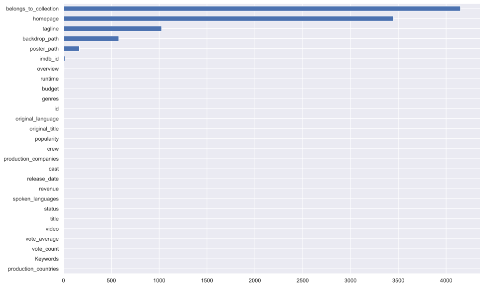
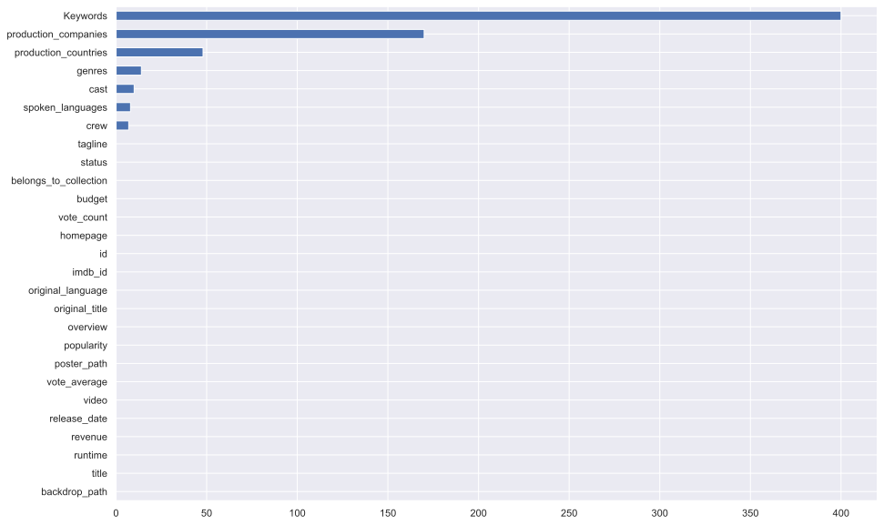

# Box Office Revenue Prediction


```python
import numpy as np
import pandas as pd

pd.set_option('display.max_columns', None)
from imageio import imread
from matplotlib.colors import rgb_to_hsv
import seaborn as sns
import matplotlib.pyplot as plt
%matplotlib inline
sns.set()


```


```python
train_raw = pd.read_csv('data/train.tsv',delimiter='\t')
```


```python
test_raw = pd.read_csv('data/test.tsv',delimiter='\t')
```


```python
train_raw
```


<div>
<style scoped>
    .dataframe tbody tr th:only-of-type {
        vertical-align: middle;
    }

    .dataframe tbody tr th {
        vertical-align: top;
    }

    .dataframe thead th {
        text-align: right;
    }
</style>
<table border="1" class="dataframe">
  <thead>
    <tr style="text-align: right;">
      <th></th>
      <th>backdrop_path</th>
      <th>belongs_to_collection</th>
      <th>budget</th>
      <th>genres</th>
      <th>homepage</th>
      <th>id</th>
      <th>imdb_id</th>
      <th>original_language</th>
      <th>original_title</th>
      <th>overview</th>
      <th>popularity</th>
      <th>poster_path</th>
      <th>production_companies</th>
      <th>production_countries</th>
      <th>release_date</th>
      <th>revenue</th>
      <th>runtime</th>
      <th>spoken_languages</th>
      <th>status</th>
      <th>tagline</th>
      <th>title</th>
      <th>video</th>
      <th>vote_average</th>
      <th>vote_count</th>
      <th>Keywords</th>
      <th>cast</th>
      <th>crew</th>
    </tr>
  </thead>
  <tbody>
    <tr>
      <th>0</th>
      <td>/7IBpOrw0ATwL1AOV97mtsceDpYs.jpg</td>
      <td>{'id': 556, 'name': 'Spider-Man Collection', '...</td>
      <td>258000000</td>
      <td>[{'id': 14, 'name': 'Fantasy'}, {'id': 28, 'na...</td>
      <td>https://www.sonypictures.com/movies/spiderman3</td>
      <td>559</td>
      <td>tt0413300</td>
      <td>en</td>
      <td>Spider-Man 3</td>
      <td>The seemingly invincible Spider-Man goes up ag...</td>
      <td>22.024</td>
      <td>/2N9lhZg6VtVJoGCZDjXVC3a81Ea.jpg</td>
      <td>[{'id': 19551, 'logo_path': '/2WpWp9b108hizjHK...</td>
      <td>[{'iso_3166_1': 'US', 'name': 'United States o...</td>
      <td>2007-05-01</td>
      <td>890871626</td>
      <td>139.0</td>
      <td>[{'iso_639_1': 'en', 'name': 'English'}, {'iso...</td>
      <td>Released</td>
      <td>The battle within.</td>
      <td>Spider-Man 3</td>
      <td>False</td>
      <td>6.2</td>
      <td>8180</td>
      <td>[{'id': 697, 'name': 'loss of loved one'}, {'i...</td>
      <td>[{'cast_id': 30, 'character': 'Peter Parker / ...</td>
      <td>[{'credit_id': '52fe4252c3a36847f80151a5', 'de...</td>
    </tr>
    <tr>
      <th>1</th>
      <td>/lYeE7k0OR3HXyoq7FeswyaxFJvL.jpg</td>
      <td>{'id': 256296, 'name': 'Silent Night, Deadly N...</td>
      <td>250000</td>
      <td>[{'id': 35, 'name': 'Comedy'}, {'id': 27, 'nam...</td>
      <td>NaN</td>
      <td>50719</td>
      <td>tt0093974</td>
      <td>en</td>
      <td>Silent Night, Deadly Night Part 2</td>
      <td>After being traumatized by his brother Billy's...</td>
      <td>4.756</td>
      <td>/64ATtm2eMd0yfrTJsHANQ0NmMSn.jpg</td>
      <td>[{'id': 18924, 'logo_path': None, 'name': 'Sil...</td>
      <td>[{'iso_3166_1': 'US', 'name': 'United States o...</td>
      <td>1987-04-10</td>
      <td>154323</td>
      <td>88.0</td>
      <td>[{'iso_639_1': 'en', 'name': 'English'}]</td>
      <td>Released</td>
      <td>The nightmare is about to begin ... AGAIN!</td>
      <td>Silent Night, Deadly Night Part 2</td>
      <td>False</td>
      <td>4.3</td>
      <td>68</td>
      <td>[{'id': 65, 'name': 'holiday'}, {'id': 1991, '...</td>
      <td>[{'cast_id': 1000, 'character': 'Ricky Caldwel...</td>
      <td>[{'credit_id': '52fe47d4c3a36847f814a70f', 'de...</td>
    </tr>
    <tr>
      <th>2</th>
      <td>/gVXLIfMR2hLmkn0nACctlMCJBfx.jpg</td>
      <td>NaN</td>
      <td>0</td>
      <td>[{'id': 99, 'name': 'Documentary'}]</td>
      <td>https://www.scottymovie.com/</td>
      <td>469062</td>
      <td>tt2773246</td>
      <td>en</td>
      <td>Scotty and the Secret History of Hollywood</td>
      <td>A deliciously scandalous portrait of unsung Ho...</td>
      <td>4.746</td>
      <td>/2uXDNXBoIrRBbfpVrvegoLr8OVt.jpg</td>
      <td>[{'id': 88564, 'logo_path': '/pn3p12IC4Tb0K8re...</td>
      <td>[{'iso_3166_1': 'US', 'name': 'United States o...</td>
      <td>2018-07-27</td>
      <td>176236</td>
      <td>98.0</td>
      <td>[{'iso_639_1': 'en', 'name': 'English'}]</td>
      <td>Released</td>
      <td>NaN</td>
      <td>Scotty and the Secret History of Hollywood</td>
      <td>False</td>
      <td>6.5</td>
      <td>15</td>
      <td>[{'id': 158718, 'name': 'lgbt'}]</td>
      <td>[{'cast_id': 1, 'character': 'Himself', 'credi...</td>
      <td>[{'credit_id': '5980e931c3a3680cfb002d0e', 'de...</td>
    </tr>
    <tr>
      <th>3</th>
      <td>/rKjE17ncAGNzeImNWbdGTimzjtk.jpg</td>
      <td>{'id': 8917, 'name': 'Hellraiser Collection', ...</td>
      <td>1000000</td>
      <td>[{'id': 27, 'name': 'Horror'}]</td>
      <td>NaN</td>
      <td>9003</td>
      <td>tt0093177</td>
      <td>en</td>
      <td>Hellraiser</td>
      <td>An unfaithful wife encounters the zombie of he...</td>
      <td>13.828</td>
      <td>/4nfAhOTlfZUHNorHJXEib7GYFpp.jpg</td>
      <td>[{'id': 1950, 'logo_path': None, 'name': 'New ...</td>
      <td>[{'iso_3166_1': 'GB', 'name': 'United Kingdom'}]</td>
      <td>1987-09-11</td>
      <td>14564027</td>
      <td>94.0</td>
      <td>[{'iso_639_1': 'en', 'name': 'English'}]</td>
      <td>Released</td>
      <td>He'll tear your soul apart.</td>
      <td>Hellraiser</td>
      <td>False</td>
      <td>6.9</td>
      <td>1115</td>
      <td>[{'id': 1449, 'name': 'underworld'}, {'id': 31...</td>
      <td>[{'cast_id': 15, 'character': 'Larry Cotton', ...</td>
      <td>[{'credit_id': '533fd9260e0a262b92001027', 'de...</td>
    </tr>
    <tr>
      <th>4</th>
      <td>/zcJxJVhvxNHJJ2J7Q7NhgO9nPUV.jpg</td>
      <td>{'id': 108693, 'name': "National Lampoon's Vac...</td>
      <td>15000000</td>
      <td>[{'id': 35, 'name': 'Comedy'}, {'id': 12, 'nam...</td>
      <td>NaN</td>
      <td>11153</td>
      <td>tt0085995</td>
      <td>en</td>
      <td>National Lampoon's Vacation</td>
      <td>Clark Griswold is on a quest to take his famil...</td>
      <td>15.070</td>
      <td>/ySI88wO1IFyKGWpSKRTSPilE3t2.jpg</td>
      <td>[{'id': 174, 'logo_path': '/IuAlhI9eVC9Z8UQWOI...</td>
      <td>[{'iso_3166_1': 'US', 'name': 'United States o...</td>
      <td>1983-07-28</td>
      <td>61399552</td>
      <td>99.0</td>
      <td>[{'iso_639_1': 'en', 'name': 'English'}]</td>
      <td>Released</td>
      <td>Every summer Chevy Chase takes his family on a...</td>
      <td>National Lampoon's Vacation</td>
      <td>False</td>
      <td>7.1</td>
      <td>782</td>
      <td>[{'id': 5493, 'name': 'relatives'}, {'id': 731...</td>
      <td>[{'cast_id': 1, 'character': 'Clark Griswold',...</td>
      <td>[{'credit_id': '52fe44039251416c75025f27', 'de...</td>
    </tr>
    <tr>
      <th>...</th>
      <td>...</td>
      <td>...</td>
      <td>...</td>
      <td>...</td>
      <td>...</td>
      <td>...</td>
      <td>...</td>
      <td>...</td>
      <td>...</td>
      <td>...</td>
      <td>...</td>
      <td>...</td>
      <td>...</td>
      <td>...</td>
      <td>...</td>
      <td>...</td>
      <td>...</td>
      <td>...</td>
      <td>...</td>
      <td>...</td>
      <td>...</td>
      <td>...</td>
      <td>...</td>
      <td>...</td>
      <td>...</td>
      <td>...</td>
      <td>...</td>
    </tr>
    <tr>
      <th>5210</th>
      <td>NaN</td>
      <td>{'id': 239968, 'name': 'La cage aux folles Col...</td>
      <td>0</td>
      <td>[{'id': 35, 'name': 'Comedy'}]</td>
      <td>NaN</td>
      <td>78159</td>
      <td>tt0088873</td>
      <td>fr</td>
      <td>La cage aux folles III - "Elles" se marient</td>
      <td>Third and final version of the La Cage aux Fol...</td>
      <td>3.050</td>
      <td>/fWmVjLsG27UJp4NSsByobK6YXj2.jpg</td>
      <td>[{'id': 23531, 'logo_path': None, 'name': 'Col...</td>
      <td>[{'iso_3166_1': 'FR', 'name': 'France'}, {'iso...</td>
      <td>1985-11-20</td>
      <td>345280</td>
      <td>87.0</td>
      <td>[{'iso_639_1': 'fr', 'name': 'Français'}]</td>
      <td>Released</td>
      <td>NaN</td>
      <td>La Cage aux Folles 3: The Wedding</td>
      <td>False</td>
      <td>4.7</td>
      <td>29</td>
      <td>[{'id': 237, 'name': 'gay'}, {'id': 824, 'name...</td>
      <td>[{'cast_id': 2, 'character': 'Renato Baldi', '...</td>
      <td>[{'credit_id': '52fe4990c3a368484e131c15', 'de...</td>
    </tr>
    <tr>
      <th>5211</th>
      <td>/sOw7TZzt3vRQXXCrwdspSHwCJDR.jpg</td>
      <td>{'id': 111751, 'name': 'Texas Chainsaw Massacr...</td>
      <td>85000</td>
      <td>[{'id': 27, 'name': 'Horror'}]</td>
      <td>NaN</td>
      <td>30497</td>
      <td>tt0072271</td>
      <td>en</td>
      <td>The Texas Chain Saw Massacre</td>
      <td>When Sally hears that her grandfather's grave ...</td>
      <td>11.580</td>
      <td>/9s8uSm5K1W0vhGPHv2icM6SFib8.jpg</td>
      <td>[{'id': 12, 'logo_path': '/iaYpEp3LQmb8AfAtmTv...</td>
      <td>[{'iso_3166_1': 'US', 'name': 'United States o...</td>
      <td>1974-10-01</td>
      <td>30859000</td>
      <td>83.0</td>
      <td>[{'iso_639_1': 'en', 'name': 'English'}]</td>
      <td>Released</td>
      <td>Who will survive and what will be left of them?</td>
      <td>The Texas Chain Saw Massacre</td>
      <td>False</td>
      <td>7.3</td>
      <td>1483</td>
      <td>[{'id': 1420, 'name': 'gas station'}, {'id': 1...</td>
      <td>[{'cast_id': 10, 'character': 'Sally Hardesty'...</td>
      <td>[{'credit_id': '5402d0d70e0a2658f10069fd', 'de...</td>
    </tr>
    <tr>
      <th>5212</th>
      <td>/5txDq5g0JeCKpemRM2CpT7H2aP3.jpg</td>
      <td>NaN</td>
      <td>30000000</td>
      <td>[{'id': 12, 'name': 'Adventure'}, {'id': 35, '...</td>
      <td>NaN</td>
      <td>14342</td>
      <td>tt0119053</td>
      <td>en</td>
      <td>Almost Heroes</td>
      <td>Two hapless explorers lead an ill-fated 1804 e...</td>
      <td>7.946</td>
      <td>/qO1cfr4UxcwQ858Nxp470QNS3v8.jpg</td>
      <td>[{'id': 813, 'logo_path': None, 'name': 'Di No...</td>
      <td>[{'iso_3166_1': 'US', 'name': 'United States o...</td>
      <td>1998-05-29</td>
      <td>6100000</td>
      <td>90.0</td>
      <td>[{'iso_639_1': 'en', 'name': 'English'}]</td>
      <td>Released</td>
      <td>Almost History... Almost Legends... Mostly Rid...</td>
      <td>Almost Heroes</td>
      <td>False</td>
      <td>5.6</td>
      <td>91</td>
      <td>[{'id': 1721, 'name': 'fight'}, {'id': 3930, '...</td>
      <td>[{'cast_id': 1, 'character': 'Bartholomew Hunt...</td>
      <td>[{'credit_id': '5779d18e92514103fc0000bc', 'de...</td>
    </tr>
    <tr>
      <th>5213</th>
      <td>/1dXTsaFxHoF9cas08UjAqE8NqOW.jpg</td>
      <td>NaN</td>
      <td>20000000</td>
      <td>[{'id': 878, 'name': 'Science Fiction'}, {'id'...</td>
      <td>http://www.eternalsunshine.com</td>
      <td>38</td>
      <td>tt0338013</td>
      <td>en</td>
      <td>Eternal Sunshine of the Spotless Mind</td>
      <td>Joel Barish, heartbroken that his girlfriend u...</td>
      <td>19.693</td>
      <td>/7y3eYvTsGjxPYDtSnumCLIMDkrV.jpg</td>
      <td>[{'id': 10146, 'logo_path': '/xnFIOeq5cKw09kCW...</td>
      <td>[{'iso_3166_1': 'US', 'name': 'United States o...</td>
      <td>2004-03-19</td>
      <td>72258126</td>
      <td>108.0</td>
      <td>[{'iso_639_1': 'en', 'name': 'English'}]</td>
      <td>Released</td>
      <td>You can erase someone from your mind. Getting ...</td>
      <td>Eternal Sunshine of the Spotless Mind</td>
      <td>False</td>
      <td>8.1</td>
      <td>8753</td>
      <td>[{'id': 563, 'name': 'deja vu'}, {'id': 802, '...</td>
      <td>[{'cast_id': 5, 'character': 'Joel Barish', 'c...</td>
      <td>[{'credit_id': '52fe4211c3a36847f800166f', 'de...</td>
    </tr>
    <tr>
      <th>5214</th>
      <td>/yZjbReSRgTGf5IZPmwpecPgm1Z1.jpg</td>
      <td>{'id': 71458, 'name': '3 Ninjas Collection', '...</td>
      <td>6500000</td>
      <td>[{'id': 28, 'name': 'Action'}, {'id': 12, 'nam...</td>
      <td>NaN</td>
      <td>16314</td>
      <td>tt0103596</td>
      <td>en</td>
      <td>3 Ninjas</td>
      <td>Each year, three brothers Samuel, Jeffrey and ...</td>
      <td>10.913</td>
      <td>/kJjhmLG9eJWVZrKimZ6kCrQ0urF.jpg</td>
      <td>[{'id': 9195, 'logo_path': '/ou5BUbtulr6tIt699...</td>
      <td>[{'iso_3166_1': 'US', 'name': 'United States o...</td>
      <td>1992-08-07</td>
      <td>29000301</td>
      <td>84.0</td>
      <td>[{'iso_639_1': 'en', 'name': 'English'}]</td>
      <td>Released</td>
      <td>Crosses Teenage Mutant Ninja Turtles and Home ...</td>
      <td>3 Ninjas</td>
      <td>False</td>
      <td>5.7</td>
      <td>240</td>
      <td>[{'id': 380, 'name': 'sibling relationship'}, ...</td>
      <td>[{'cast_id': 1, 'character': 'Grandpa Mori Tan...</td>
      <td>[{'credit_id': '52fe46c49251416c75082dab', 'de...</td>
    </tr>
  </tbody>
</table>
<p>5215 rows × 27 columns</p>
</div>


## Explenatory Data Analysis:


```python
# Highest Revenue:
train_raw.loc[train_raw['revenue'].idxmax(),['title','revenue','release_date']]
```


    title           Avengers: Infinity War
    revenue                     2046239637
    release_date                2018-04-25
    Name: 1996, dtype: object


```python
train_raw.describe().apply(lambda s: s.apply(lambda x: format(x, 'g')))
```


<div>
<style scoped>
    .dataframe tbody tr th:only-of-type {
        vertical-align: middle;
    }

    .dataframe tbody tr th {
        vertical-align: top;
    }

    .dataframe thead th {
        text-align: right;
    }
</style>
<table border="1" class="dataframe">
  <thead>
    <tr style="text-align: right;">
      <th></th>
      <th>budget</th>
      <th>id</th>
      <th>popularity</th>
      <th>revenue</th>
      <th>runtime</th>
      <th>vote_average</th>
      <th>vote_count</th>
    </tr>
  </thead>
  <tbody>
    <tr>
      <th>count</th>
      <td>5215</td>
      <td>5215</td>
      <td>5215</td>
      <td>5215</td>
      <td>5211</td>
      <td>5215</td>
      <td>5215</td>
    </tr>
    <tr>
      <th>mean</th>
      <td>2.14797e+07</td>
      <td>98768.7</td>
      <td>10.0166</td>
      <td>6.53874e+07</td>
      <td>108.027</td>
      <td>6.3991</td>
      <td>1062.86</td>
    </tr>
    <tr>
      <th>std</th>
      <td>3.63151e+07</td>
      <td>143993</td>
      <td>7.0758</td>
      <td>1.43238e+08</td>
      <td>22.741</td>
      <td>0.943931</td>
      <td>2097.17</td>
    </tr>
    <tr>
      <th>min</th>
      <td>0</td>
      <td>5</td>
      <td>1.519</td>
      <td>1</td>
      <td>0</td>
      <td>0</td>
      <td>0</td>
    </tr>
    <tr>
      <th>25%</th>
      <td>0</td>
      <td>10136</td>
      <td>6.264</td>
      <td>2.36072e+06</td>
      <td>94</td>
      <td>5.9</td>
      <td>74</td>
    </tr>
    <tr>
      <th>50%</th>
      <td>6.5e+06</td>
      <td>24662</td>
      <td>9.009</td>
      <td>1.51562e+07</td>
      <td>104</td>
      <td>6.4</td>
      <td>290</td>
    </tr>
    <tr>
      <th>75%</th>
      <td>2.6e+07</td>
      <td>121704</td>
      <td>11.801</td>
      <td>6.21425e+07</td>
      <td>118</td>
      <td>7.1</td>
      <td>1028</td>
    </tr>
    <tr>
      <th>max</th>
      <td>3.8e+08</td>
      <td>679106</td>
      <td>151.237</td>
      <td>2.04624e+09</td>
      <td>465</td>
      <td>10</td>
      <td>24834</td>
    </tr>
  </tbody>
</table>
</div>


```python
# TODO: Handle with budget and runtime 0
train_raw[train_raw.runtime == 0]
```


<div>
<style scoped>
    .dataframe tbody tr th:only-of-type {
        vertical-align: middle;
    }

    .dataframe tbody tr th {
        vertical-align: top;
    }

    .dataframe thead th {
        text-align: right;
    }
</style>
<table border="1" class="dataframe">
  <thead>
    <tr style="text-align: right;">
      <th></th>
      <th>backdrop_path</th>
      <th>belongs_to_collection</th>
      <th>budget</th>
      <th>genres</th>
      <th>homepage</th>
      <th>id</th>
      <th>imdb_id</th>
      <th>original_language</th>
      <th>original_title</th>
      <th>overview</th>
      <th>popularity</th>
      <th>poster_path</th>
      <th>production_companies</th>
      <th>production_countries</th>
      <th>release_date</th>
      <th>revenue</th>
      <th>runtime</th>
      <th>spoken_languages</th>
      <th>status</th>
      <th>tagline</th>
      <th>title</th>
      <th>video</th>
      <th>vote_average</th>
      <th>vote_count</th>
      <th>Keywords</th>
      <th>cast</th>
      <th>crew</th>
    </tr>
  </thead>
  <tbody>
    <tr>
      <th>104</th>
      <td>NaN</td>
      <td>{'id': 131989, 'name': 'Recep İvedik Serisi', ...</td>
      <td>0</td>
      <td>[{'id': 35, 'name': 'Comedy'}]</td>
      <td>NaN</td>
      <td>625489</td>
      <td>tt7399138</td>
      <td>tr</td>
      <td>Recep İvedik 6</td>
      <td>NaN</td>
      <td>54.524</td>
      <td>/1pnGF3bX0giCc9FFXH2CUIyE1hq.jpg</td>
      <td>[{'id': 23745, 'logo_path': '/tbvDqeTTb9EKm4vl...</td>
      <td>[{'iso_3166_1': 'TR', 'name': 'Turkey'}]</td>
      <td>2019-11-07</td>
      <td>10941643</td>
      <td>0.0</td>
      <td>[{'iso_639_1': 'tr', 'name': 'Türkçe'}]</td>
      <td>Released</td>
      <td>NaN</td>
      <td>Recep İvedik 6</td>
      <td>False</td>
      <td>4.6</td>
      <td>14</td>
      <td>[]</td>
      <td>[{'cast_id': 1, 'character': 'Recep İvedik', '...</td>
      <td>[{'credit_id': '5d5ff047e375c000151c5d05', 'de...</td>
    </tr>
    <tr>
      <th>229</th>
      <td>NaN</td>
      <td>NaN</td>
      <td>0</td>
      <td>[{'id': 35, 'name': 'Comedy'}]</td>
      <td>NaN</td>
      <td>217414</td>
      <td>tt2604346</td>
      <td>es</td>
      <td>¿Quién mató a Bambi?</td>
      <td>It tells the story of two young friends who mu...</td>
      <td>3.346</td>
      <td>NaN</td>
      <td>[{'id': 11651, 'logo_path': None, 'name': 'Rod...</td>
      <td>[{'iso_3166_1': 'ES', 'name': 'Spain'}]</td>
      <td>2013-11-15</td>
      <td>850259</td>
      <td>0.0</td>
      <td>[{'iso_639_1': 'es', 'name': 'Español'}]</td>
      <td>Released</td>
      <td>NaN</td>
      <td>¿Quién mató a Bambi?</td>
      <td>False</td>
      <td>5.8</td>
      <td>39</td>
      <td>[{'id': 1930, 'name': 'kidnapping'}, {'id': 97...</td>
      <td>[{'cast_id': 3, 'character': 'David', 'credit_...</td>
      <td>[{'credit_id': '556798e2c3a3681c60000a37', 'de...</td>
    </tr>
    <tr>
      <th>1141</th>
      <td>/3nkhO8hYyQDnovhHjN04c45dYsb.jpg</td>
      <td>NaN</td>
      <td>0</td>
      <td>[{'id': 35, 'name': 'Comedy'}]</td>
      <td>NaN</td>
      <td>593400</td>
      <td>tt9840382</td>
      <td>it</td>
      <td>Se mi vuoi bene</td>
      <td>Diego (Claudio Bisio), a successful lawyer wit...</td>
      <td>4.074</td>
      <td>/wD8H9RtTUoDAOsAjfZid2X2Qv8G.jpg</td>
      <td>[{'id': 114788, 'logo_path': None, 'name': 'El...</td>
      <td>[{'iso_3166_1': 'IT', 'name': 'Italy'}]</td>
      <td>2019-10-17</td>
      <td>702001</td>
      <td>0.0</td>
      <td>[{'iso_639_1': 'it', 'name': 'Italiano'}]</td>
      <td>Released</td>
      <td>NaN</td>
      <td>Se mi vuoi bene</td>
      <td>False</td>
      <td>5.8</td>
      <td>12</td>
      <td>[]</td>
      <td>[{'cast_id': 1, 'character': 'Diego', 'credit_...</td>
      <td>[{'credit_id': '5ca9ee6cc3a3683f4f615ef7', 'de...</td>
    </tr>
    <tr>
      <th>1671</th>
      <td>/7OZyTuniVvpmCyuAtq1mFkBrjDC.jpg</td>
      <td>{'id': 669603, 'name': 'Il peggio della mia vi...</td>
      <td>6843500</td>
      <td>[{'id': 35, 'name': 'Comedy'}]</td>
      <td>NaN</td>
      <td>147868</td>
      <td>tt2550838</td>
      <td>it</td>
      <td>Il peggior Natale della mia vita</td>
      <td>Paolo needs to reach the castle of Alberto Cac...</td>
      <td>6.992</td>
      <td>/jflOmKG2sBVzxS36YtDQZQAGUBr.jpg</td>
      <td>[{'id': 10975, 'logo_path': None, 'name': 'Col...</td>
      <td>[{'iso_3166_1': 'IT', 'name': 'Italy'}]</td>
      <td>2012-12-22</td>
      <td>10703234</td>
      <td>0.0</td>
      <td>[{'iso_639_1': 'it', 'name': 'Italiano'}]</td>
      <td>Released</td>
      <td>NaN</td>
      <td>The Worst Christmas of My Life</td>
      <td>False</td>
      <td>5.9</td>
      <td>350</td>
      <td>[]</td>
      <td>[{'cast_id': 4, 'character': 'Paolo', 'credit_...</td>
      <td>[{'credit_id': '5a3997180e0a264cc41fa22d', 'de...</td>
    </tr>
    <tr>
      <th>1774</th>
      <td>/3MWp4V7RZ1LAFgzIFcysvq11yYg.jpg</td>
      <td>NaN</td>
      <td>800000</td>
      <td>[{'id': 18, 'name': 'Drama'}, {'id': 53, 'name...</td>
      <td>NaN</td>
      <td>92384</td>
      <td>tt0285869</td>
      <td>en</td>
      <td>Trois 2: Pandora's Box</td>
      <td>Stuck in a dull marriage, successful shrink Mi...</td>
      <td>3.386</td>
      <td>NaN</td>
      <td>[{'id': 1309, 'logo_path': '/gdsheJrD3lznh3O2q...</td>
      <td>[{'iso_3166_1': 'US', 'name': 'United States o...</td>
      <td>2002-08-09</td>
      <td>833779</td>
      <td>0.0</td>
      <td>[{'iso_639_1': 'en', 'name': 'English'}]</td>
      <td>Released</td>
      <td>Open at your own risk.</td>
      <td>Trois 2: Pandora's Box</td>
      <td>False</td>
      <td>6.3</td>
      <td>8</td>
      <td>[]</td>
      <td>[{'cast_id': 0, 'character': 'Hampton Hines', ...</td>
      <td>[{'credit_id': '5caba45a0e0a260f40ca588e', 'de...</td>
    </tr>
    <tr>
      <th>2365</th>
      <td>/dckyPWJGhFwSBhX9VhRwdqHkQwN.jpg</td>
      <td>NaN</td>
      <td>0</td>
      <td>[{'id': 18, 'name': 'Drama'}]</td>
      <td>http://www.meyouusforever.com</td>
      <td>148665</td>
      <td>tt0829432</td>
      <td>en</td>
      <td>Me &amp; You, Us, Forever</td>
      <td>A 47 year old Christian man on the other side ...</td>
      <td>2.179</td>
      <td>/u4b5waxz5jeRctnaP2sAZMXzQM6.jpg</td>
      <td>[{'id': 60358, 'logo_path': None, 'name': 'Dav...</td>
      <td>[{'iso_3166_1': 'US', 'name': 'United States o...</td>
      <td>2008-02-15</td>
      <td>84093</td>
      <td>0.0</td>
      <td>[{'iso_639_1': 'en', 'name': 'English'}]</td>
      <td>Released</td>
      <td>NaN</td>
      <td>Me &amp; You, Us, Forever</td>
      <td>False</td>
      <td>2.0</td>
      <td>1</td>
      <td>[{'id': 18035, 'name': 'family'}]</td>
      <td>[{'cast_id': 0, 'character': 'Dave', 'credit_i...</td>
      <td>[{'credit_id': '5ac63bde92514162b100ece8', 'de...</td>
    </tr>
    <tr>
      <th>2643</th>
      <td>/m1MtfeZDmkEAj7wrXE5RMCtlmOb.jpg</td>
      <td>NaN</td>
      <td>0</td>
      <td>[{'id': 35, 'name': 'Comedy'}, {'id': 10749, '...</td>
      <td>NaN</td>
      <td>75970</td>
      <td>tt1278186</td>
      <td>it</td>
      <td>La seconda volta non si scorda mai</td>
      <td>NaN</td>
      <td>3.791</td>
      <td>/AgeIJjtcoWcd7Vz0kgM9m1tuIWn.jpg</td>
      <td>[{'id': 41630, 'logo_path': None, 'name': 'Lun...</td>
      <td>[{'iso_3166_1': 'IT', 'name': 'Italy'}]</td>
      <td>2007-04-11</td>
      <td>2246142</td>
      <td>0.0</td>
      <td>[{'iso_639_1': 'it', 'name': 'Italiano'}]</td>
      <td>Released</td>
      <td>NaN</td>
      <td>La seconda volta non si scorda mai</td>
      <td>False</td>
      <td>5.8</td>
      <td>51</td>
      <td>[]</td>
      <td>[{'cast_id': 2, 'character': 'Giulio Terraccia...</td>
      <td>[{'credit_id': '52fe4920c3a368484e11b5df', 'de...</td>
    </tr>
    <tr>
      <th>2960</th>
      <td>NaN</td>
      <td>NaN</td>
      <td>6000000</td>
      <td>[{'id': 35, 'name': 'Comedy'}]</td>
      <td>NaN</td>
      <td>379284</td>
      <td>tt5529392</td>
      <td>pt</td>
      <td>Um Suburbano Sortudo</td>
      <td>NaN</td>
      <td>3.336</td>
      <td>NaN</td>
      <td>[{'id': 5591, 'logo_path': None, 'name': 'Down...</td>
      <td>[{'iso_3166_1': 'BR', 'name': 'Brazil'}]</td>
      <td>2016-02-11</td>
      <td>11600000</td>
      <td>0.0</td>
      <td>[{'iso_639_1': 'pt', 'name': 'Português'}]</td>
      <td>Released</td>
      <td>NaN</td>
      <td>Um Suburbano Sortudo</td>
      <td>False</td>
      <td>5.8</td>
      <td>37</td>
      <td>[]</td>
      <td>[{'cast_id': 0, 'character': 'Denílson / Tia L...</td>
      <td>[{'credit_id': '56a5831dc3a368388b009195', 'de...</td>
    </tr>
    <tr>
      <th>3082</th>
      <td>NaN</td>
      <td>NaN</td>
      <td>0</td>
      <td>[]</td>
      <td>https://en.wikipedia.org/wiki/UFC_Fight_Night:...</td>
      <td>372115</td>
      <td>NaN</td>
      <td>en</td>
      <td>UFC Fight Night 80: Namajunas vs. VanZant</td>
      <td>UFC Fight Night: Namajunas vs. VanZant (also k...</td>
      <td>3.654</td>
      <td>NaN</td>
      <td>[{'id': 20529, 'logo_path': None, 'name': 'Zuf...</td>
      <td>[{'iso_3166_1': 'US', 'name': 'United States o...</td>
      <td>2015-12-10</td>
      <td>234725</td>
      <td>0.0</td>
      <td>[]</td>
      <td>Released</td>
      <td>NaN</td>
      <td>UFC Fight Night 80: Namajunas vs. VanZant</td>
      <td>True</td>
      <td>0.0</td>
      <td>0</td>
      <td>[{'id': 9917, 'name': 'mixed martial arts'}, {...</td>
      <td>[{'cast_id': 0, 'character': '', 'credit_id': ...</td>
      <td>[]</td>
    </tr>
    <tr>
      <th>4191</th>
      <td>/hRcSGSW0CZvvUqmDabGLYJygkgO.jpg</td>
      <td>NaN</td>
      <td>0</td>
      <td>[{'id': 35, 'name': 'Comedy'}]</td>
      <td>NaN</td>
      <td>532938</td>
      <td>tt6918220</td>
      <td>fr</td>
      <td>Les Crevettes Pailletées</td>
      <td>Matthias Le Goff, an Olympic champion at the e...</td>
      <td>10.644</td>
      <td>/3OShlu6Aii3RqRg6cYCFApppXw4.jpg</td>
      <td>[{'id': 88917, 'logo_path': None, 'name': 'Les...</td>
      <td>[{'iso_3166_1': 'FR', 'name': 'France'}]</td>
      <td>2019-05-08</td>
      <td>4509301</td>
      <td>0.0</td>
      <td>[{'iso_639_1': 'en', 'name': 'English'}, {'iso...</td>
      <td>Released</td>
      <td>NaN</td>
      <td>The Shiny Shrimps</td>
      <td>False</td>
      <td>6.7</td>
      <td>180</td>
      <td>[{'id': 237, 'name': 'gay'}, {'id': 1013, 'nam...</td>
      <td>[{'cast_id': 2, 'character': 'Matthias Le Goff...</td>
      <td>[{'credit_id': '5c68c0b60e0a261aaf94fa99', 'de...</td>
    </tr>
    <tr>
      <th>4259</th>
      <td>/dDQsSHuxiQi8DhqB2OOgfQhzHQN.jpg</td>
      <td>NaN</td>
      <td>0</td>
      <td>[{'id': 16, 'name': 'Animation'}]</td>
      <td>http://sumikkogurashi-movie.com</td>
      <td>636959</td>
      <td>NaN</td>
      <td>ja</td>
      <td>すみっコぐらし</td>
      <td>Sumikko Gurashi debuted in 2012 as slightly ne...</td>
      <td>3.810</td>
      <td>/kSfQCKRzdIPATJOOkeJsGBIXaZz.jpg</td>
      <td>[{'id': 103564, 'logo_path': '/t0dnUMFPjzPStIk...</td>
      <td>[{'iso_3166_1': 'JP', 'name': 'Japan'}]</td>
      <td>2019-11-08</td>
      <td>12000000</td>
      <td>0.0</td>
      <td>[{'iso_639_1': 'ja', 'name': '日本語'}]</td>
      <td>Released</td>
      <td>NaN</td>
      <td>Sumikko Gurashi</td>
      <td>False</td>
      <td>0.0</td>
      <td>0</td>
      <td>[{'id': 210024, 'name': 'anime'}, {'id': 23425...</td>
      <td>[{'cast_id': 4, 'character': 'Narración (narra...</td>
      <td>[{'credit_id': '5e137453fc5f06001991bb5a', 'de...</td>
    </tr>
    <tr>
      <th>4728</th>
      <td>/1dCHo980MpQfbFPXBDsDSkR2RZ4.jpg</td>
      <td>NaN</td>
      <td>0</td>
      <td>[{'id': 35, 'name': 'Comedy'}]</td>
      <td>NaN</td>
      <td>623780</td>
      <td>tt9207188</td>
      <td>pt</td>
      <td>Os Parças 2</td>
      <td>NaN</td>
      <td>3.221</td>
      <td>/12vNU3VSGZUWxBvqni5hLopVyDY.jpg</td>
      <td>[{'id': 53105, 'logo_path': None, 'name': 'Par...</td>
      <td>[{'iso_3166_1': 'BR', 'name': 'Brazil'}]</td>
      <td>2019-11-14</td>
      <td>890729</td>
      <td>0.0</td>
      <td>[{'iso_639_1': 'pt', 'name': 'Português'}]</td>
      <td>Released</td>
      <td>NaN</td>
      <td>Os Parças 2</td>
      <td>False</td>
      <td>8.0</td>
      <td>19</td>
      <td>[]</td>
      <td>[{'cast_id': 1, 'character': 'Toinho', 'credit...</td>
      <td>[{'credit_id': '5d578c20bc86574b372f02cd', 'de...</td>
    </tr>
  </tbody>
</table>
</div>


```python
sns.pairplot(train_raw.select_dtypes('number').drop(columns='id'), kind="reg", diag_kind="kde")
plt.show()
```


### Missing values:


```python
fig = plt.figure(figsize=(15, 10))
train_raw.isna().sum().sort_values(ascending=True).plot(kind='barh')
plt.show()
```





`belongs_to_collection` - many movies aren't part of a collection. (Logical NaN)
 
`homepage` - Not useful, we can drop it.

`tagline` - about 20% of movies don't have a tagline.

`backdrop_path` & `poster_path` - we will not use any image processing.

### Missing Objects values (Empty lists, Empty objects, etc.)


```python
fig = plt.figure(figsize=(15, 10))
train_raw.isin(['[]', '{}', '']).sum().sort_values(ascending=True).plot(kind='barh')
plt.show()
```





Everything below 10% of the data, and thus ignorable.

## Feature Extraction:


```python

removed_columns = ['backdrop_path', 'homepage', 'poster_path', 'revenue']
train = train_raw[[col for col in train_raw.columns if col not in removed_columns]].copy().set_index('id')

Y = train_raw[['revenue']].copy()

train['belongs_to_collection'] = train.belongs_to_collection.apply(lambda x: None if pd.isna(x) else eval(x))
train['belongs_to_collection.id'] = train.belongs_to_collection\
                                        .apply(lambda x: None if pd.isna(x) else x['id']).astype('Int64')
# COLLECTION_DICT = {v['id']:v['name'] for v in train['belongs_to_collection'] if not pd.isna(v)}


train['genres'] = train.genres.apply(lambda gs: tuple(g['name'] for g in eval(gs)))

train['production_companies'] = train.production_companies.apply(eval)
train['production_companies.id'] = train.production_companies\
                                        .apply(lambda companies: tuple(company['id'] for company in companies))
train['production_companies.name'] = train.production_companies\
                                        .apply(lambda companies: tuple(company['name'] for company in companies))
train['production_companies.origin_country'] = train.production_companies\
                                        .apply(lambda companies: tuple(company['origin_country'] for company in companies))


train['production_countries'] = train.production_countries.apply(lambda countries: tuple(country['iso_3166_1'] for country in eval(countries)))

train['release_date'] = pd.to_datetime(train.release_date)
train['release_month'] = train.release_date.dt.month
train['release_year'] = train.release_date.dt.year

train['spoken_languages'] = train.spoken_languages.apply(lambda langs: tuple(lang['iso_639_1'] for lang in eval(langs)))

train['Keywords'] = train.Keywords.apply(eval)
KEYWORDS_DICT = {v['id']:v['name'] for v in train.Keywords.sum()}
train['Keywords.id'] =train.Keywords.apply(lambda keywords: tuple(kw['id'] for kw in keywords)) # TODO: Maybe keep words?

train['cast'] = train.cast.apply(eval)
train['cast.id'] = train.cast.apply(lambda actors: tuple(actor['id'] for actor in actors))
train['cast.gender'] = train.cast.apply(lambda actors: tuple(actor['gender'] for actor in actors)) # Gender ratio

train['crew'] = train.crew.apply(eval)
train['crew.id'] = train.crew.apply(lambda crew: tuple(member['id'] for member in crew))
train['crew.gender'] = train.crew.apply(lambda crew: tuple(member['gender'] for member in crew)) # Gender ratio
train['crew.department'] = train.crew.apply(lambda crew: tuple(member['department'] for member in crew)) # Dept size


# TODO: 'status' column is 'Released' only..
# TODO: 'video' column is False only (almost)..
# TODO: Keep only one of 'title' and 'original_title', with boolean if changed? (no - different languages)
# TODO: Should we treat release months only? seasons? (Binning)
# TODO: Should we bin runtime? budget?
```


```python
train
```


<div>
<style scoped>
    .dataframe tbody tr th:only-of-type {
        vertical-align: middle;
    }

    .dataframe tbody tr th {
        vertical-align: top;
    }

    .dataframe thead th {
        text-align: right;
    }
</style>
<table border="1" class="dataframe">
  <thead>
    <tr style="text-align: right;">
      <th></th>
      <th>belongs_to_collection</th>
      <th>budget</th>
      <th>genres</th>
      <th>imdb_id</th>
      <th>original_language</th>
      <th>original_title</th>
      <th>overview</th>
      <th>popularity</th>
      <th>production_companies</th>
      <th>production_countries</th>
      <th>release_date</th>
      <th>runtime</th>
      <th>spoken_languages</th>
      <th>status</th>
      <th>tagline</th>
      <th>title</th>
      <th>video</th>
      <th>vote_average</th>
      <th>vote_count</th>
      <th>Keywords</th>
      <th>cast</th>
      <th>crew</th>
      <th>belongs_to_collection.id</th>
      <th>production_companies.id</th>
      <th>production_companies.name</th>
      <th>production_companies.origin_country</th>
      <th>release_month</th>
      <th>release_year</th>
      <th>Keywords.id</th>
      <th>cast.id</th>
      <th>cast.gender</th>
      <th>crew.id</th>
      <th>crew.gender</th>
      <th>crew.department</th>
    </tr>
    <tr>
      <th>id</th>
      <th></th>
      <th></th>
      <th></th>
      <th></th>
      <th></th>
      <th></th>
      <th></th>
      <th></th>
      <th></th>
      <th></th>
      <th></th>
      <th></th>
      <th></th>
      <th></th>
      <th></th>
      <th></th>
      <th></th>
      <th></th>
      <th></th>
      <th></th>
      <th></th>
      <th></th>
      <th></th>
      <th></th>
      <th></th>
      <th></th>
      <th></th>
      <th></th>
      <th></th>
      <th></th>
      <th></th>
      <th></th>
      <th></th>
      <th></th>
    </tr>
  </thead>
  <tbody>
    <tr>
      <th>559</th>
      <td>{'id': 556, 'name': 'Spider-Man Collection', '...</td>
      <td>258000000</td>
      <td>(Fantasy, Action, Adventure)</td>
      <td>tt0413300</td>
      <td>en</td>
      <td>Spider-Man 3</td>
      <td>The seemingly invincible Spider-Man goes up ag...</td>
      <td>22.024</td>
      <td>[{'id': 19551, 'logo_path': '/2WpWp9b108hizjHK...</td>
      <td>(US,)</td>
      <td>2007-05-01</td>
      <td>139.0</td>
      <td>(en, fr)</td>
      <td>Released</td>
      <td>The battle within.</td>
      <td>Spider-Man 3</td>
      <td>False</td>
      <td>6.2</td>
      <td>8180</td>
      <td>[{'id': 697, 'name': 'loss of loved one'}, {'i...</td>
      <td>[{'cast_id': 30, 'character': 'Peter Parker / ...</td>
      <td>[{'credit_id': '52fe4252c3a36847f80151a5', 'de...</td>
      <td>556</td>
      <td>(19551, 5, 326, 34)</td>
      <td>(Marvel Enterprises, Columbia Pictures, Laura ...</td>
      <td>(US, US, , US)</td>
      <td>5</td>
      <td>2007</td>
      <td>(697, 851, 1453, 1965, 2038, 3446, 3986, 4391,...</td>
      <td>(2219, 205, 17051, 19159, 17052, 18997, 18998,...</td>
      <td>(2, 1, 2, 2, 2, 1, 1, 2, 2, 1, 2, 2, 1, 2, 1, ...</td>
      <td>(6410, 10570, 7623, 7623, 7624, 7624, 7625, 77...</td>
      <td>(1, 0, 2, 2, 2, 2, 2, 2, 1, 2, 2, 2, 2, 2, 2, ...</td>
      <td>(Production, Production, Writing, Directing, W...</td>
    </tr>
    <tr>
      <th>50719</th>
      <td>{'id': 256296, 'name': 'Silent Night, Deadly N...</td>
      <td>250000</td>
      <td>(Comedy, Horror)</td>
      <td>tt0093974</td>
      <td>en</td>
      <td>Silent Night, Deadly Night Part 2</td>
      <td>After being traumatized by his brother Billy's...</td>
      <td>4.756</td>
      <td>[{'id': 18924, 'logo_path': None, 'name': 'Sil...</td>
      <td>(US,)</td>
      <td>1987-04-10</td>
      <td>88.0</td>
      <td>(en,)</td>
      <td>Released</td>
      <td>The nightmare is about to begin ... AGAIN!</td>
      <td>Silent Night, Deadly Night Part 2</td>
      <td>False</td>
      <td>4.3</td>
      <td>68</td>
      <td>[{'id': 65, 'name': 'holiday'}, {'id': 1991, '...</td>
      <td>[{'cast_id': 1000, 'character': 'Ricky Caldwel...</td>
      <td>[{'credit_id': '52fe47d4c3a36847f814a70f', 'de...</td>
      <td>256296</td>
      <td>(18924,)</td>
      <td>(Silent Night Releasing Corporation,)</td>
      <td>(,)</td>
      <td>4</td>
      <td>1987</td>
      <td>(65, 1991, 9663, 9826, 10714, 11181, 157758, 1...</td>
      <td>(151123, 151124, 98078, 560010, 101281, 560011...</td>
      <td>(2, 2, 1, 0, 0, 0, 0, 0, 0, 0, 2, 0, 0, 2, 0, ...</td>
      <td>(71031, 91309, 97711, 110718, 213404, 213404, ...</td>
      <td>(2, 0, 0, 0, 0, 0, 0, 0, 0, 0, 0, 0, 0, 0, 0)</td>
      <td>(Sound, Crew, Writing, Camera, Writing, Direct...</td>
    </tr>
    <tr>
      <th>469062</th>
      <td>None</td>
      <td>0</td>
      <td>(Documentary,)</td>
      <td>tt2773246</td>
      <td>en</td>
      <td>Scotty and the Secret History of Hollywood</td>
      <td>A deliciously scandalous portrait of unsung Ho...</td>
      <td>4.746</td>
      <td>[{'id': 88564, 'logo_path': '/pn3p12IC4Tb0K8re...</td>
      <td>(US,)</td>
      <td>2018-07-27</td>
      <td>98.0</td>
      <td>(en,)</td>
      <td>Released</td>
      <td>NaN</td>
      <td>Scotty and the Secret History of Hollywood</td>
      <td>False</td>
      <td>6.5</td>
      <td>15</td>
      <td>[{'id': 158718, 'name': 'lgbt'}]</td>
      <td>[{'cast_id': 1, 'character': 'Himself', 'credi...</td>
      <td>[{'credit_id': '5980e931c3a3680cfb002d0e', 'de...</td>
      <td>&lt;NA&gt;</td>
      <td>(88564,)</td>
      <td>(Water's End Productions,)</td>
      <td>(US,)</td>
      <td>7</td>
      <td>2018</td>
      <td>(158718,)</td>
      <td>(1862182, 71766, 1862185, 1862186, 11275, 1453...</td>
      <td>(2, 2, 0, 0, 2, 2, 1)</td>
      <td>(27710, 74761, 143067, 222365, 939501, 1046137...</td>
      <td>(0, 0, 2, 0, 0, 0, 0, 2, 0, 0, 0, 0, 0, 0, 0, ...</td>
      <td>(Production, Sound, Editing, Sound, Crew, Prod...</td>
    </tr>
    <tr>
      <th>9003</th>
      <td>{'id': 8917, 'name': 'Hellraiser Collection', ...</td>
      <td>1000000</td>
      <td>(Horror,)</td>
      <td>tt0093177</td>
      <td>en</td>
      <td>Hellraiser</td>
      <td>An unfaithful wife encounters the zombie of he...</td>
      <td>13.828</td>
      <td>[{'id': 1950, 'logo_path': None, 'name': 'New ...</td>
      <td>(GB,)</td>
      <td>1987-09-11</td>
      <td>94.0</td>
      <td>(en,)</td>
      <td>Released</td>
      <td>He'll tear your soul apart.</td>
      <td>Hellraiser</td>
      <td>False</td>
      <td>6.9</td>
      <td>1115</td>
      <td>[{'id': 1449, 'name': 'underworld'}, {'id': 31...</td>
      <td>[{'cast_id': 15, 'character': 'Larry Cotton', ...</td>
      <td>[{'credit_id': '533fd9260e0a262b92001027', 'de...</td>
      <td>8917</td>
      <td>(1950, 15338, 15339, 15340)</td>
      <td>(New World Pictures, Cinemarque Entertainment ...</td>
      <td>(, , , )</td>
      <td>9</td>
      <td>1987</td>
      <td>(1449, 3182, 6152, 9748, 10327, 10864, 15001, ...</td>
      <td>(14782, 45588, 56551, 56552, 24737, 56553, 565...</td>
      <td>(2, 1, 1, 2, 2, 2, 0, 0, 2, 0, 2, 0, 2, 2, 2, ...</td>
      <td>(498, 19155, 19155, 9000, 10121, 10121, 40765,...</td>
      <td>(1, 2, 2, 2, 0, 0, 0, 2, 2, 2, 2, 2, 2, 2, 2, ...</td>
      <td>(Costume &amp; Make-Up, Sound, Sound, Production, ...</td>
    </tr>
    <tr>
      <th>11153</th>
      <td>{'id': 108693, 'name': 'National Lampoon's Vac...</td>
      <td>15000000</td>
      <td>(Comedy, Adventure)</td>
      <td>tt0085995</td>
      <td>en</td>
      <td>National Lampoon's Vacation</td>
      <td>Clark Griswold is on a quest to take his famil...</td>
      <td>15.070</td>
      <td>[{'id': 174, 'logo_path': '/IuAlhI9eVC9Z8UQWOI...</td>
      <td>(US,)</td>
      <td>1983-07-28</td>
      <td>99.0</td>
      <td>(en,)</td>
      <td>Released</td>
      <td>Every summer Chevy Chase takes his family on a...</td>
      <td>National Lampoon's Vacation</td>
      <td>False</td>
      <td>7.1</td>
      <td>782</td>
      <td>[{'id': 5493, 'name': 'relatives'}, {'id': 731...</td>
      <td>[{'cast_id': 1, 'character': 'Clark Griswold',...</td>
      <td>[{'credit_id': '52fe44039251416c75025f27', 'de...</td>
      <td>108693</td>
      <td>(174,)</td>
      <td>(Warner Bros. Pictures,)</td>
      <td>(US,)</td>
      <td>7</td>
      <td>1983</td>
      <td>(5493, 7312, 10673, 14724, 33694, 158340, 179431)</td>
      <td>(54812, 821, 70089, 1811, 1904, 1217003, 35109...</td>
      <td>(2, 1, 1, 2, 2, 1, 1, 2, 2, 2, 2, 2, 2, 1, 1, ...</td>
      <td>(1524, 1531, 11505, 14536, 69342, 69343)</td>
      <td>(2, 2, 2, 2, 2, 2)</td>
      <td>(Directing, Editing, Writing, Camera, Producti...</td>
    </tr>
    <tr>
      <th>...</th>
      <td>...</td>
      <td>...</td>
      <td>...</td>
      <td>...</td>
      <td>...</td>
      <td>...</td>
      <td>...</td>
      <td>...</td>
      <td>...</td>
      <td>...</td>
      <td>...</td>
      <td>...</td>
      <td>...</td>
      <td>...</td>
      <td>...</td>
      <td>...</td>
      <td>...</td>
      <td>...</td>
      <td>...</td>
      <td>...</td>
      <td>...</td>
      <td>...</td>
      <td>...</td>
      <td>...</td>
      <td>...</td>
      <td>...</td>
      <td>...</td>
      <td>...</td>
      <td>...</td>
      <td>...</td>
      <td>...</td>
      <td>...</td>
      <td>...</td>
      <td>...</td>
    </tr>
    <tr>
      <th>78159</th>
      <td>{'id': 239968, 'name': 'La cage aux folles Col...</td>
      <td>0</td>
      <td>(Comedy,)</td>
      <td>tt0088873</td>
      <td>fr</td>
      <td>La cage aux folles III - "Elles" se marient</td>
      <td>Third and final version of the La Cage aux Fol...</td>
      <td>3.050</td>
      <td>[{'id': 23531, 'logo_path': None, 'name': 'Col...</td>
      <td>(FR, IT)</td>
      <td>1985-11-20</td>
      <td>87.0</td>
      <td>(fr,)</td>
      <td>Released</td>
      <td>NaN</td>
      <td>La Cage aux Folles 3: The Wedding</td>
      <td>False</td>
      <td>4.7</td>
      <td>29</td>
      <td>[{'id': 237, 'name': 'gay'}, {'id': 824, 'name...</td>
      <td>[{'cast_id': 2, 'character': 'Renato Baldi', '...</td>
      <td>[{'credit_id': '52fe4990c3a368484e131c15', 'de...</td>
      <td>239968</td>
      <td>(23531, 16058)</td>
      <td>(Columbia Films, Da Ma Produzione)</td>
      <td>(, )</td>
      <td>11</td>
      <td>1985</td>
      <td>(237, 824, 15130)</td>
      <td>(32312, 12270, 38763, 24629, 43205, 38512, 190...</td>
      <td>(2, 2, 1, 2, 0, 0, 1, 0, 2)</td>
      <td>(1259, 18563, 32055, 49069)</td>
      <td>(2, 2, 2, 2)</td>
      <td>(Sound, Directing, Costume &amp; Make-Up, Crew)</td>
    </tr>
    <tr>
      <th>30497</th>
      <td>{'id': 111751, 'name': 'Texas Chainsaw Massacr...</td>
      <td>85000</td>
      <td>(Horror,)</td>
      <td>tt0072271</td>
      <td>en</td>
      <td>The Texas Chain Saw Massacre</td>
      <td>When Sally hears that her grandfather's grave ...</td>
      <td>11.580</td>
      <td>[{'id': 12, 'logo_path': '/iaYpEp3LQmb8AfAtmTv...</td>
      <td>(US,)</td>
      <td>1974-10-01</td>
      <td>83.0</td>
      <td>(en,)</td>
      <td>Released</td>
      <td>Who will survive and what will be left of them?</td>
      <td>The Texas Chain Saw Massacre</td>
      <td>False</td>
      <td>7.3</td>
      <td>1483</td>
      <td>[{'id': 1420, 'name': 'gas station'}, {'id': 1...</td>
      <td>[{'cast_id': 10, 'character': 'Sally Hardesty'...</td>
      <td>[{'credit_id': '5402d0d70e0a2658f10069fd', 'de...</td>
      <td>111751</td>
      <td>(12, 1197)</td>
      <td>(New Line Cinema, Vortex)</td>
      <td>(US, )</td>
      <td>10</td>
      <td>1974</td>
      <td>(1420, 1556, 4580, 11487, 11545, 11546, 11547,...</td>
      <td>(27798, 122454, 122455, 122456, 122457, 27803,...</td>
      <td>(1, 2, 2, 2, 1, 2, 2, 2, 2, 0, 0, 2, 0, 0, 0, ...</td>
      <td>(6042, 10051, 10051, 10051, 10051, 10066, 2779...</td>
      <td>(2, 2, 2, 2, 2, 0, 2, 2, 2, 0, 0, 0)</td>
      <td>(Camera, Writing, Directing, Production, Sound...</td>
    </tr>
    <tr>
      <th>14342</th>
      <td>None</td>
      <td>30000000</td>
      <td>(Adventure, Comedy, Western)</td>
      <td>tt0119053</td>
      <td>en</td>
      <td>Almost Heroes</td>
      <td>Two hapless explorers lead an ill-fated 1804 e...</td>
      <td>7.946</td>
      <td>[{'id': 813, 'logo_path': None, 'name': 'Di No...</td>
      <td>(US,)</td>
      <td>1998-05-29</td>
      <td>90.0</td>
      <td>(en,)</td>
      <td>Released</td>
      <td>Almost History... Almost Legends... Mostly Rid...</td>
      <td>Almost Heroes</td>
      <td>False</td>
      <td>5.6</td>
      <td>91</td>
      <td>[{'id': 1721, 'name': 'fight'}, {'id': 3930, '...</td>
      <td>[{'cast_id': 1, 'character': 'Bartholomew Hunt...</td>
      <td>[{'credit_id': '5779d18e92514103fc0000bc', 'de...</td>
      <td>&lt;NA&gt;</td>
      <td>(813, 6189)</td>
      <td>(Di Novi Pictures, Turner Pictures (I))</td>
      <td>(US, CA)</td>
      <td>5</td>
      <td>1998</td>
      <td>(1721, 3930, 9253, 10322, 10468, 165577, 17348...</td>
      <td>(58198, 14408, 71913, 8214, 26510, 9146, 41517...</td>
      <td>(2, 2, 2, 2, 2, 1, 2, 2, 2, 2, 2, 2, 2, 2, 2, ...</td>
      <td>(1899, 2123, 5360, 13524, 19679, 19680, 35166,...</td>
      <td>(1, 2, 2, 2, 1, 1, 0, 1, 2, 1, 0, 2, 1, 2, 2, 0)</td>
      <td>(Production, Editing, Camera, Directing, Produ...</td>
    </tr>
    <tr>
      <th>38</th>
      <td>None</td>
      <td>20000000</td>
      <td>(Science Fiction, Drama, Romance)</td>
      <td>tt0338013</td>
      <td>en</td>
      <td>Eternal Sunshine of the Spotless Mind</td>
      <td>Joel Barish, heartbroken that his girlfriend u...</td>
      <td>19.693</td>
      <td>[{'id': 10146, 'logo_path': '/xnFIOeq5cKw09kCW...</td>
      <td>(US,)</td>
      <td>2004-03-19</td>
      <td>108.0</td>
      <td>(en,)</td>
      <td>Released</td>
      <td>You can erase someone from your mind. Getting ...</td>
      <td>Eternal Sunshine of the Spotless Mind</td>
      <td>False</td>
      <td>8.1</td>
      <td>8753</td>
      <td>[{'id': 563, 'name': 'deja vu'}, {'id': 802, '...</td>
      <td>[{'cast_id': 5, 'character': 'Joel Barish', 'c...</td>
      <td>[{'credit_id': '52fe4211c3a36847f800166f', 'de...</td>
      <td>&lt;NA&gt;</td>
      <td>(10146, 10039, 10059)</td>
      <td>(Focus Features, Anonymous Content, This Is Th...</td>
      <td>(US, US, )</td>
      <td>3</td>
      <td>2004</td>
      <td>(563, 802, 931, 1453, 1566, 1604, 5625, 9673, ...</td>
      <td>(206, 204, 205, 103, 109, 207, 209, 212, 77013...</td>
      <td>(2, 1, 1, 2, 2, 2, 1, 2, 1, 2, 0, 0, 1, 2, 0, ...</td>
      <td>(201, 201, 222, 312, 313, 202, 202, 202, 321, ...</td>
      <td>(2, 2, 0, 2, 1, 2, 2, 2, 2, 2, 0, 1, 0, 2, 2, ...</td>
      <td>(Directing, Writing, Writing, Sound, Camera, W...</td>
    </tr>
    <tr>
      <th>16314</th>
      <td>{'id': 71458, 'name': '3 Ninjas Collection', '...</td>
      <td>6500000</td>
      <td>(Action, Adventure, Comedy, Family)</td>
      <td>tt0103596</td>
      <td>en</td>
      <td>3 Ninjas</td>
      <td>Each year, three brothers Samuel, Jeffrey and ...</td>
      <td>10.913</td>
      <td>[{'id': 9195, 'logo_path': '/ou5BUbtulr6tIt699...</td>
      <td>(US,)</td>
      <td>1992-08-07</td>
      <td>84.0</td>
      <td>(en,)</td>
      <td>Released</td>
      <td>Crosses Teenage Mutant Ninja Turtles and Home ...</td>
      <td>3 Ninjas</td>
      <td>False</td>
      <td>5.7</td>
      <td>240</td>
      <td>[{'id': 380, 'name': 'sibling relationship'}, ...</td>
      <td>[{'cast_id': 1, 'character': 'Grandpa Mori Tan...</td>
      <td>[{'credit_id': '52fe46c49251416c75082dab', 'de...</td>
      <td>71458</td>
      <td>(9195,)</td>
      <td>(Touchstone Pictures,)</td>
      <td>(US,)</td>
      <td>8</td>
      <td>1992</td>
      <td>(380, 1701, 9823, 10084, 10842, 14751, 15017, ...</td>
      <td>(11395, 80280, 8187, 80281, 80282, 80283, 8028...</td>
      <td>(2, 2, 2, 2, 2, 2, 1, 1, 2, 2, 2, 0, 0, 2, 0, ...</td>
      <td>(12962, 139849, 139850)</td>
      <td>(2, 0, 0)</td>
      <td>(Directing, Writing, Writing)</td>
    </tr>
  </tbody>
</table>
<p>5215 rows × 34 columns</p>
</div>


```python
# TODO: Dummy var: production_companies, genres, production_countries, spoken_languages, ??keywords?? , ??cast??, ??crew??
from sklearn.preprocessing import MultiLabelBinarizer

mlb = MultiLabelBinarizer()
```


```python
# Collection Size:
train['collection_size'] = train.groupby('belongs_to_collection.id')['belongs_to_collection.id'].transform('count').astype('Int64').copy()
train['collection_size']
```


    id
    559          2
    50719        1
    469062    <NA>
    9003         2
    11153        2
              ... 
    78159        1
    30497        3
    14342     <NA>
    38        <NA>
    16314        4
    Name: collection_size, Length: 5215, dtype: Int64


```python
def map_and_max(collection, mapping_dict):
    return max(map(mapping_dict.get, collection)) if collection else None
```


```python
# Company Size (movie count):
dummy_companies = pd.DataFrame(mlb.fit_transform(train['production_companies.id']),
                                columns=[cl for cl in mlb.classes_], 
                                index=train.index)
company_size_dict = dummy_companies.sum(axis=0).to_dict() # {company_id : company_size}

train['biggest_company_size'] = train['production_companies.id']\
                                        .apply(lambda companies: map_and_max(companies, company_size_dict)).astype('Int64')
train['biggest_company_size']
```


    id
    559       256
    50719       1
    469062      1
    9003       10
    11153     344
             ... 
    78159       1
    30497     123
    14342      10
    38         44
    16314     105
    Name: biggest_company_size, Length: 5215, dtype: Int64


```python
# Company count per country:

id_country_set = set(train.production_companies.apply(lambda xs: [(x['id'], x['origin_country']) for x in xs if x['origin_country']]).sum())
company_per_country = dict()
for comp_id, country in id_country_set:
    company_per_country[country] = company_per_country.get(country, 0) + 1
company_per_country[''] = 0 # Update no-countries to 0

train['biggest_country'] = train['production_companies.origin_country'].apply(lambda companies: map_and_max(companies, company_per_country)).astype('Int64')
train['biggest_country']
```


    id
    559       769
    50719       0
    469062    769
    9003        0
    11153     769
             ... 
    78159       0
    30497     769
    14342     769
    38        769
    16314     769
    Name: biggest_country, Length: 5215, dtype: Int64


```python
# Movie count per country:

```


```python
# Gender actor ratio: 0 is unspecified, 1 is female, and 2 is male
def genders_ratio(genders):
    arr = np.array(genders)
    males = (arr == 1).sum()
    females = (arr == 2).sum()
    if males or females:
        return males / (females+males)
    return 0

train['cast.gender_ratio'] = train['cast.gender'].apply(genders_ratio)
train['cast.gender_ratio']
```


    id
    559       0.611111
    50719     0.416667
    469062    0.200000
    9003      0.230769
    11153     0.272727
                ...   
    78159     0.333333
    30497     0.181818
    14342     0.045455
    38        0.375000
    16314     0.187500
    Name: cast.gender_ratio, Length: 5215, dtype: float64


```python
# NLP from tagline, overview, keywords, ??title??:

```


```python

```


```python
dummy_genres = pd.DataFrame(mlb.fit_transform(train.genres),
                            columns=['genre_'+cl for cl in mlb.classes_], 
                            index=train.index)
```


```python
dummy_collection = pd.DataFrame(mlb.fit_transform(train['belongs_to_collection.id']),
                            columns=['collection_'+cl for cl in mlb.classes_], 
                            index=train.index)
```


```python
dummy_companies = pd.DataFrame(mlb.fit_transform(train['production_companies.id']),
                                columns=['company_'+cl for cl in mlb.classes_], 
                                index=train.index)
```


```python
dummy_countries =pd.DataFrame(mlb.fit_transform(train.production_countries),
                                columns=['country_'+cl for cl in mlb.classes_], 
                                index=train.index)
```


```python
dummy_lang = pd.DataFrame(mlb.fit_transform(train.spoken_languages),
                            columns=['lang_'+cl for cl in mlb.classes_], 
                            index=train.index)

```


```python
dummy_keywords = pd.DataFrame(mlb.fit_transform(train['Keywords.id']),
                                columns=['kw_'+cl for cl in mlb.classes_], 
                                index=train.index)
```


```python
dummy_cast = pd.DataFrame(mlb.fit_transform(train['cast.id']),
                                columns=['cast_'+cl for cl in mlb.classes_], 
                                index=train.index)
```


```python
dummy_crew = pd.DataFrame(mlb.fit_transform(train['crew.id']),
                                columns=['crew_'+cl for cl in mlb.classes_], 
                                index=train.index)
```


```python

```
